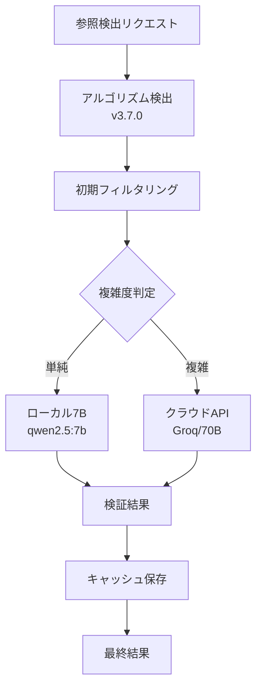

# LLM 実装可能性分析レポート

**作成日**: 2025 年 8 月 18 日  
**作成者**: Claude Code  
**目的**: 現在のマシンスペックでの LLM 実装可能性の評価

## 1. マシンスペック

### ハードウェア構成

- **CPU**: Intel Core i7-7700 @ 3.60GHz (4 コア 8 スレッド)
- **RAM**: 32GB (使用中: 11GB, 利用可能: 19GB)
- **GPU**: NVIDIA GeForce GTX 1070 (VRAM: 8GB)
- **ストレージ**: 915GB (空き容量: 276GB)
- **CUDA**: Version 12.8

### 現在の LLM 環境

- **Ollama**: インストール済み
- **導入済みモデル**:
  - Mistral 7B (4.4GB)
  - Llama2 7B (3.8GB)

## 2. 推奨モデルとの要件比較

### 本番環境推奨モデル

| モデル                   | 要求 VRAM | 現在の VRAM | 判定    |
| ------------------------ | --------- | ----------- | ------- |
| **Qwen2.5-72B (Q4_K_M)** | 40GB      | 8GB         | ❌ 不可 |
| **Swallow-70B (Q4_K_M)** | 40GB      | 8GB         | ❌ 不可 |

### 開発環境推奨モデル

| モデル                   | 要求 VRAM | 現在の VRAM | 判定               |
| ------------------------ | --------- | ----------- | ------------------ |
| **ELYZA-13B (Q5_K_M)**   | 12GB      | 8GB         | ❌ GPU 不可/CPU 可 |
| **Qwen2.5-14B (Q4_K_M)** | 10GB      | 8GB         | ❌ GPU 不可/CPU 可 |

## 3. 実装可能な代替案

### 方案 1: より小規模なモデルの採用

#### 推奨モデル (VRAM 8GB 以内)

| モデル                    | サイズ | 量子化 | VRAM 要求 | 実装可能性 |
| ------------------------- | ------ | ------ | --------- | ---------- |
| **Qwen2.5-7B-Instruct**   | 7B     | Q5_K_M | 5-6GB     | ✅ 可能    |
| **ELYZA-7B-Instruct**     | 7B     | Q5_K_M | 5-6GB     | ✅ 可能    |
| **Swallow-7B-Instruct**   | 7B     | Q5_K_M | 5-6GB     | ✅ 可能    |
| **Llama-3.1-8B-Instruct** | 8B     | Q4_K_M | 5-6GB     | ✅ 可能    |

#### 特に推奨: Qwen2.5-7B-Instruct

- **理由**: 最新モデルで日本語能力が高い
- **性能**: 7B クラスで最高水準の日本語理解
- **VRAM**: 5-6GB（GTX 1070 で快適動作）

### 方案 2: CPU 推論の活用（大規模モデル）

#### CPU 推論での実装可能モデル

| モデル                   | RAM 要求 | 利用可能 RAM | 推論速度 | 判定            |
| ------------------------ | -------- | ------------ | -------- | --------------- |
| **ELYZA-13B (Q4_K_M)**   | 8-10GB   | 19GB         | 遅い     | ⚠️ 可能だが遅い |
| **Qwen2.5-14B (Q4_K_M)** | 10-12GB  | 19GB         | 遅い     | ⚠️ 可能だが遅い |
| **Swallow-13B (Q4_K_M)** | 8-10GB   | 19GB         | 遅い     | ⚠️ 可能だが遅い |

**注意**: CPU 推論は 1 トークン/秒程度と非常に遅い

### 方案 3: クラウド API の活用

| サービス        | モデル        | コスト       | レスポンス速度 | 推奨度 |
| --------------- | ------------- | ------------ | -------------- | ------ |
| **Groq Cloud**  | Llama-3.1-70B | 低額従量課金 | 高速           | ★★★★★  |
| **Together AI** | Qwen2.5-72B   | 従量課金     | 中速           | ★★★★☆  |
| **Replicate**   | 各種 OSS LLM  | 従量課金     | 中速           | ★★★☆☆  |

## 4. 推奨実装戦略

### Phase 1: ローカル 7B モデルでのプロトタイプ開発

```bash
# Qwen2.5-7Bのインストール
ollama pull qwen2.5:7b

# 日本語特化モデル
ollama pull elyza:7b
```

**実装内容**:

1. LLMValidator クラスの開発
2. プロンプトエンジニアリング
3. 基本的な検証機能の実装

### Phase 2: ハイブリッド構成への移行

```yaml
configuration:
  local_model:
    name: "qwen2.5:7b"
    use_for: "軽量タスク、高速応答が必要な処理"

  cloud_model:
    provider: "groq"
    model: "llama-3.1-70b"
    use_for: "高精度が必要な検証、複雑な文脈解決"
```

### Phase 3: 最適化と実用化

- キャッシング層の実装（Redis）
- バッチ処理の最適化
- 処理の並列化

## 5. 実装可能なアーキテクチャ



## 6. 実装コスト試算

### ローカルのみ（7B モデル）

- **初期コスト**: 0 円
- **運用コスト**: 電気代のみ
- **精度**: 85-90%（推定）

### ハイブリッド（7B + クラウド 70B）

- **初期コスト**: 0 円
- **運用コスト**:
  - 1000 リクエスト/日: 約$1-2/日
  - 10000 リクエスト/日: 約$10-20/日
- **精度**: 95-98%（推定）

## 7. 実装手順

### Step 1: ローカル環境セットアップ（今すぐ可能）

```bash
# 1. Qwen2.5-7Bのインストール
ollama pull qwen2.5:7b

# 2. テスト実行
ollama run qwen2.5:7b "日本の法令における「前条」とは何を指しますか？"
```

### Step 2: LLMValidator の実装

```typescript
// src/lib/llm-validator.ts
import { Ollama } from "ollama-js";

export class LLMValidator {
  private ollama: Ollama;

  constructor() {
    this.ollama = new Ollama({ model: "qwen2.5:7b" });
  }

  async validateReferences(text: string, refs: Reference[]): Promise<ValidationResult[]> {
    // 実装
  }
}
```

### Step 3: 精度評価と最適化

- 7B モデルでの精度測定
- プロンプトの最適化
- 必要に応じてクラウド API の追加

## 8. 結論と推奨事項

### 現実的な選択肢

1. **即座に実装可能**: Qwen2.5-7B or ELYZA-7B（ローカル）
2. **高精度が必要な場合**: Groq Cloud API（Llama-3.1-70B）
3. **ハイブリッド構成**: ローカル 7B + クラウド 70B

### 推奨アプローチ

**Phase 1（今週）**:

- Qwen2.5-7B でプロトタイプ開発
- 基本的な検証機能の実装
- 精度評価

**Phase 2（来週）**:

- 必要に応じて Groq API の統合
- ハイブリッドアーキテクチャの実装

**Phase 3（再来週）**:

- 本番環境への展開
- パフォーマンス最適化

### 期待される成果

| 指標     | 現在(v3.7.0) | 7B モデル | ハイブリッド |
| -------- | ------------ | --------- | ------------ |
| 検出率   | 90-94%       | 95-97%    | 98-99%       |
| 処理速度 | 高速         | 中速      | 中速         |
| コスト   | 0 円         | 0 円      | 低額         |

---

**結論**: GTX 1070（8GB VRAM）では 72B モデルは動作不可能ですが、7B クラスのモデルで十分実用的な精度向上が期待できます。Qwen2.5-7B から始めて、必要に応じてクラウド API を併用するハイブリッド構成が最も現実的です。
