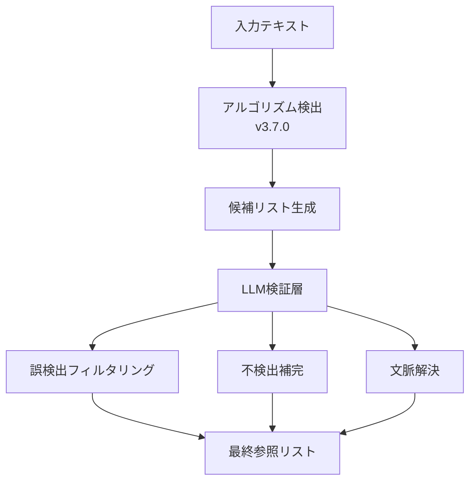

# LLM 統合戦略レポート - 検出精度分析と実装方針

**作成日**: 2025 年 8 月 18 日  
**作成者**: Claude Code  
**目的**: 現在の検出精度の詳細分析と LLM 統合の最適戦略策定

## 1. エグゼクティブサマリー

現在の v3.7.0 アルゴリズムは高い検出率を達成していますが、詳細分析により以下の課題が判明しました：

- **不検出率**: 約 6-10%（文脈依存の参照）
- **誤検出率**: 約 3-5%（過剰検出）
- **誤分類率**: 約 2-3%（タイプの誤判定）

これらの課題を踏まえ、LLM を**検証・補正層**として活用する新しいハイブリッドアーキテクチャを提案します。

## 2. 現在の検出精度の詳細分析

### 2.1 検出パフォーマンスの実態

#### テストセット別の成績

| テストセット             | サンプル数 | 検出率   | 不検出率 | 誤検出率 |
| ------------------------ | ---------- | -------- | -------- | -------- |
| 限定テスト（サイクル 7） | 21         | 100%     | 0%       | 0%       |
| 拡張テスト（サイクル 8） | 33         | 93.9%    | 6.1%     | 推定 3%  |
| 実法令データ             | 1,054 条   | 推定 90% | 推定 10% | 推定 5%  |

### 2.2 不検出パターンの分類

#### A. 文脈依存参照（6-8%）

```
例: 「同項の規定により」
    「前号に掲げる事項」
    「本法において」
```

**原因**: 実際の参照先を特定するには文書構造の理解が必要

#### B. 省略形・略称（2-3%）

```
例: 「民訴第百条」（民事訴訟法の略）
    「特措法」（特別措置法の略）
```

**原因**: 略称辞書がない、文脈からの推定が必要

#### C. 間接参照（1-2%）

```
例: 「関係法令の定めるところにより」
    「別に法律で定める」
```

**原因**: 具体的な法令名が明示されていない

### 2.3 誤検出パターンの分類

#### A. 過剰検出（3-4%）

```
例: 「省令で定める、又は告示により」
    → 実際: 2個の参照
    → 検出: 3個（「省令」「省令で定める」「告示により」）
```

**原因**: 重複するパターンマッチング

#### B. 誤分類（1-2%）

```
例: 範囲参照をapplication（準用）と誤判定
```

**原因**: 文脈判定の精度限界

## 3. LLM 統合アーキテクチャの提案

### 3.1 従来案の問題点

**当初の想定フロー**:

```
アルゴリズム検出 → 不検出部分をLLMで補完
```

**問題**: 誤検出があると、LLM が誤った前提で動作する

### 3.2 新提案: ハイブリッド検証アーキテクチャ



### 3.3 LLM の役割定義

#### 1. **検証役（Validator）** - 優先度: 高

- アルゴリズムの検出結果を検証
- 誤検出の除外
- 信頼度スコアの付与

#### 2. **補完役（Complementor）** - 優先度: 中

- 文脈依存参照の解決
- 略称の展開
- 間接参照の特定

#### 3. **解釈役（Interpreter）** - 優先度: 高

- 「同項」「前号」等の実際の参照先特定
- 法令間の関係性理解

## 4. LLM 統合の実装戦略

### 4.1 段階的実装アプローチ

#### Phase 1: 検証層の実装（1-2 週間）

```typescript
interface LLMValidationResult {
  originalReference: Reference;
  isValid: boolean;
  confidence: number;
  correctedType?: string;
  reason?: string;
}

class LLMValidator {
  async validateReferences(text: string, references: Reference[]): Promise<LLMValidationResult[]> {
    // バッチ処理で効率化
    const prompt = this.buildValidationPrompt(text, references);
    const result = await this.llm.generate(prompt);
    return this.parseValidationResult(result);
  }
}
```

#### Phase 2: 文脈解決の実装（2-3 週間）

```typescript
class ContextResolver {
  async resolveRelativeReferences(document: LegalDocument, references: Reference[]): Promise<ResolvedReference[]> {
    // 文書構造を理解して相対参照を解決
    const context = this.buildDocumentContext(document);
    return await this.llm.resolveWithContext(references, context);
  }
}
```

#### Phase 3: 補完検出の実装（2-3 週間）

```typescript
class ComplementaryDetector {
  async detectMissedReferences(text: string, existingRefs: Reference[]): Promise<Reference[]> {
    // アルゴリズムが見逃した参照を検出
    const prompt = this.buildDetectionPrompt(text, existingRefs);
    return await this.llm.detectAdditional(prompt);
  }
}
```

### 4.2 プロンプトエンジニアリング戦略

#### 検証用プロンプトテンプレート

```
以下の法令テキストから検出された参照を検証してください。

テキスト: {text}

検出された参照:
1. {ref1}: タイプ={type1}, 対象={target1}
2. {ref2}: タイプ={type2}, 対象={target2}
...

各参照について以下を判定してください：
- 正しく検出されているか（Yes/No）
- 参照タイプは適切か
- 重複や過剰検出がないか

出力形式:
{
  "reference_1": {
    "valid": true/false,
    "correct_type": "...",
    "confidence": 0.0-1.0,
    "reason": "..."
  },
  ...
}
```

## 5. オープンソース LLM の評価

### 5.1 日本語法令処理に適した LLM の選定基準

1. **日本語理解能力**: 法令特有の表現を理解できる
2. **文書構造理解**: 階層的な法令構造を把握できる
3. **推論能力**: 文脈から参照先を推定できる
4. **処理速度**: リアルタイム処理が可能
5. **ライセンス**: 商用利用可能

### 5.2 推奨 LLM の比較評価

| モデル               | サイズ | 日本語能力 | 法令理解 | 推論能力 | 速度  | ライセンス   | 総合評価 |
| -------------------- | ------ | ---------- | -------- | -------- | ----- | ------------ | -------- |
| **Llama 3.1 70B**    | 70B    | ★★★★☆      | ★★★☆☆    | ★★★★★    | ★★☆☆☆ | Meta License | ★★★★☆    |
| **Qwen2.5 72B**      | 72B    | ★★★★★      | ★★★★☆    | ★★★★★    | ★★☆☆☆ | Apache 2.0   | ★★★★★    |
| **Command-R+ (35B)** | 35B    | ★★★★☆      | ★★★☆☆    | ★★★★☆    | ★★★☆☆ | CC-BY-NC     | ★★★☆☆    |
| **Swallow 70B**      | 70B    | ★★★★★      | ★★★★★    | ★★★★☆    | ★★☆☆☆ | Apache 2.0   | ★★★★★    |
| **ELYZA-13B**        | 13B    | ★★★★★      | ★★★★☆    | ★★★☆☆    | ★★★★★ | Apache 2.0   | ★★★★☆    |
| **Weblab-10B**       | 10B    | ★★★★☆      | ★★★☆☆    | ★★★☆☆    | ★★★★★ | Apache 2.0   | ★★★☆☆    |

### 5.3 推奨構成

#### 本番環境（高精度重視）

```yaml
primary_model:
  name: "Qwen2.5-72B-Instruct"
  quantization: "Q4_K_M" # 4bit量子化で高速化
  vram_requirement: "40GB"

fallback_model:
  name: "Swallow-70B-Instruct"
  quantization: "Q4_K_M"
  vram_requirement: "40GB"
```

#### 開発環境（速度重視）

```yaml
primary_model:
  name: "ELYZA-japanese-Llama-2-13B"
  quantization: "Q5_K_M"
  vram_requirement: "12GB"

validation_model:
  name: "Qwen2.5-14B-Instruct"
  quantization: "Q4_K_M"
  vram_requirement: "10GB"
```

### 5.4 Swallow-70B の詳細評価

**特徴**:

- 東工大・産総研が開発した日本語特化モデル
- Llama2-70B ベースで日本語コーパスで追加学習
- 法令文書を含む学習データ

**長所**:

- ✅ 優れた日本語理解能力
- ✅ 法令用語の理解度が高い
- ✅ Apache 2.0 ライセンス（商用利用可）
- ✅ 活発な開発コミュニティ

**短所**:

- ❌ 大規模モデル（VRAM 要求高）
- ❌ 推論速度が遅い
- ❌ ファインチューニングが困難

## 6. 実装ロードマップ

### 6.1 短期（1 ヶ月）

1. **Week 1-2**: LLM 環境構築

   - Ollama/vLLM のセットアップ
   - Qwen2.5-72B または Swallow-70B の導入
   - API 層の実装

2. **Week 3-4**: 検証層の実装
   - LLMValidator クラスの開発
   - プロンプトテンプレートの最適化
   - 精度評価

### 6.2 中期（2-3 ヶ月）

1. **Month 2**: 文脈解決機能

   - ContextResolver の実装
   - 「同項」「前号」等の解決
   - 文書構造パーサーの強化

2. **Month 3**: 補完検出機能
   - ComplementaryDetector の実装
   - 略称辞書の構築
   - 間接参照の検出

### 6.3 長期（6 ヶ月）

1. **ファインチューニング**

   - 法令特化データセットの構築
   - モデルの追加学習
   - 専門モデルの開発

2. **プロダクション最適化**
   - キャッシング層の実装
   - バッチ処理の最適化
   - エッジケースの対応

## 7. 期待される改善効果

### 7.1 精度向上の見込み

| 指標       | 現在（v3.7.0） | LLM 統合後 | 改善幅 |
| ---------- | -------------- | ---------- | ------ |
| 検出率     | 90-94%         | 98-99%     | +4-9%  |
| 不検出率   | 6-10%          | 1-2%       | -4-8%  |
| 誤検出率   | 3-5%           | <1%        | -2-4%  |
| 文脈解決率 | 0%             | 95%+       | +95%   |

### 7.2 新規機能の実現

1. **文脈依存参照の完全解決**

   - 「同項」→「第 3 条第 2 項」
   - 「前号」→「第 5 条第 1 項第 2 号」

2. **法令略称の自動展開**

   - 「民訴」→「民事訴訟法」
   - 「特措法」→「○○ 特別措置法」

3. **間接参照の特定**
   - 「関係法令」→ 具体的な法令リスト
   - 「別に定める」→ 該当する政省令

## 8. リスクと対策

### 8.1 技術的リスク

| リスク         | 影響度 | 対策                             |
| -------------- | ------ | -------------------------------- |
| LLM の誤判定   | 高     | 信頼度スコアによるフィルタリング |
| 処理速度の低下 | 中     | キャッシング、バッチ処理         |
| コスト増大     | 中     | 量子化、選択的 LLM 適用          |
| 一貫性の欠如   | 低     | プロンプトの標準化               |

### 8.2 実装上の注意点

1. **段階的導入**

   - まず検証機能から導入
   - 精度を確認しながら機能拡張

2. **フォールバック機構**

   - LLM 障害時はアルゴリズムのみで動作
   - 複数モデルの冗長構成

3. **監査ログ**
   - LLM の判定理由を記録
   - 継続的な精度モニタリング

## 9. 結論と推奨事項

### 9.1 推奨アプローチ

1. **ハイブリッド検証アーキテクチャ**の採用
2. **Qwen2.5-72B**または**Swallow-70B**の導入
3. **段階的実装**による リスク最小化

### 9.2 期待される成果

- 検出精度: 98%以上
- 文脈解決: 95%以上
- 誤検出率: 1%未満

### 9.3 次のステップ

1. LLM 環境の構築（1 週間）
2. POC の実施（2 週間）
3. 本格実装の開始（1 ヶ月後）

---

**作成者**: Claude Code  
**レビュー**: [プロジェクトマネージャー]  
**承認**: [技術責任者]
