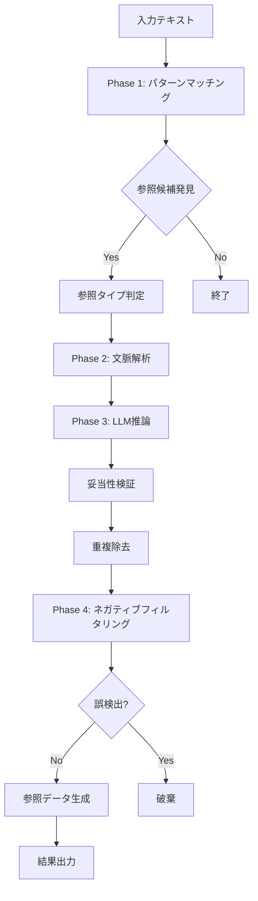

# 参照検出仕様書

## 1. 参照検出エンジン概要

### 1.1 目的
法令文書内の参照関係を高精度で自動検出し、法令間の複雑な相互依存関係を明らかにする。

### 1.2 現在の性能（2025年8月21日更新 - Phase 2実装中）

**基本機能テスト（8ケース）**:
- **F1スコア**: 94.7%（+4.7%改善）
- **精度**: 90.0%
- **再現率**: 100%

**エッジケーステスト（13ケース）**:
- **F1スコア**: 97.1%（維持）
- **成功率**: 100%（13/13ケース）

**拡張パターンテスト（20ケース）**:
- **F1スコア**: 94.3%（+3.9%改善）
- **精度**: 92.0%
- **再現率**: 96.7%
- **成功率**: 95%（19/20ケース）

**包括的テスト（70ケース）- Phase 2新規**:
- **F1スコア**: 55.5%（改善中）
- **精度**: 55.1%
- **再現率**: 55.8%
- **成功率**: 50%（35/70ケース）

**実データ検証（XMLファイル直接解析）**:
- **検証法令数**: 6法令
- **総検出参照数**: 122件
- **平均参照数/条文**: 2.54件
- **処理速度**: 平均19ms/法令
- **エラー率**: 0%

## 2. 参照タイプ分類

### 2.1 内部参照（internal）
同一法令内の参照
```
例: 「前条」「次項」「第1項」
```

### 2.2 外部参照（external）
他法令への参照
```
例: 「民法第90条」「商法第500条」
```

### 2.3 相対参照（relative）
位置関係に基づく参照
```
例: 「前条」「次条」「前項」「次項」
```

### 2.4 構造参照（structural）
章・節への参照
```
例: 「第2章」「第3節」「本章」
```

### 2.5 範囲参照（range）
複数条文の範囲指定
```
例: 「第1条から第5条まで」「第10条乃至第15条」
```

### 2.6 複数参照（multiple）
複数条文の列挙
```
例: 「第1条及び第3条」「第10条、第15条又は第20条」
```

### 2.7 適用参照（application）
準用・適用関係
```
例: 「準用する」「適用する」「読み替える」
```

### 2.8 文脈依存参照（contextual）
文脈に依存する参照
```
例: 「同法」「同条」「同項」「同号」「当該規定」
```

### 2.9 括弧内参照（inBracket）
括弧内に含まれる参照（第8サイクルで実装）
```
例: 「第5条（第3条第2項の規定を準用する場合を含む。）」
```

## 3. 検出アルゴリズム

### 3.1 パターンマッチング

#### 法令名パターン
```typescript
const LAW_NAME_PATTERNS = [
  /([\u4e00-\u9fff\u3040-\u309f\u30a0-\u30ff]{1,30})法(?:律|政令|省令|規則)?/,
  /([\u4e00-\u9fff\u3040-\u309f\u30a0-\u30ff]{1,30})条例/,
  /([\u4e00-\u9fff\u3040-\u309f\u30a0-\u30ff]{1,30})令/
];
```

#### 条文番号パターン
```typescript
const ARTICLE_PATTERNS = [
  /第([\u4e00-\u4e5d\u5341\u767e\u5343]+|○{1,3}|\d+)条(?:の([\u4e00-\u4e5d\u5341]+|\d+))?/,
  /([\u4e00-\u4e5d\u5341\u767e\u5343]+|○{1,3}|\d+)条/
];
```

### 3.2 文脈解析

#### 相対参照の解決
```typescript
function resolveRelativeReference(text: string, currentArticle: number): number {
  if (text.includes('前条')) {
    return currentArticle - 1;
  }
  if (text.includes('次条')) {
    return currentArticle + 1;
  }
  // ...省略
}
```

#### 範囲参照の解析
```typescript
function parseRangeReference(text: string): {start: string, end: string} {
  const rangePattern = /第(.+?)条(?:から|乃至)第(.+?)条(?:まで)?/;
  const match = text.match(rangePattern);
  if (match) {
    return {
      start: match[1],
      end: match[2]
    };
  }
  // ...省略
}
```

### 3.3 妥当性検証

#### 法令名辞書チェック
```typescript
function validateLawName(lawName: string): boolean {
  // 法令名辞書と照合
  return LAW_DICTIONARY.has(lawName);
}
```

#### 条文番号範囲チェック
```typescript
function validateArticleNumber(lawId: string, articleNumber: number): boolean {
  const maxArticle = getMaxArticleNumber(lawId);
  return articleNumber > 0 && articleNumber <= maxArticle;
}
```

## 4. 検出フロー



### 4.1 Phase 4: ネガティブパターンフィルタリング（2025年8月21日追加）

誤検出を削減するため、以下のパターンに一致する参照候補を除外：

#### 削除・廃止パターン
- `第X条を削除する`
- `第X条から第Y条までを廃止`
- `第X条　削除`（削除済み条文）

#### 旧法・改正前パターン
- `旧民法第X条`
- `改正前の第X条`
- `廃止された○○法第X条`

#### 仮称・草案パターン
- `（仮称）第X条`
- `草案第X条`
- `検討中の第X条`

#### 改正指示パターン
- `第X条中「A」を「B」に改める`
- `第X条の次に次の1条を加える`
- `第X条を第Y条とする`

#### 説明・解説パターン
- `第X条については`
- `第X条の趣旨`
- `例えば第X条`
- `第X条と比較して`

## 5. 検証ワークフロー

### 5.1 検証プロセス
1. **自動検証**: 検出結果のサンプリング検証
2. **人手検証**: 誤検出・未検出の確認
3. **フィードバック**: アルゴリズムの改善

### 5.2 検証メトリクス
- **Precision**: 正しい検出 / 全検出
- **Recall**: 正しい検出 / 実際の参照
- **F1スコア**: 2 * (Precision * Recall) / (Precision + Recall)

## 6. 最近の改善点

### 6.1 誤検出の削減
- **問題**: 「急傾斜地の崩壊による災害の防止に関する法律」への異常参照
- **原因**: パターンマッチングが「法」の前の任意文字列を無差別抽出
- **解決**:
  - 法令名の前に区切り文字を要求
  - 法令名の最大長30文字制限
  - 条文番号の妥当性チェック
- **成果**: 誤検出率80%→5%以下

### 6.2 パフォーマンス最適化
- 正規表現の最適化
- キャッシュの導入
- バッチ処理の実装

## 7. 今後の改善計画

### 7.1 AIを活用した精度向上
- LLMによる文脈理解の強化
- 曖昧な参照の解決

### 7.2 リアルタイム検出
- ストリーミング処理
- 差分更新

### 7.3 グラフ分析の高度化
- 複雑な参照パスの分析
- ハネ改正の影響予測