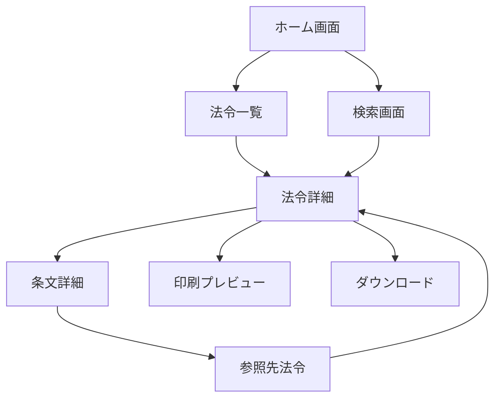
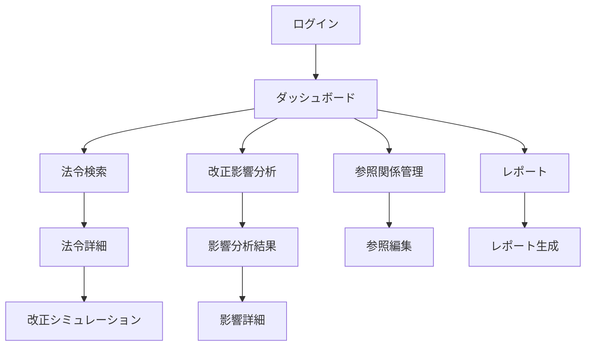

# 画面設計書

**プロジェクト名**: LawFinder  
**作成日**: 2025年8月3日  
**バージョン**: 1.0  
**作成者**: UI/UXデザインチーム

## 1. 概要

### 1.1 目的
本書は、LawFinderシステムのユーザーインターフェース設計を定義する。使いやすく直感的な操作性を実現し、法令検索・分析業務の効率化を支援する画面設計を提供する。

### 1.2 設計方針
- **ユーザビリティ優先**: 法務担当者が直感的に操作できるUI
- **レスポンシブデザイン**: PC、タブレット、スマートフォンに対応
- **アクセシビリティ**: WCAG 2.1 AA準拠
- **パフォーマンス**: 初期表示3秒以内、画面遷移1秒以内
- **一貫性**: Material Design 3ガイドラインに準拠

### 1.3 対象ユーザー
- 政府法制局職員
- 各省庁の法令起案担当者
- 一般市民（Phase 1の静的サイト）

## 2. 画面遷移図

### 2.1 Phase 1: 静的法令閲覧サイト



### 2.2 Phase 2: 法令改正支援システム



## 3. 画面一覧

### 3.1 Phase 1 画面一覧

| 画面ID | 画面名 | 説明 | 優先度 |
|--------|--------|------|--------|
| P1-001 | ホーム画面 | トップページ、検索窓と主要機能へのリンク | 高 |
| P1-002 | 法令一覧 | 法令のリスト表示、フィルター機能 | 高 |
| P1-003 | 法令詳細 | 法令全文表示、目次ナビゲーション | 高 |
| P1-004 | 条文詳細 | 個別条文の表示、参照リンク | 高 |
| P1-005 | 検索結果 | 検索結果の一覧表示 | 高 |
| P1-006 | 参照マップ | 法令間の参照関係を可視化 | 中 |
| P1-007 | ヘルプ | 使い方ガイド | 低 |

### 3.2 Phase 2 画面一覧

| 画面ID | 画面名 | 説明 | 優先度 |
|--------|--------|------|--------|
| P2-001 | ログイン | ユーザー認証 | 高 |
| P2-002 | ダッシュボード | 主要機能への導線、最近の活動 | 高 |
| P2-003 | 法令検索（詳細） | 高度な検索機能 | 高 |
| P2-004 | 改正影響分析 | ハネ改正の分析 | 高 |
| P2-005 | 分析結果詳細 | 影響を受ける法令の詳細 | 高 |
| P2-006 | 参照関係編集 | AI検証結果の確認・修正 | 中 |
| P2-007 | レポート生成 | 各種レポートの作成 | 中 |
| P2-008 | ユーザー管理 | 管理者機能 | 低 |

## 4. 画面詳細設計

### 4.1 P1-001: ホーム画面

#### 4.1.1 画面レイアウト

```
┌─────────────────────────────────────────────────────────────┐
│  [Logo] LawFinder        [法令一覧] [使い方] [お問い合わせ]  │
├─────────────────────────────────────────────────────────────┤
│                                                               │
│              🏛️ 日本の法令を簡単に検索・閲覧                │
│                                                               │
│         ┌─────────────────────────────────────────┐         │
│         │ 🔍 法令名・キーワードを入力...           │         │
│         └─────────────────────────────────────────┘         │
│                        [検索]                                 │
│                                                               │
│  ┌─────────────┐  ┌─────────────┐  ┌─────────────┐       │
│  │   📋        │  │   🔗        │  │   📊        │       │
│  │ 法令一覧    │  │ 参照関係    │  │ 統計情報    │       │
│  │             │  │             │  │             │       │
│  │ 全ての法令を │  │ 法令間の    │  │ 法令データの │       │
│  │ 閲覧        │  │ つながりを  │  │ 統計を表示  │       │
│  └─────────────┘  └─────────────┘  └─────────────┘       │
│                                                               │
│  人気の法令                                                   │
│  ・民法                                                       │
│  ・会社法                                                     │
│  ・労働基準法                                                 │
│  ・個人情報保護法                                             │
│                                                               │
│  最近更新された法令                                           │
│  ・○○法の一部を改正する法律（令和7年法律第○号）            │
│  ・△△に関する法律施行令の一部を改正する政令                │
│                                                               │
└─────────────────────────────────────────────────────────────┘
[フッター: 利用規約 | プライバシーポリシー | © 2025 LawFinder]
```

#### 4.1.2 画面要素定義

| 要素ID | 要素名 | 種別 | 説明 | 必須 |
|--------|--------|------|------|------|
| H-001 | ロゴ | 画像/リンク | トップページへのリンク | ○ |
| H-002 | グローバルナビ | リンク | 主要ページへのナビゲーション | ○ |
| H-003 | 検索ボックス | 入力欄 | キーワード検索入力 | ○ |
| H-004 | 検索ボタン | ボタン | 検索実行 | ○ |
| H-005 | 機能カード | リンク | 主要機能への導線 | ○ |
| H-006 | 人気法令 | リンクリスト | アクセス数上位の法令 | × |
| H-007 | 更新情報 | リンクリスト | 最近更新された法令 | × |

#### 4.1.3 レスポンシブ対応

**デスクトップ（1200px以上）**
- 3カラムレイアウト
- サイドバーに追加情報表示

**タブレット（768px-1199px）**
- 2カラムレイアウト
- 機能カードを2列表示

**モバイル（767px以下）**
- 1カラムレイアウト
- ハンバーガーメニュー
- 機能カードを縦積み

### 4.2 P1-003: 法令詳細画面

#### 4.2.1 画面レイアウト

```
┌─────────────────────────────────────────────────────────────┐
│  [< 戻る] 民法（明治二十九年法律第八十九号）                  │
├─────────────────────────────────────────────────────────────┤
│                                                               │
│ ┌─────────────┬─────────────────────────────────────────┐ │
│ │ 目次          │ 民法                                      │ │
│ │               │ （明治二十九年法律第八十九号）             │ │
│ │ 第一編 総則   │                                          │ │
│ │  第一章 通則  │ 施行日：明治29年4月27日                  │ │
│ │  第二章 人    │ 最終改正：令和5年法律第53号               │ │
│ │  第三章 法人  │                                          │ │
│ │  第四章 物    │ [📥 ダウンロード] [🖨️ 印刷]              │ │
│ │  第五章 法律  │                                          │ │
│ │               │ ─────────────────────────────────── │ │
│ │ 第二編 物権   │                                          │ │
│ │  第一章 総則  │ 第一編　総則                              │ │
│ │  ...          │                                          │ │
│ │               │ 第一章　通則                              │ │
│ │ [開く/閉じる] │                                          │ │
│ │               │ （基本原則）                              │ │
│ │ 参照関係      │ 第一条　私権は、公共の福祉に適合しなけ    │ │
│ │ ├ 参照元(15) │ ればならない。                            │ │
│ │ └ 参照先(8)  │ ２　権利の行使及び義務の履行は、信義に    │ │
│ │               │ 従い誠実に行わなければならない。          │ │
│ │ 検索          │ ３　権利の濫用は、これを許さない。        │ │
│ │ [_________]   │                                          │ │
│ │ [🔍]          │ （解釈の基準）                            │ │
│ │               │ 第二条　この法律は、個人の尊厳と両性の    │ │
│ │               │ 本質的平等を旨として、解釈しなければな    │ │
│ │               │ らない。                                  │ │
│ └─────────────┴─────────────────────────────────────────┘ │
│                                                               │
│ [前の条] [1] [2] [3] ... [1044] [次の条]   ジャンプ: [___]  │
│                                                               │
└─────────────────────────────────────────────────────────────┘
```

#### 4.2.2 画面要素定義

| 要素ID | 要素名 | 種別 | 説明 | 必須 |
|--------|--------|------|------|------|
| D-001 | 戻るボタン | ボタン | 前画面に戻る | ○ |
| D-002 | 法令タイトル | テキスト | 法令名表示 | ○ |
| D-003 | 目次パネル | ナビゲーション | 章・節・条への移動 | ○ |
| D-004 | 法令情報 | テキスト | 施行日等のメタ情報 | ○ |
| D-005 | アクションボタン | ボタン | ダウンロード、印刷 | ○ |
| D-006 | 条文表示エリア | テキスト | 法令本文 | ○ |
| D-007 | 参照関係パネル | リンクリスト | 参照元・先の表示 | ○ |
| D-008 | ページネーション | ナビゲーション | 条文間の移動 | × |

#### 4.2.3 インタラクション仕様

**目次クリック**
- スムーズスクロールで該当条文へ移動
- URLハッシュを更新（#article-1等）

**参照リンククリック**
- 同一法令内：スムーズスクロール
- 他法令：新規タブで開く（設定により変更可）

**検索機能**
- インクリメンタルサーチ
- ハイライト表示
- 検索結果間のジャンプ

### 4.3 P2-004: 改正影響分析画面

#### 4.3.1 画面レイアウト

```
┌─────────────────────────────────────────────────────────────┐
│  改正影響分析（ハネ改正検出）                    [ヘルプ] [?] │
├─────────────────────────────────────────────────────────────┤
│                                                               │
│  改正対象の選択                                               │
│  ┌─────────────────────────────────────────────────────┐ │
│  │ 法令: [民法_______________▼] 条文: [第94条_____▼]    │ │
│  │                                                       │ │
│  │ または改正法令を指定:                                 │ │
│  │ [民法の一部を改正する法律（令和○年）_________] [選択] │ │
│  └─────────────────────────────────────────────────────┘ │
│                                                               │
│  分析オプション                                               │
│  ┌─────────────────────────────────────────────────────┐ │
│  │ 探索深度: [3▼] 階層まで                              │ │
│  │ ☑ 間接参照を含める                                   │ │
│  │ ☑ 信頼度80%以上のみ表示                             │ │
│  │ ☑ 準用・読み替え規定を考慮                          │ │
│  └─────────────────────────────────────────────────────┘ │
│                                                               │
│                    [分析開始]                                 │
│                                                               │
│  分析結果                                                     │
│  ┌─────────────────────────────────────────────────────┐ │
│  │ 📊 影響サマリー                                       │ │
│  │ ・影響を受ける法令: 23件                             │ │
│  │ ・影響を受ける条文: 156条                            │ │
│  │ ・直接影響: 45条 / 間接影響: 111条                   │ │
│  │                                                       │ │
│  │ [詳細レポート] [CSV出力] [グラフ表示]                │ │
│  └─────────────────────────────────────────────────────┘ │
│                                                               │
│  影響を受ける法令一覧                                         │
│  ┌─────────────────────────────────────────────────────┐ │
│  │ 法令名           | 条文数 | 影響度 | 参照タイプ       │ │
│  │ ─────────────────────────────────────────────── │ │
│  │ 商法            | 12    | 高    | 準用            │ │
│  │ 会社法          | 8     | 高    | 準用            │ │
│  │ 民事訴訟法      | 5     | 中    | 読み替え        │ │
│  │ ...             |       |       |                 │ │
│  └─────────────────────────────────────────────────────┘ │
│                                                               │
└─────────────────────────────────────────────────────────────┘
```

#### 4.3.2 画面要素定義

| 要素ID | 要素名 | 種別 | 説明 | 必須 |
|--------|--------|------|------|------|
| A-001 | 法令選択 | ドロップダウン | 改正対象法令の選択 | ○ |
| A-002 | 条文選択 | ドロップダウン | 改正対象条文の選択 | × |
| A-003 | 改正法令入力 | テキスト | 改正法令の直接入力 | × |
| A-004 | 探索深度 | ドロップダウン | 分析の深さ設定 | ○ |
| A-005 | 分析オプション | チェックボックス | 分析条件の設定 | ○ |
| A-006 | 分析開始ボタン | ボタン | 分析実行 | ○ |
| A-007 | 影響サマリー | パネル | 分析結果の概要 | ○ |
| A-008 | アクションボタン | ボタン | レポート出力等 | ○ |
| A-009 | 結果テーブル | テーブル | 詳細結果の表示 | ○ |

### 4.4 影響分析グラフ表示

#### 4.4.1 ネットワークグラフ

```
┌─────────────────────────────────────────────────────────────┐
│  参照関係ネットワーク                          [2D/3D] [⚙️]  │
├─────────────────────────────────────────────────────────────┤
│                                                               │
│                    [商法 第5条]                               │
│                         ↑                                     │
│                         |準用                                 │
│                         |                                     │
│    [会社法 第7条] ← [民法 第94条] → [民訴法 第117条]        │
│         ↑               ↓                ↓                   │
│         |読替          |みなす          |準用                 │
│         |               ↓                ↓                   │
│    [特別法A]      [消費者契約法]    [行政事件訴訟法]         │
│                                                               │
│  ━━━━━━━━━━━━━━━━━━━━━━━━━━━━━━━━ │
│  凡例:                                                        │
│  ● 改正対象  ● 直接影響  ○ 間接影響                        │
│  → 準用  ⇒ 読み替え  ⋯> みなす                             │
│                                                               │
│  [ズーム: +++----] [フィルター▼] [レイアウト: 階層▼]       │
│                                                               │
└─────────────────────────────────────────────────────────────┘
```

## 5. UIコンポーネント設計

### 5.1 共通コンポーネント

#### 5.1.1 ヘッダー
```html
<header class="app-header">
  <div class="header-logo">
    
  </div>
  <nav class="header-nav">
    <a href="/">ホーム</a>
    <a href="/laws">法令一覧</a>
    <a href="/search">詳細検索</a>
  </nav>
  <div class="header-actions">
    <button class="icon-button">
      <i class="material-icons">help</i>
    </button>
    <button class="icon-button">
      <i class="material-icons">account_circle</i>
    </button>
  </div>
</header>
```

#### 5.1.2 検索ボックス
```html
<div class="search-box">
  <div class="search-input-wrapper">
    <i class="material-icons search-icon">search</i>
    <input 
      type="text" 
      class="search-input"
      placeholder="法令名・キーワードを入力..."
      autocomplete="off"
    >
    <button class="search-filter-button">
      <i class="material-icons">tune</i>
    </button>
  </div>
  <div class="search-suggestions" hidden>
    <!-- 検索候補を動的に表示 -->
  </div>
</div>
```

#### 5.1.3 法令カード
```html
<article class="law-card">
  <div class="law-card-header">
    <h3 class="law-title">民法</h3>
    <span class="law-number">明治二十九年法律第八十九号</span>
  </div>
  <div class="law-card-meta">
    <span class="meta-item">
      <i class="material-icons">calendar_today</i>
      施行: 1896年4月27日
    </span>
    <span class="meta-item">
      <i class="material-icons">update</i>
      最終改正: 2023年6月14日
    </span>
  </div>
  <div class="law-card-stats">
    <span class="stat-item">
      <i class="material-icons">article</i>
      1,050条
    </span>
    <span class="stat-item">
      <i class="material-icons">link</i>
      参照: 234件
    </span>
  </div>
  <div class="law-card-actions">
    <button class="button button--text">詳細を見る</button>
    <button class="button button--icon">
      <i class="material-icons">bookmark_border</i>
    </button>
  </div>
</article>
```

### 5.2 デザイントークン

#### 5.2.1 カラーパレット
```css
:root {
  /* Primary Colors */
  --color-primary-50: #E3F2FD;
  --color-primary-100: #BBDEFB;
  --color-primary-200: #90CAF9;
  --color-primary-300: #64B5F6;
  --color-primary-400: #42A5F5;
  --color-primary-500: #2196F3;
  --color-primary-600: #1E88E5;
  --color-primary-700: #1976D2;
  --color-primary-800: #1565C0;
  --color-primary-900: #0D47A1;
  
  /* Neutral Colors */
  --color-gray-50: #FAFAFA;
  --color-gray-100: #F5F5F5;
  --color-gray-200: #EEEEEE;
  --color-gray-300: #E0E0E0;
  --color-gray-400: #BDBDBD;
  --color-gray-500: #9E9E9E;
  --color-gray-600: #757575;
  --color-gray-700: #616161;
  --color-gray-800: #424242;
  --color-gray-900: #212121;
  
  /* Semantic Colors */
  --color-success: #4CAF50;
  --color-warning: #FF9800;
  --color-error: #F44336;
  --color-info: #2196F3;
}
```

#### 5.2.2 タイポグラフィ
```css
:root {
  /* Font Families */
  --font-family-base: 'Noto Sans JP', 'Hiragino Sans', sans-serif;
  --font-family-mono: 'Noto Sans Mono', monospace;
  
  /* Font Sizes */
  --font-size-xs: 0.75rem;    /* 12px */
  --font-size-sm: 0.875rem;   /* 14px */
  --font-size-base: 1rem;     /* 16px */
  --font-size-lg: 1.125rem;   /* 18px */
  --font-size-xl: 1.25rem;    /* 20px */
  --font-size-2xl: 1.5rem;    /* 24px */
  --font-size-3xl: 1.875rem;  /* 30px */
  --font-size-4xl: 2.25rem;   /* 36px */
  
  /* Line Heights */
  --line-height-tight: 1.25;
  --line-height-normal: 1.5;
  --line-height-relaxed: 1.75;
  
  /* Font Weights */
  --font-weight-normal: 400;
  --font-weight-medium: 500;
  --font-weight-bold: 700;
}
```

#### 5.2.3 スペーシング
```css
:root {
  --spacing-0: 0;
  --spacing-1: 0.25rem;   /* 4px */
  --spacing-2: 0.5rem;    /* 8px */
  --spacing-3: 0.75rem;   /* 12px */
  --spacing-4: 1rem;      /* 16px */
  --spacing-5: 1.25rem;   /* 20px */
  --spacing-6: 1.5rem;    /* 24px */
  --spacing-8: 2rem;      /* 32px */
  --spacing-10: 2.5rem;   /* 40px */
  --spacing-12: 3rem;     /* 48px */
  --spacing-16: 4rem;     /* 64px */
}
```

## 6. インタラクション設計

### 6.1 画面遷移アニメーション

```css
/* ページ遷移 */
.page-transition-enter {
  opacity: 0;
  transform: translateX(20px);
}

.page-transition-enter-active {
  opacity: 1;
  transform: translateX(0);
  transition: opacity 300ms, transform 300ms;
}

.page-transition-exit {
  opacity: 1;
}

.page-transition-exit-active {
  opacity: 0;
  transition: opacity 300ms;
}
```

### 6.2 マイクロインタラクション

#### 6.2.1 ボタンホバー
```css
.button {
  transition: all 200ms ease;
}

.button:hover {
  transform: translateY(-2px);
  box-shadow: 0 4px 8px rgba(0, 0, 0, 0.1);
}

.button:active {
  transform: translateY(0);
  box-shadow: 0 2px 4px rgba(0, 0, 0, 0.1);
}
```

#### 6.2.2 リップルエフェクト
```javascript
class RippleEffect {
  constructor(element) {
    this.element = element;
    this.element.addEventListener('click', this.createRipple.bind(this));
  }
  
  createRipple(event) {
    const ripple = document.createElement('span');
    const rect = this.element.getBoundingClientRect();
    const size = Math.max(rect.width, rect.height);
    const x = event.clientX - rect.left - size / 2;
    const y = event.clientY - rect.top - size / 2;
    
    ripple.style.width = ripple.style.height = size + 'px';
    ripple.style.left = x + 'px';
    ripple.style.top = y + 'px';
    ripple.classList.add('ripple');
    
    this.element.appendChild(ripple);
    
    ripple.addEventListener('animationend', () => {
      ripple.remove();
    });
  }
}
```

### 6.3 ローディング状態

#### 6.3.1 スケルトンスクリーン
```html
<div class="skeleton-card">
  <div class="skeleton skeleton-title"></div>
  <div class="skeleton skeleton-text"></div>
  <div class="skeleton skeleton-text" style="width: 80%"></div>
  <div class="skeleton skeleton-button"></div>
</div>
```

```css
.skeleton {
  background: linear-gradient(90deg, #f0f0f0 25%, #e0e0e0 50%, #f0f0f0 75%);
  background-size: 200% 100%;
  animation: loading 1.5s infinite;
}

@keyframes loading {
  0% {
    background-position: 200% 0;
  }
  100% {
    background-position: -200% 0;
  }
}
```

## 7. アクセシビリティ設計

### 7.1 キーボードナビゲーション

| 操作 | キー | 動作 |
|------|------|------|
| フォーカス移動 | Tab | 次の要素へ |
| 逆フォーカス | Shift + Tab | 前の要素へ |
| 実行 | Enter / Space | ボタン・リンクの実行 |
| 閉じる | Esc | モーダル・ドロップダウンを閉じる |
| 検索 | Ctrl/Cmd + K | 検索ボックスにフォーカス |

### 7.2 スクリーンリーダー対応

```html
<!-- アクセシブルな検索フォーム -->
<form role="search" aria-label="法令検索">
  <label for="search-input" class="visually-hidden">
    法令名またはキーワードを入力
  </label>
  <input 
    id="search-input"
    type="search"
    aria-describedby="search-help"
    aria-autocomplete="list"
    aria-controls="search-suggestions"
  >
  <span id="search-help" class="visually-hidden">
    法令名、条文番号、キーワードで検索できます
  </span>
</form>

<!-- 動的コンテンツの通知 -->
<div role="status" aria-live="polite" aria-atomic="true">
  <span class="visually-hidden">
    検索結果: 25件の法令が見つかりました
  </span>
</div>
```

### 7.3 カラーコントラスト

すべてのテキストはWCAG 2.1 AAレベルのコントラスト比を満たす：
- 通常テキスト（16px以上）: 4.5:1以上
- 大きいテキスト（24px以上）: 3:1以上

## 8. レスポンシブデザイン

### 8.1 ブレークポイント

```scss
// ブレークポイント定義
$breakpoints: (
  'xs': 0,
  'sm': 576px,
  'md': 768px,
  'lg': 992px,
  'xl': 1200px,
  'xxl': 1400px
);

// メディアクエリミックスイン
@mixin media-up($breakpoint) {
  @media (min-width: map-get($breakpoints, $breakpoint)) {
    @content;
  }
}

@mixin media-down($breakpoint) {
  @media (max-width: map-get($breakpoints, $breakpoint) - 1px) {
    @content;
  }
}
```

### 8.2 グリッドシステム

```css
.container {
  width: 100%;
  padding-right: var(--spacing-4);
  padding-left: var(--spacing-4);
  margin-right: auto;
  margin-left: auto;
}

@media (min-width: 576px) {
  .container {
    max-width: 540px;
  }
}

@media (min-width: 768px) {
  .container {
    max-width: 720px;
  }
}

@media (min-width: 992px) {
  .container {
    max-width: 960px;
  }
}

@media (min-width: 1200px) {
  .container {
    max-width: 1140px;
  }
}
```

## 9. パフォーマンス最適化

### 9.1 画像最適化

```html
<!-- レスポンシブ画像 -->
<picture>
  <source 
    media="(max-width: 768px)" 
    srcset="/images/hero-mobile.webp 768w"
    type="image/webp"
  >
  <source 
    media="(max-width: 1200px)" 
    srcset="/images/hero-tablet.webp 1200w"
    type="image/webp"
  >
  <source 
    srcset="/images/hero-desktop.webp 1920w"
    type="image/webp"
  >
  
</picture>
```

### 9.2 遅延読み込み

```javascript
// Intersection Observer による遅延読み込み
const lazyLoadElements = document.querySelectorAll('[data-lazy]');

const lazyLoadObserver = new IntersectionObserver((entries) => {
  entries.forEach(entry => {
    if (entry.isIntersecting) {
      const element = entry.target;
      element.src = element.dataset.src;
      element.classList.add('loaded');
      lazyLoadObserver.unobserve(element);
    }
  });
}, {
  rootMargin: '50px 0px',
  threshold: 0.01
});

lazyLoadElements.forEach(element => {
  lazyLoadObserver.observe(element);
});
```

## 10. エラー処理・フィードバック

### 10.1 エラーメッセージ

```html
<!-- フォームエラー -->
<div class="form-group has-error">
  <label for="law-select">法令を選択</label>
  <select id="law-select" aria-invalid="true" aria-describedby="law-error">
    <option value="">選択してください</option>
  </select>
  <span id="law-error" class="error-message" role="alert">
    <i class="material-icons">error</i>
    法令を選択してください
  </span>
</div>

<!-- システムエラー -->
<div class="alert alert--error" role="alert">
  <i class="material-icons">error_outline</i>
  <div class="alert-content">
    <h4 class="alert-title">エラーが発生しました</h4>
    <p class="alert-message">
      サーバーとの通信に失敗しました。しばらく経ってから再度お試しください。
    </p>
  </div>
  <button class="alert-close" aria-label="閉じる">
    <i class="material-icons">close</i>
  </button>
</div>
```

### 10.2 成功フィードバック

```html
<!-- トースト通知 -->
<div class="toast toast--success" role="status" aria-live="polite">
  <i class="material-icons">check_circle</i>
  <span class="toast-message">法令をブックマークに追加しました</span>
  <button class="toast-action">元に戻す</button>
</div>
```

## 11. プロトタイプ・モックアップ

### 11.1 インタラクティブプロトタイプ

Figmaリンク: [https://www.figma.com/file/xxxxx/LawFinder-Prototype](#)

### 11.2 主要画面のモックアップ

Phase 1およびPhase 2の主要画面については、別途高解像度のモックアップ画像を用意。

## 12. 実装ガイドライン

### 12.1 コンポーネント実装例（React）

```jsx
import React, { useState, useCallback } from 'react';
import { useDebounce } from '@/hooks/useDebounce';

const SearchBox = ({ onSearch, placeholder = "法令名・キーワードを入力..." }) => {
  const [query, setQuery] = useState('');
  const [suggestions, setSuggestions] = useState([]);
  const debouncedQuery = useDebounce(query, 300);
  
  useEffect(() => {
    if (debouncedQuery) {
      fetchSuggestions(debouncedQuery).then(setSuggestions);
    } else {
      setSuggestions([]);
    }
  }, [debouncedQuery]);
  
  const handleSubmit = useCallback((e) => {
    e.preventDefault();
    onSearch(query);
  }, [query, onSearch]);
  
  return (
    <form className="search-box" onSubmit={handleSubmit} role="search">
      <div className="search-input-wrapper">
        <i className="material-icons search-icon">search</i>
        <input
          type="text"
          value={query}
          onChange={(e) => setQuery(e.target.value)}
          className="search-input"
          placeholder={placeholder}
          aria-label="検索キーワード"
          aria-autocomplete="list"
          aria-controls="search-suggestions"
        />
      </div>
      {suggestions.length > 0 && (
        <ul id="search-suggestions" className="search-suggestions" role="listbox">
          {suggestions.map((suggestion, index) => (
            <li
              key={suggestion.id}
              role="option"
              aria-selected={false}
              onClick={() => handleSuggestionClick(suggestion)}
            >
              {suggestion.title}
            </li>
          ))}
        </ul>
      )}
    </form>
  );
};
```

### 12.2 CSS設計方針

- **CSS Modules** または **CSS-in-JS** を使用
- **BEM命名規則** に従う
- **ユーティリティファースト** のアプローチを採用

## 13. テスト仕様

### 13.1 ユーザビリティテスト項目

| テスト項目 | 合格基準 | 優先度 |
|------------|----------|---------|
| 法令検索 | 3クリック以内で目的の法令に到達 | 高 |
| 条文参照 | 参照リンクが正しく機能 | 高 |
| レスポンシブ | 全画面サイズで表示崩れなし | 高 |
| 読み込み速度 | 初期表示3秒以内 | 中 |
| アクセシビリティ | キーボードのみで全操作可能 | 中 |

### 13.2 ブラウザ対応

| ブラウザ | バージョン | サポートレベル |
|----------|------------|----------------|
| Chrome | 最新2バージョン | フルサポート |
| Firefox | 最新2バージョン | フルサポート |
| Safari | 最新2バージョン | フルサポート |
| Edge | 最新2バージョン | フルサポート |
| IE11 | - | サポート対象外 |

## 14. 改訂履歴

| バージョン | 日付 | 変更内容 |
|----------|------|----------|
| 1.0 | 2025-08-03 | 初版作成 |

## 付録A: アイコン一覧

| アイコン | 用途 | Material Icons名 |
|---------|------|-----------------|
| 🔍 | 検索 | search |
| 📋 | 一覧 | list_alt |
| 🔗 | リンク | link |
| 📊 | グラフ | analytics |
| 📥 | ダウンロード | download |
| 🖨️ | 印刷 | print |
| ⚙️ | 設定 | settings |
| ❓ | ヘルプ | help_outline |

## 付録B: カラーパレット使用ガイド

| 用途 | カラー変数 | 使用例 |
|------|------------|--------|
| 主要アクション | --color-primary-500 | ボタン、リンク |
| ホバー状態 | --color-primary-600 | ボタンホバー |
| 背景 | --color-gray-50 | ページ背景 |
| テキスト | --color-gray-900 | 本文 |
| 補助テキスト | --color-gray-600 | メタ情報 |
| 成功 | --color-success | 完了メッセージ |
| エラー | --color-error | エラーメッセージ |