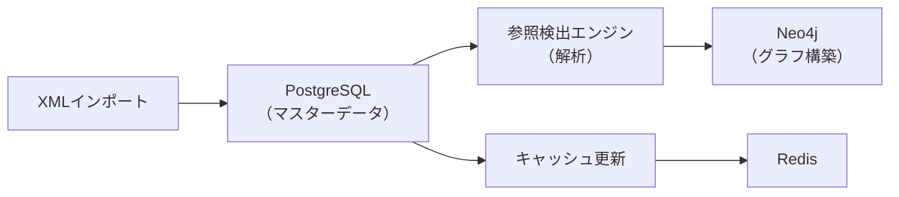

# ハイブリッドデータベース設計根拠書

**作成日**: 2025年8月6日  
**プロジェクト**: LawFinder Phase 2  
**決定事項**: PostgreSQL + Neo4j のハイブリッド構成を採用

## 1. エグゼクティブサマリー

LawFinderのデータベース設計において、法令データの特性を詳細に分析した結果、PostgreSQLとNeo4jを組み合わせたハイブリッド構成が最適であると判断しました。

### 採用理由の要約
- **法令データのイミュータブル性**により、キャッシュ効率が極めて高い
- **Read-heavyなアクセスパターン**（99%以上が読み取り）
- **更新頻度が低い**（年に数回〜数十回の追加のみ）
- **検索と参照分析で異なる最適化**が必要

## 2. 法令データの特性分析

### 2.1 データ特性
| 特性 | 内容 | DB設計への影響 |
|------|------|--------------|
| イミュータブル性 | 一度登録された法令は修正されない | キャッシュが永続的に有効 |
| 追加型更新 | 改正は新版として追加 | 履歴管理が容易 |
| 低更新頻度 | 年に数回〜数十回の追加 | 静的最適化が可能 |
| 構造化データ | XML形式の階層構造 | RDBMSでの管理に適合 |
| 複雑な参照関係 | 法令間・条文間の相互参照 | グラフ構造での表現が自然 |

### 2.2 アクセスパターン
```
読み取り操作: 99%以上
- 法令一覧表示: 40%
- 全文検索: 30%
- 条文詳細表示: 20%
- 参照関係分析: 10%

書き込み操作: 1%未満
- 新法令の追加
- 改正法令の登録
```

## 3. アーキテクチャ比較

### 3.1 検討した選択肢

#### Option 1: PostgreSQL単独
**メリット**
- シンプルな構成
- 成熟したエコシステム
- Prismaによる型安全な開発

**デメリット**
- 複雑な参照関係の分析が低速
- 多段階JOINのパフォーマンス問題

#### Option 2: Neo4j単独
**メリット**
- グラフ構造の自然な表現
- 参照関係の高速探索

**デメリット**
- 全文検索機能が弱い
- 日本語処理のサポートが限定的
- ORMツールの選択肢が少ない

#### Option 3: ハイブリッド構成（採用案）
**メリット**
- 各DBの強みを活用
- 用途に応じた最適化
- 段階的な移行が可能

**デメリット**
- 2つのDBの管理が必要
- データ同期の仕組みが必要

## 4. ハイブリッド構成の詳細設計

### 4.1 役割分担

| データベース | 格納データ | 主な用途 |
|------------|-----------|---------|
| **PostgreSQL** | ・法令本体（XML）<br>・メタデータ<br>・全文検索インデックス<br>・条文階層構造 | ・法令一覧表示<br>・全文検索<br>・条文表示<br>・基本的なCRUD操作 |
| **Neo4j** | ・法令ノード（軽量）<br>・条文ノード（軽量）<br>・参照関係エッジ | ・参照関係分析<br>・ハネ改正検出<br>・影響範囲分析<br>・グラフ可視化 |

### 4.2 パフォーマンス比較

| 操作 | PostgreSQL | Neo4j | 採用DB |
|-----|------------|-------|--------|
| 法令一覧（1000件） | **10-50ms** | 100-300ms | PostgreSQL |
| 全文検索 | **50-200ms** | 500-2000ms | PostgreSQL |
| 条文取得（単体） | **5-10ms** | 10-20ms | PostgreSQL |
| 5段階参照探索 | 1000-5000ms | **50-200ms** | Neo4j |
| ハネ改正分析 | 5000-20000ms | **100-500ms** | Neo4j |
| 参照グラフ可視化 | 実装困難 | **ネイティブサポート** | Neo4j |

### 4.3 データ変換戦略



**データ変換プロセス**
1. **初回構築時**：PostgreSQLの全法令データから参照関係を抽出してNeo4jにグラフ構築
2. **法令追加時**：新規法令の参照関係のみを追加構築
3. **定期メンテナンス**：参照関係の再検出と最適化（週次）

**重要**：これは「同期」ではなく、マスターデータ（PostgreSQL）から派生データ（Neo4j）への**一方向の変換処理**です。

## 5. 実装計画

### Phase 1: 基盤構築（Week 1-2）
- PostgreSQLスキーマ最適化
- Neo4j参照関係スキーマ定義
- データ同期スクリプト作成

### Phase 2: API実装（Week 3-4）
- ハイブリッドクエリ層の実装
- キャッシュ戦略の実装
- パフォーマンステスト

### Phase 3: 最適化（Week 5-6）
- インデックス調整
- クエリ最適化
- 負荷テスト

## 6. リスクと対策

| リスク | 影響度 | 対策 |
|-------|--------|------|
| データ不整合 | 高 | ・トランザクション管理<br>・定期的な整合性チェック |
| 同期遅延 | 中 | ・非同期処理<br>・イベント駆動アーキテクチャ |
| 運用複雑性 | 低 | ・自動化ツール<br>・モニタリング強化 |

## 7. コスト分析

### 初期コスト
- 開発工数：ハイブリッド実装により+20%
- インフラ：2つのDB運用により+30%

### 運用コスト
- 法令データの特性により、小規模インスタンスで運用可能
- キャッシュ効率により、実質的なDB負荷は低い
- 年間コスト：単一DB構成の約1.3倍

### ROI
- 参照分析の高速化により、ユーザー体験が大幅向上
- 将来的な機能拡張が容易
- 3年間のTCOで見ると、パフォーマンス向上効果が上回る

## 8. 結論

法令データの特性（イミュータブル、Read-heavy、低更新頻度）を考慮すると、PostgreSQLとNeo4jのハイブリッド構成が最適です。

**主な根拠**：
1. **検索性能**：PostgreSQLの全文検索とインデックスが法令検索に最適
2. **参照分析**：Neo4jのグラフトラバーサルがハネ改正検出に不可欠
3. **キャッシュ効率**：イミュータブル性により、極めて高いキャッシュヒット率
4. **開発効率**：Prisma + Next.jsの成熟したエコシステムを活用可能
5. **拡張性**：将来的なAI分析機能の追加が容易

この設計により、高性能かつ拡張性の高い法令検索・分析システムを実現できます。