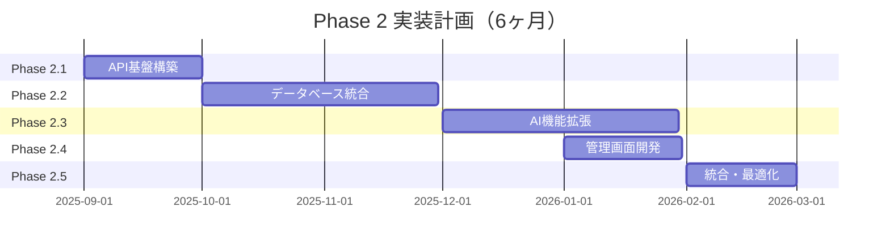

# LawFinder Phase 2 段階的機能拡張計画

**作成日**: 2025年8月4日  
**バージョン**: 1.0  
**プロジェクト名**: LawFinder Phase 2

## 1. Phase 2 概要

### 1.1 目的と背景

Phase 1で構築した静的法令閲覧サイトの成功を基に、法令改正支援システムとしての高度な機能を段階的に実装します。

**Phase 1の成果**:
- 10,000件の法令データを処理可能な静的サイト生成システム
- 複合参照パターンまで検出可能な高精度な参照抽出エンジン
- ローカルLLM統合による参照解析
- e-Gov準拠の直感的なUI

**Phase 2の目標**:
- リアルタイムな法令データ更新
- ハネ改正の自動検出と影響分析
- 管理者向けの高度な分析ツール
- APIによるシステム連携

### 1.2 段階的アプローチの利点

1. **リスク最小化**: 小さな単位で機能を追加し、各段階で検証
2. **早期価値提供**: 重要な機能から順次リリース
3. **フィードバック反映**: ユーザーの意見を取り入れながら開発
4. **技術的学習**: 新技術の導入を段階的に行い、チームの習熟度向上

## 2. 実装フェーズ計画

### 2.1 フェーズ分割と優先順位



### 2.2 各フェーズの詳細

#### Phase 2.1: API基盤構築（1ヶ月）

**目的**: 既存の静的サイト生成機能をAPI化し、動的なデータアクセスを可能にする

**実装項目**:
```typescript
// 1. 既存機能のAPI化
- GET /api/v1/laws - 法令一覧取得
- GET /api/v1/laws/:id - 特定法令取得
- GET /api/v1/laws/:id/articles/:num - 条文取得
- GET /api/v1/references/:lawId - 参照関係取得

// 2. 認証・認可
- POST /api/v1/auth/login - ログイン
- POST /api/v1/auth/refresh - トークン更新
- JWT認証ミドルウェア

// 3. 基本インフラ
- Express.jsサーバー設定
- エラーハンドリング
- ロギング（Winston）
- レート制限
```

**成果物**:
- RESTful APIサーバー
- OpenAPI仕様書
- 認証システム
- APIドキュメント

#### Phase 2.2: データベース統合（2ヶ月）

**目的**: 静的ファイルからデータベースへの移行により、高速な検索と分析を実現

**実装項目**:

1. **PostgreSQL（メタデータ管理）**
```sql
-- 主要テーブル
- laws（法令マスタ）
- articles（条文）
- amendments（改正履歴）
- users（ユーザー管理）
```

2. **Neo4j（参照関係グラフ）**
```cypher
-- ノードとリレーション
(:Law)-[:HAS_ARTICLE]->(:Article)
(:Article)-[:REFERENCES]->(:Article)
(:Amendment)-[:AFFECTS]->(:Article)
```

3. **Elasticsearch（全文検索）**
```json
{
  "mappings": {
    "properties": {
      "law_title": { "type": "text", "analyzer": "kuromoji" },
      "article_content": { "type": "text", "analyzer": "kuromoji" },
      "references": { "type": "nested" }
    }
  }
}
```

4. **データ移行**
- XMLファイルからのバッチインポート
- インデックス構築
- データ整合性チェック

**成果物**:
- マルチデータベース環境
- データ移行スクリプト
- バックアップ・リストア手順
- パフォーマンスベンチマーク

#### Phase 2.3: AI機能拡張（2ヶ月）

**目的**: ハネ改正検出と高度な参照解析を実現

**実装項目**:

1. **ハイブリッドAIシステム**
```typescript
class HybridAIAnalyzer {
  // ローカルLLM（既存のMistral）
  private localLLM: LocalLLMService;
  
  // OpenAI GPT-4o（新規追加）
  private openAI: OpenAIService;
  
  // コスト最適化ロジック
  async analyze(text: string, context: AnalysisContext) {
    // 1. 必ずローカルLLMで初回解析
    const localResult = await this.localLLM.analyze(text);
    
    // 2. 複雑なケースのみGPT-4oを使用
    if (this.needsAdvancedAnalysis(localResult)) {
      return await this.openAI.analyze(text, {
        systemPrompt: this.buildPrompt(context),
        maxTokens: 500
      });
    }
    
    return localResult;
  }
}
```

2. **ハネ改正検出エンジン**
```typescript
class AmendmentImpactAnalyzer {
  async analyzeImpact(amendment: Amendment) {
    // 1. 直接影響の検出
    const directImpacts = await this.findDirectReferences(amendment);
    
    // 2. 間接影響の検出（グラフ探索）
    const indirectImpacts = await this.neo4j.traverse({
      startNode: amendment.targetArticle,
      relationship: 'REFERENCES',
      maxDepth: 3
    });
    
    // 3. 影響度スコアリング
    return this.scoreImpacts(directImpacts, indirectImpacts);
  }
}
```

3. **自然言語クエリ**
- 「民法の成年に関する条文を教えて」
- 「会社法で取締役の責任について定めた条文は？」
- 「この改正で影響を受ける法令を一覧で」

**成果物**:
- ハイブリッドAIシステム
- ハネ改正検出API
- 自然言語検索機能
- AI使用量ダッシュボード

#### Phase 2.4: 管理画面開発（1ヶ月）

**目的**: 法令改正業務を支援する直感的な管理インターフェース

**実装項目**:

1. **React管理画面**
```typescript
// 主要コンポーネント
- LawEditor: 法令編集画面
- ReferenceGraph: 参照関係グラフビュー
- ImpactAnalyzer: 改正影響分析
- ReportGenerator: レポート生成
```

2. **主要機能**
- 法令データの検索・閲覧・編集
- 参照関係の視覚化（D3.js）
- 改正シミュレーション
- 影響分析レポート生成
- ユーザー管理

3. **UIフレームワーク**
- Next.js 14（App Router）
- Material-UI または Ant Design
- React Query（データフェッチング）
- Zustand（状態管理）

**成果物**:
- 管理者向けWebアプリケーション
- ユーザーマニュアル
- 操作トレーニング資料

#### Phase 2.5: 統合・最適化（1ヶ月）

**目的**: システム全体の統合テストと本番環境への準備

**実装項目**:

1. **パフォーマンス最適化**
- データベースクエリ最適化
- キャッシュ戦略の実装
- CDN設定
- 負荷テスト

2. **セキュリティ強化**
- ペネトレーションテスト
- OWASP Top 10対策
- データ暗号化
- 監査ログ

3. **運用準備**
- CI/CDパイプライン構築
- 監視・アラート設定
- バックアップ戦略
- 災害復旧計画

**成果物**:
- 本番環境
- 運用マニュアル
- SLA定義
- インシデント対応手順

## 3. 技術的実装詳細

### 3.1 既存コードの活用戦略

Phase 1で実装された以下のコンポーネントは、Phase 2でも継続利用：

```typescript
// 1. XMLパーサー（そのまま利用）
class XMLParser {
  parseLawXML(xmlContent: string): Law { /* 既存実装 */ }
}

// 2. 参照検出エンジン（API化して利用）
class ReferenceDetector {
  detectReferences(text: string): Reference[] { /* 既存実装 */ }
  detectComplexPatterns(text: string): ComplexReference[] { /* 既存実装 */ }
}

// 3. LLM統合（拡張して利用）
class LLMAnalyzer {
  // 既存のOllama/Mistral統合
  async analyzeWithLocalLLM(text: string): AnalysisResult { /* 既存実装 */ }
  
  // 新規追加：OpenAI統合
  async analyzeWithGPT4o(text: string): AnalysisResult { /* 新規実装 */ }
}
```

### 3.2 移行戦略

**段階的移行アプローチ**:

1. **並行稼働期間（2ヶ月）**
   - 静的サイトとAPIを並行運用
   - 段階的にトラフィックを移行
   - 問題発生時の切り戻し準備

2. **データ同期**
   - 初期は静的生成を継続
   - APIからも同じデータを提供
   - 徐々にリアルタイム更新へ移行

3. **ユーザー移行**
   - 新機能は管理者のみに提供
   - フィードバックを収集
   - 段階的に一般公開

### 3.3 コスト最適化

**AI利用コストの管理**:

```typescript
class CostOptimizer {
  private monthlyBudget = 100; // $100/月
  private usage = {
    localLLM: { calls: 0, cost: 0 },
    gpt4o: { calls: 0, cost: 0 }
  };
  
  async shouldUseGPT4o(complexity: number): boolean {
    // 複雑度が高く、予算に余裕がある場合のみGPT-4oを使用
    const remainingBudget = this.monthlyBudget - this.usage.gpt4o.cost;
    const estimatedCost = this.estimateCost(complexity);
    
    return complexity > 0.8 && estimatedCost < remainingBudget * 0.1;
  }
}
```

## 4. リスク管理と対策

### 4.1 技術的リスク

| リスク | 影響 | 可能性 | 対策 |
|--------|------|--------|------|
| データ移行の失敗 | 高 | 中 | 段階的移行、ロールバック計画 |
| API性能不足 | 高 | 中 | キャッシュ強化、負荷分散 |
| AI精度の低下 | 中 | 低 | ハイブリッドアプローチ、人的レビュー |
| セキュリティ侵害 | 高 | 低 | 定期監査、最新セキュリティ対策 |

### 4.2 プロジェクトリスク

| リスク | 影響 | 可能性 | 対策 |
|--------|------|--------|------|
| スケジュール遅延 | 中 | 高 | バッファ時間確保、優先順位付け |
| 予算超過 | 高 | 中 | 段階的投資、ROI測定 |
| 要件変更 | 中 | 高 | アジャイル開発、頻繁なレビュー |
| 人材不足 | 高 | 中 | 早期採用、外部リソース活用 |

## 5. 成功指標（KPI）

### 5.1 技術的指標

- **API応答時間**: 95パーセンタイルで1秒以内
- **システム稼働率**: 99.5%以上
- **ハネ改正検出精度**: 95%以上
- **データ処理速度**: 1法令あたり10秒以内

### 5.2 ビジネス指標

- **法令改正作業時間**: 50%削減
- **ユーザー満足度**: 4.0以上（5段階評価）
- **月間アクティブユーザー**: 1,000人以上
- **コスト削減効果**: 年間1,000万円以上

## 6. 次のステップ

### 6.1 即時実行項目

1. **技術選定の最終確認**
   - データベース製品の選定
   - クラウドプロバイダーの決定
   - 開発ツールの統一

2. **チーム編成**
   - 必要スキルの定義
   - 採用計画の策定
   - 役割分担の明確化

3. **詳細設計の開始**
   - データベーススキーマ設計
   - API仕様の詳細化
   - UI/UXデザイン

### 6.2 準備事項

1. **環境構築**
   - 開発環境の整備
   - CI/CDパイプライン
   - 監視ツールの導入

2. **ドキュメント整備**
   - 技術仕様書
   - 運用手順書
   - トレーニング資料

3. **ステークホルダー調整**
   - 予算承認
   - リソース確保
   - スケジュール合意

## 7. まとめ

Phase 2の段階的機能拡張計画は、Phase 1の成功を基盤として、より高度な法令改正支援システムを実現します。段階的アプローチにより、リスクを最小化しながら確実に価値を提供し、最終的には法令改正業務の大幅な効率化を実現します。

各フェーズで明確な成果物を定義し、継続的な検証とフィードバックを行うことで、プロジェクトの成功を確実なものとします。