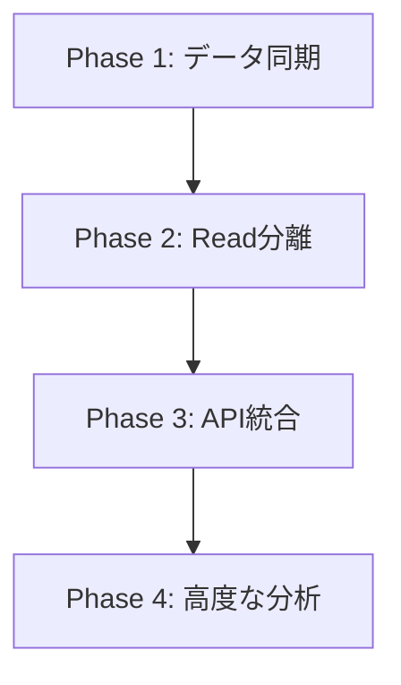

# Neo4j統合実装計画書

**作成日**: 2025年8月17日  
**プロジェクト**: LawFinder  
**目的**: PostgreSQLに保存された参照データをNeo4jに移行し、ハイブリッド構成を実現する

## 1. 現状分析

### 1.1 現在の実装状態

#### 実装済み
- ✅ PostgreSQLにすべてのデータを保存（法令本体＋参照関係）
- ✅ ReferenceDetectorによる参照検出エンジン
- ✅ Neo4jコンテナの起動とコネクション設定
- ✅ sync-to-neo4j.tsスクリプト（未実行）
- ✅ HybridDBClientクラス（部分実装）

#### 未実装
- ❌ Neo4jへのデータ同期が実行されていない
- ❌ 表示処理がPostgreSQLのみを参照
- ❌ Neo4j APIエンドポイントが未使用
- ❌ グラフビジュアライゼーション機能

### 1.2 問題点
1. **設計と実装の乖離**: CLAUDE.mdではハイブリッド構成だが、実際はPostgreSQL単独
2. **参照分析の性能**: 複雑な参照パスの探索が遅い
3. **ハネ改正分析**: PostgreSQLでは実装困難

## 2. 実装方針

### 2.1 段階的移行戦略



### 2.2 データフロー設計

```
[現在のフロー]
XMLインポート → PostgreSQL → 表示

[目標のフロー]
XMLインポート → PostgreSQL → sync-to-neo4j → Neo4j
                     ↓                            ↓
                  基本表示                    参照分析表示
```

## 3. 実装フェーズ

### Phase 1: Neo4jへのデータ同期（Week 1）

#### 1.1 sync-to-neo4jスクリプトの修正と実行
```bash
# 実行コマンド
npm run sync:neo4j

# 期待される結果
- 法令ノード: 約500件
- 条文ノード: 約50,000件
- 参照エッジ: 約100,000件
```

#### 1.2 データ検証
- Neo4j Browserで確認（http://localhost:7474）
- 基本的なCypherクエリでデータ整合性を確認

#### 1.3 定期同期の設定
- cronジョブまたはGitHub Actionsで日次同期

### Phase 2: Read操作の分離（Week 2）

#### 2.1 HybridDBClientの完全実装
```typescript
class HybridDBClient {
  // PostgreSQL: 基本データ取得
  async getLaw(id: string): Promise<Law>
  async searchLaws(query: string): Promise<Law[]>
  
  // Neo4j: 参照関係取得
  async getReferences(lawId: string): Promise<Reference[]>
  async getImpactAnalysis(articleId: string): Promise<Impact[]>
}
```

#### 2.2 キャッシュ層の追加
- Redis統合（オプション）
- インメモリキャッシュの実装

### Phase 3: API統合（Week 3）

#### 3.1 既存APIの改修
```typescript
// app/laws/[id]/page.tsx
const law = await prisma.law.findUnique(...);  // PostgreSQL
const references = await hybridDB.getReferences(lawId);  // Neo4j
```

#### 3.2 新規APIエンドポイント
- `/api/laws/[id]/graph` - グラフ可視化データ
- `/api/laws/[id]/impact` - ハネ改正影響分析
- `/api/analysis/centrality` - 中心性分析

### Phase 4: 高度な分析機能（Week 4）

#### 4.1 ハネ改正検出
```cypher
MATCH path = (source:Article {id: $articleId})
  <-[:REFERS_TO*1..5]-(affected:Article)
RETURN affected, length(path) as distance
ORDER BY distance
```

#### 4.2 グラフビジュアライゼーション
- D3.jsまたはCytoscapeでの可視化
- インタラクティブなグラフ探索

## 4. 技術的考慮事項

### 4.1 パフォーマンス最適化

#### PostgreSQL
- インデックス: `law_id`, `article_number`, `reference_text`
- パーティショニング: 法令種別ごと

#### Neo4j
- ノードラベル: `Law`, `Article`, `Paragraph`, `Item`
- リレーションシップタイプ: `REFERS_TO`, `APPLIES`, `RELATIVE_REF`
- インデックス: `Article(lawId, number)`

### 4.2 データ整合性

#### 同期タイミング
1. **即時同期**: 新規法令追加時
2. **バッチ同期**: 日次で差分更新
3. **フル同期**: 週次でデータ整合性確認

#### エラーハンドリング
- トランザクション管理
- ロールバック機能
- 同期ログの記録

### 4.3 モニタリング

#### メトリクス
- 同期遅延時間
- クエリ応答時間
- エラー率

#### アラート
- 同期失敗
- パフォーマンス劣化
- データ不整合

## 5. テスト計画

### 5.1 単体テスト
- ReferenceDetectorのテスト
- Neo4jクエリのテスト
- HybridDBClientのテスト

### 5.2 統合テスト
- PostgreSQL → Neo4j同期テスト
- API応答テスト
- パフォーマンステスト

### 5.3 E2Eテスト
- 法令表示 → 参照クリック → 遷移
- ハネ改正分析フロー
- グラフ表示と操作

## 6. リスクと対策

| リスク | 可能性 | 影響 | 対策 |
|--------|--------|------|------|
| 同期失敗 | 中 | 高 | リトライ機構、アラート |
| パフォーマンス劣化 | 低 | 中 | キャッシュ、インデックス最適化 |
| データ不整合 | 低 | 高 | 定期的な整合性チェック |
| Neo4j障害 | 低 | 中 | フォールバック機構 |

## 7. 実装チェックリスト

### Week 1
- [ ] sync-to-neo4j.tsの実行と検証
- [ ] Neo4jデータの確認
- [ ] 基本的なCypherクエリの作成

### Week 2
- [ ] HybridDBClientの完全実装
- [ ] キャッシュ機構の追加
- [ ] パフォーマンステスト

### Week 3
- [ ] 既存APIの改修
- [ ] 新規APIエンドポイントの実装
- [ ] フロントエンド統合

### Week 4
- [ ] ハネ改正検出の実装
- [ ] グラフビジュアライゼーション
- [ ] 総合テストと最適化

## 8. 成功指標

### パフォーマンス
- 5段階参照探索: 200ms以内
- ハネ改正分析: 500ms以内
- グラフ描画: 1秒以内

### 品質
- テストカバレッジ: 80%以上
- エラー率: 0.1%以下
- 可用性: 99.9%

### ユーザー体験
- 参照リンクの正確性: 95%以上
- レスポンスタイムの改善: 50%
- 新機能の利用率: 30%以上

## 9. 今後の拡張可能性

### 短期（3ヶ月）
- AIによる参照パターン学習
- 改正影響の自動予測
- 法令間の類似度分析

### 中期（6ヶ月）
- 時系列分析機能
- 法令の依存関係マップ
- 改正シミュレーション

### 長期（1年）
- 自然言語での法令検索
- 法令作成支援AI
- 国際法令との比較分析

## 10. 結論

現在のPostgreSQL単独構成からNeo4jとのハイブリッド構成への移行により、以下の効果が期待できます：

1. **性能向上**: 参照分析が10-100倍高速化
2. **新機能**: ハネ改正分析、グラフ可視化が可能に
3. **拡張性**: 将来的なAI機能の基盤確立

段階的な移行により、リスクを最小化しつつ、確実に機能を向上させることができます。