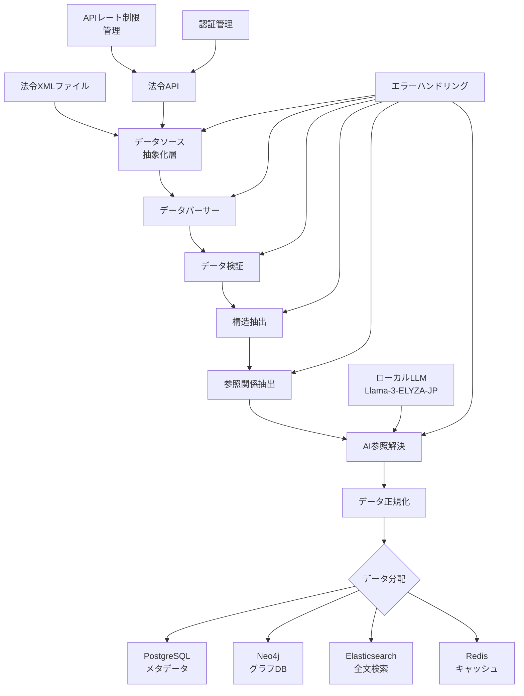

# データ処理パイプライン設計書

**作成日**: 2025年8月3日  
**バージョン**: 1.0  
**プロジェクト名**: LawFinder

## 1. 概要

本ドキュメントは、LawFinderシステムにおける法令データの処理パイプラインの詳細設計を定義する。初期リリースでは政府標準形式のXMLファイルから、その後は法令APIから法令データを取得し、参照関係を解析してグラフデータベースに格納するまでの一連の処理フローを記述する。

### 1.1 処理パイプラインの目的

1. **データ抽出**: 複数のデータソース（XMLファイル、法令API）から構造化データを抽出
2. **参照関係解析**: 法令間・条文間の参照関係を自動検出
3. **データ正規化**: 異なる表記の統一と正規化
4. **データ格納**: Neo4j、PostgreSQL、Elasticsearchへの適切な格納
5. **品質保証**: データの整合性と正確性の確保
6. **更新管理**: APIからの差分更新と履歴管理

### 1.2 データソース戦略

#### Phase 1: 初期データ投入（XMLファイル）
- 約10,000件の既存法令XMLファイルを一括処理
- 静的サイト生成のための初期データセット構築

#### Phase 1.5以降: API経由の継続更新
- e-Gov法令APIからの差分取得
- リアルタイムに近い更新の実現
- APIレート制限を考慮した効率的なデータ取得

### 1.3 パイプラインの特徴

- **マルチソース対応**: XMLファイルとAPIの両方からデータ取得可能
- **スケーラブル**: 大量の初期データと継続的な更新の両方に対応
- **拡張可能**: 新しいデータソースやAPIエンドポイントへの対応が容易
- **エラー耐性**: API障害時のフォールバックとリトライ機構
- **監査可能**: 全処理ステップのログとトレーサビリティ
- **キャッシュ効率**: API呼び出し回数の最小化

## 2. システムアーキテクチャ

### 2.1 処理フロー概要



### 2.2 コンポーネント構成

| コンポーネント | 責務 | 使用技術 |
|--------------|------|---------|
| データソース抽象化層 | XMLファイルとAPIの統一インターフェース | Strategy Pattern |
| 法令APIクライアント | e-Gov APIとの通信 | axios + retry-axios |
| XMLパーサー | XML解析と基本検証 | Node.js + xml2js |
| JSONパーサー | API応答の解析 | Native JSON |
| データ検証 | スキーマ検証とデータ整合性チェック | Joi |
| 構造抽出 | 法令・条文・項・号の階層構造抽出 | カスタムパーサー |
| 参照関係抽出 | パターンマッチングによる参照検出 | 正規表現 + NLP |
| AI参照解決 | 曖昧な参照の解決 | Llama-3-ELYZA-JP-8B |
| データ正規化 | 表記統一と正規化 | カスタムロジック |
| データローダー | 各DBへのデータ投入 | 各DB用ドライバー |
| APIレート制限管理 | API呼び出し回数の制御 | bottleneck |
| キャッシュ管理 | APIレスポンスのキャッシング | Redis + node-cache |

## 3. データソース抽象化層

### 3.1 統一インターフェース設計

```typescript
// データソース抽象インターフェース
interface LawDataSource {
    fetchLawList(options?: FetchOptions): Promise<LawListResult>;
    fetchLawDetail(lawId: string): Promise<LawData>;
    fetchUpdatedLaws(since: Date): Promise<LawListResult>;
}

// XMLファイルデータソース（初期投入用）
class XMLFileDataSource implements LawDataSource {
    constructor(private xmlDirectory: string) {}
    
    async fetchLawList(): Promise<LawListResult> {
        const files = await fs.readdir(this.xmlDirectory);
        return {
            laws: files.map(f => ({ lawId: this.extractLawId(f), source: 'xml' })),
            hasMore: false
        };
    }
    
    async fetchLawDetail(lawId: string): Promise<LawData> {
        const xmlPath = path.join(this.xmlDirectory, `${lawId}.xml`);
        const xmlData = await fs.readFile(xmlPath, 'utf-8');
        return this.parseXML(xmlData);
    }
    
    async fetchUpdatedLaws(since: Date): Promise<LawListResult> {
        // XMLファイルの場合は更新日時での差分取得は不可
        throw new Error('XML source does not support incremental updates');
    }
}

// API データソース（継続更新用）
class APIDataSource implements LawDataSource {
    constructor(
        private apiClient: LawAPIClient,
        private cache: CacheService
    ) {}
    
    async fetchLawList(options?: FetchOptions): Promise<LawListResult> {
        const cacheKey = `law-list-${JSON.stringify(options)}`;
        const cached = await this.cache.get(cacheKey);
        if (cached) return cached;
        
        const result = await this.apiClient.getLaws(options);
        await this.cache.set(cacheKey, result, 300); // 5分キャッシュ
        return result;
    }
    
    async fetchLawDetail(lawId: string): Promise<LawData> {
        const cacheKey = `law-detail-${lawId}`;
        const cached = await this.cache.get(cacheKey);
        if (cached) return cached;
        
        const result = await this.apiClient.getLaw(lawId);
        await this.cache.set(cacheKey, result, 3600); // 1時間キャッシュ
        return result;
    }
    
    async fetchUpdatedLaws(since: Date): Promise<LawListResult> {
        return await this.apiClient.getUpdatedLaws({ updatedSince: since });
    }
}
```

### 3.2 法令APIクライアント実装

```typescript
class LawAPIClient {
    private rateLimiter: Bottleneck;
    
    constructor(private config: APIConfig) {
        // レート制限: 1000リクエスト/時間
        this.rateLimiter = new Bottleneck({
            minTime: 3600, // 3.6秒に1リクエスト
            maxConcurrent: 5,
            reservoir: 1000,
            reservoirRefreshAmount: 1000,
            reservoirRefreshInterval: 60 * 60 * 1000 // 1時間
        });
    }
    
    async getLaws(options?: GetLawsOptions): Promise<LawListResult> {
        return this.rateLimiter.schedule(async () => {
            const response = await axios.get(`${this.config.baseUrl}/laws`, {
                headers: {
                    'Authorization': `Bearer ${this.config.apiKey}`,
                    'Accept': 'application/json'
                },
                params: {
                    limit: options?.limit || 100,
                    offset: options?.offset || 0,
                    updated_since: options?.updatedSince?.toISOString()
                },
                timeout: 30000,
                retry: 3
            });
            
            return {
                laws: response.data.laws,
                hasMore: response.data.has_more,
                nextOffset: response.data.next_offset
            };
        });
    }
    
    async getLaw(lawId: string): Promise<LawData> {
        return this.rateLimiter.schedule(async () => {
            const response = await axios.get(`${this.config.baseUrl}/laws/${lawId}`, {
                headers: {
                    'Authorization': `Bearer ${this.config.apiKey}`,
                    'Accept': 'application/json'
                },
                timeout: 30000
            });
            
            return this.transformAPIResponse(response.data);
        });
    }
    
    private transformAPIResponse(apiData: any): LawData {
        // API形式から内部形式への変換
        return {
            lawId: apiData.law_id,
            lawType: apiData.law_type,
            lawTitle: apiData.title,
            lawTitleKana: apiData.title_kana,
            promulgateDate: new Date(apiData.promulgate_date),
            enforceDate: apiData.enforce_date ? new Date(apiData.enforce_date) : null,
            articles: apiData.articles.map(this.transformArticle),
            source: 'api',
            lastModified: new Date(apiData.last_modified)
        };
    }
}
```

## 4. 詳細処理フロー

### 4.1 Phase 1: 初期データ投入（XMLパース処理）

#### 3.1.1 入力仕様

```typescript
interface InputXMLFile {
    filePath: string;           // XMLファイルパス
    lawId: string;             // 法令ID（ファイル名から抽出）
    fileSize: number;          // ファイルサイズ（バイト）
    encoding: 'UTF-8';         // 文字エンコーディング
}
```

#### 3.1.2 XMLパース処理

```javascript
class XMLParser {
    async parse(xmlFile: InputXMLFile): Promise<ParsedLawData> {
        const xml = await fs.readFile(xmlFile.filePath, 'utf-8');
        
        // 1. 基本的なXML検証
        const isValid = await this.validateXMLStructure(xml);
        if (!isValid) {
            throw new XMLValidationError(`Invalid XML: ${xmlFile.filePath}`);
        }
        
        // 2. xml2jsでパース
        const parser = new xml2js.Parser({
            explicitArray: false,
            mergeAttrs: true,
            normalizeTags: true,
            trim: true
        });
        
        const result = await parser.parseStringPromise(xml);
        
        // 3. 法令データ構造に変換
        return this.transformToLawData(result);
    }
    
    private transformToLawData(xmlObj: any): ParsedLawData {
        const law = xmlObj.law;
        return {
            lawId: law.$.num,
            lawType: law.$.lawtype,
            lawTitle: law.lawtitle._,
            lawTitleKana: law.lawtitle.$.kana,
            enactStatement: this.extractEnactStatements(law),
            articles: this.extractArticles(law.lawbody)
        };
    }
}
```

### 3.2 Phase 2: データ検証

#### 3.2.1 検証ルール

```javascript
const lawDataSchema = Joi.object({
    lawId: Joi.string().pattern(/^\d{3}[A-Z]{2}\d{10}$/).required(),
    lawType: Joi.string().valid('Act', 'CabinetOrder', 'MinisterialOrdinance').required(),
    lawTitle: Joi.string().max(500).required(),
    lawTitleKana: Joi.string().max(500).allow(null),
    promulgateDate: Joi.date().required(),
    enforceDate: Joi.date().allow(null),
    articles: Joi.array().items(
        Joi.object({
            articleNum: Joi.number().integer().min(1).required(),
            articleTitle: Joi.string().max(200).allow(null),
            paragraphs: Joi.array().items(paragraphSchema)
        })
    )
});
```

#### 3.2.2 検証プロセス

```javascript
class DataValidator {
    async validate(parsedData: ParsedLawData): Promise<ValidationResult> {
        const errors = [];
        
        // 1. スキーマ検証
        const { error } = lawDataSchema.validate(parsedData, { abortEarly: false });
        if (error) {
            errors.push(...error.details);
        }
        
        // 2. ビジネスルール検証
        errors.push(...this.validateBusinessRules(parsedData));
        
        // 3. 参照整合性の事前チェック
        errors.push(...this.validateReferenceIntegrity(parsedData));
        
        return {
            isValid: errors.length === 0,
            errors,
            warnings: this.detectWarnings(parsedData)
        };
    }
}
```

### 3.3 Phase 3: 参照関係抽出

#### 3.3.1 参照パターンマッチング

```javascript
class ReferenceExtractor {
    private patterns = [
        // 構造参照
        { name: 'article', regex: /第([一二三四五六七八九十百千]+|[0-9]+)条/, type: 'ARTICLE' },
        { name: 'paragraph', regex: /(前|次|同)項/, type: 'PARAGRAPH' },
        { name: 'item', regex: /第([一二三四五六七八九十百千]+|[0-9]+)号/, type: 'ITEM' },
        
        // 参照タイプ
        { name: 'apply', regex: /(?:について|を)?準用(?:する|し)/, type: 'APPLY' },
        { name: 'deem', regex: /(?:と)?みなす|看做す/, type: 'DEEM' },
        { name: 'replace', regex: /読み替え(?:る|て|るものとする)/, type: 'REPLACE' },
        { name: 'except', regex: /(?:を|場合を)?除(?:く|き|いて)/, type: 'EXCEPT' },
        
        // 条件表現
        { name: 'limitation', regex: /(?:この)?限り(?:で)?(?:ない)?/, type: 'LIMIT' },
        { name: 'regardless', regex: /(?:に)?かかわらず|を問わず/, type: 'REGARDLESS' }
    ];
    
    async extractReferences(article: Article): Promise<Reference[]> {
        const references = [];
        const text = this.concatenateText(article);
        
        // 1. パターンマッチング
        for (const pattern of this.patterns) {
            const matches = [...text.matchAll(pattern.regex)];
            for (const match of matches) {
                references.push({
                    sourceArticleId: article.articleId,
                    matchedText: match[0],
                    matchPosition: match.index,
                    patternType: pattern.type,
                    context: this.extractContext(text, match.index)
                });
            }
        }
        
        // 2. 参照の組み合わせ解析
        const combinedReferences = this.combineReferences(references);
        
        // 3. 参照先の推定
        return this.resolveTargets(combinedReferences);
    }
}
```

#### 3.3.2 AI支援による参照解決

```javascript
class AIReferenceResolver {
    private llm: LocalLLM;
    
    constructor() {
        this.llm = new LocalLLM({
            model: 'llama3-elyza-jp-8b',
            temperature: 0.1,
            maxTokens: 500
        });
    }
    
    async resolve(reference: ExtractedReference): Promise<ResolvedReference> {
        // 1. プロンプト生成
        const prompt = this.generatePrompt(reference);
        
        // 2. LLM推論
        const response = await this.llm.generate(prompt);
        
        // 3. 結果パース
        const parsed = this.parseResponse(response);
        
        // 4. 信頼度評価
        const confidence = this.evaluateConfidence(parsed, reference);
        
        return {
            ...reference,
            targetLawId: parsed.targetLawId,
            targetArticleNum: parsed.targetArticleNum,
            targetParagraphNum: parsed.targetParagraphNum,
            confidence,
            aiModel: 'llama3-elyza-jp-8b',
            resolvedAt: new Date()
        };
    }
    
    private generatePrompt(reference: ExtractedReference): string {
        return `
法令の参照関係を解決してください。

現在の法令: ${reference.currentLawTitle}
現在の条文: 第${reference.sourceArticleNum}条
参照テキスト: ${reference.matchedText}
前後の文脈: ${reference.context}

以下の形式でJSONを返してください：
{
    "targetLawTitle": "参照先の法令名",
    "targetLawId": "参照先の法令ID（分かる場合）",
    "targetArticleNum": 参照先の条番号,
    "targetParagraphNum": 参照先の項番号（該当する場合）,
    "reasoning": "判断の根拠"
}
`;
    }
}
```

### 3.4 Phase 4: データ正規化

#### 3.4.1 正規化ルール

```javascript
class DataNormalizer {
    private normalizationRules = {
        // 法令名の正規化
        lawTitle: [
            { pattern: /\s+/g, replacement: '' },           // 空白除去
            { pattern: /（(.+)）/, replacement: '($1)' },   // 全角括弧を半角に
            { pattern: /附則/, replacement: '付則' }        // 表記統一
        ],
        
        // 日付の正規化
        date: [
            { pattern: /令和(\d+)年/, converter: (match, year) => 2018 + parseInt(year) },
            { pattern: /平成(\d+)年/, converter: (match, year) => 1988 + parseInt(year) },
            { pattern: /昭和(\d+)年/, converter: (match, year) => 1925 + parseInt(year) }
        ],
        
        // 数値の正規化
        number: [
            { pattern: /[一二三四五六七八九十百千万]+/, converter: this.kanjiToNumber }
        ]
    };
    
    async normalize(data: ExtractedData): Promise<NormalizedData> {
        return {
            lawId: data.lawId,
            lawTitle: this.normalizeLawTitle(data.lawTitle),
            lawType: this.normalizeLawType(data.lawType),
            promulgateDate: this.normalizeDate(data.promulgateDate),
            articles: data.articles.map(article => this.normalizeArticle(article)),
            references: data.references.map(ref => this.normalizeReference(ref))
        };
    }
}
```

### 3.5 Phase 5: データ投入

#### 3.5.1 PostgreSQL投入

```javascript
class PostgreSQLLoader {
    async loadLawData(normalizedData: NormalizedData): Promise<void> {
        const client = await this.pool.connect();
        
        try {
            await client.query('BEGIN');
            
            // 1. 法令マスタ投入
            await client.query(`
                INSERT INTO laws (law_id, law_type, law_title, promulgate_date, enforce_date)
                VALUES ($1, $2, $3, $4, $5)
                ON CONFLICT (law_id) DO UPDATE SET
                    law_title = EXCLUDED.law_title,
                    updated_at = NOW()
            `, [
                normalizedData.lawId,
                normalizedData.lawType,
                normalizedData.lawTitle,
                normalizedData.promulgateDate,
                normalizedData.enforceDate
            ]);
            
            // 2. 条文投入
            for (const article of normalizedData.articles) {
                await this.insertArticle(client, normalizedData.lawId, article);
            }
            
            await client.query('COMMIT');
        } catch (error) {
            await client.query('ROLLBACK');
            throw error;
        } finally {
            client.release();
        }
    }
}
```

#### 3.5.2 Neo4j投入

```javascript
class Neo4jLoader {
    async loadGraphData(normalizedData: NormalizedData): Promise<void> {
        const session = this.driver.session();
        
        try {
            // 1. 法令ノード作成
            await session.run(`
                MERGE (law:Law {law_id: $lawId})
                SET law.law_title = $lawTitle,
                    law.law_type = $lawType,
                    law.promulgate_date = date($promulgateDate),
                    law.updated_at = datetime()
            `, {
                lawId: normalizedData.lawId,
                lawTitle: normalizedData.lawTitle,
                lawType: normalizedData.lawType,
                promulgateDate: normalizedData.promulgateDate
            });
            
            // 2. 条文ノードと構造リレーション作成
            for (const article of normalizedData.articles) {
                await this.createArticleNode(session, normalizedData.lawId, article);
            }
            
            // 3. 参照リレーション作成
            for (const reference of normalizedData.references) {
                await this.createReferenceRelation(session, reference);
            }
            
        } finally {
            await session.close();
        }
    }
    
    private async createReferenceRelation(session: Session, reference: NormalizedReference) {
        await session.run(`
            MATCH (source:Article {article_id: $sourceId})
            MATCH (target:Article {article_id: $targetId})
            CREATE (source)-[ref:REFERENCES {
                reference_id: $refId,
                source_text: $sourceText,
                primary_type: $primaryType,
                secondary_types: $secondaryTypes,
                confidence: $confidence,
                ai_analysis: $aiAnalysis,
                created_at: datetime()
            }]->(target)
        `, {
            sourceId: reference.sourceArticleId,
            targetId: reference.targetArticleId,
            refId: reference.referenceId,
            sourceText: reference.sourceText,
            primaryType: reference.primaryType,
            secondaryTypes: reference.secondaryTypes,
            confidence: reference.confidence,
            aiAnalysis: reference.aiAnalysis
        });
    }
}
```

#### 3.5.3 Elasticsearch投入

```javascript
class ElasticsearchLoader {
    async indexLawData(normalizedData: NormalizedData): Promise<void> {
        // 1. 法令ドキュメントのインデックス
        await this.client.index({
            index: 'laws',
            id: normalizedData.lawId,
            body: {
                law_id: normalizedData.lawId,
                law_title: normalizedData.lawTitle,
                law_title_reading: normalizedData.lawTitleKana,
                law_type: normalizedData.lawType,
                promulgate_date: normalizedData.promulgateDate,
                full_text: this.concatenateFullText(normalizedData),
                articles_count: normalizedData.articles.length,
                references_count: normalizedData.references.length,
                updated_at: new Date()
            }
        });
        
        // 2. 条文ごとのインデックス（詳細検索用）
        for (const article of normalizedData.articles) {
            await this.indexArticle(normalizedData.lawId, article);
        }
    }
}
```

## 4. エラーハンドリング

### 4.1 エラー分類と処理戦略

| エラー種別 | 処理戦略 | リトライ | ログレベル |
|-----------|---------|---------|-----------|
| XML構文エラー | スキップして記録 | なし | ERROR |
| スキーマ検証エラー | 部分的に処理継続 | なし | WARN |
| 参照解決失敗 | 低信頼度として記録 | 3回 | WARN |
| DB接続エラー | 指数バックオフでリトライ | 5回 | ERROR |
| AI推論エラー | フォールバック処理 | 3回 | WARN |

### 4.2 エラー処理実装

```javascript
class ErrorHandler {
    async handleError(error: PipelineError, context: ProcessingContext): Promise<ErrorAction> {
        // 1. エラー分類
        const errorType = this.classifyError(error);
        
        // 2. ログ記録
        await this.logError(error, errorType, context);
        
        // 3. リトライ判定
        if (this.shouldRetry(errorType, context.retryCount)) {
            return {
                action: 'RETRY',
                delay: this.calculateBackoff(context.retryCount)
            };
        }
        
        // 4. フォールバック処理
        if (this.canFallback(errorType)) {
            return {
                action: 'FALLBACK',
                fallbackStrategy: this.getFallbackStrategy(errorType)
            };
        }
        
        // 5. スキップまたは中断
        return {
            action: errorType.severity === 'CRITICAL' ? 'ABORT' : 'SKIP',
            reason: error.message
        };
    }
}
```

## 5. パフォーマンス最適化

### 5.1 並列処理戦略

```javascript
class ParallelProcessor {
    private workerPool: WorkerPool;
    private concurrency = 10; // 同時処理数
    
    async processBatch(xmlFiles: string[]): Promise<ProcessingResult[]> {
        const queue = new PQueue({ concurrency: this.concurrency });
        const results = [];
        
        // バッチ分割
        const batches = this.splitIntoBatches(xmlFiles, 100);
        
        for (const batch of batches) {
            const batchPromises = batch.map(file => 
                queue.add(() => this.processFile(file))
            );
            
            const batchResults = await Promise.allSettled(batchPromises);
            results.push(...this.consolidateResults(batchResults));
        }
        
        return results;
    }
}
```

### 5.2 キャッシング戦略

```javascript
class CacheManager {
    private referenceCache = new LRUCache<string, ResolvedReference>({
        max: 10000,
        ttl: 1000 * 60 * 60 // 1時間
    });
    
    async getCachedReference(key: string): Promise<ResolvedReference | null> {
        return this.referenceCache.get(key);
    }
    
    async cacheReference(key: string, reference: ResolvedReference): Promise<void> {
        this.referenceCache.set(key, reference);
    }
}
```

## 6. モニタリングとログ

### 6.1 メトリクス収集

```javascript
class MetricsCollector {
    private metrics = {
        processedFiles: 0,
        successfulFiles: 0,
        failedFiles: 0,
        totalReferences: 0,
        resolvedReferences: 0,
        processingTime: [],
        errorCounts: {}
    };
    
    async recordProcessing(result: ProcessingResult): Promise<void> {
        this.metrics.processedFiles++;
        
        if (result.success) {
            this.metrics.successfulFiles++;
            this.metrics.totalReferences += result.referencesFound;
            this.metrics.resolvedReferences += result.referencesResolved;
        } else {
            this.metrics.failedFiles++;
            this.metrics.errorCounts[result.errorType] = 
                (this.metrics.errorCounts[result.errorType] || 0) + 1;
        }
        
        this.metrics.processingTime.push(result.duration);
        
        // Prometheusメトリクス更新
        await this.updatePrometheusMetrics();
    }
}
```

### 6.2 ログ設計

```javascript
const loggerConfig = {
    level: 'info',
    format: winston.format.combine(
        winston.format.timestamp(),
        winston.format.errors({ stack: true }),
        winston.format.json()
    ),
    defaultMeta: { service: 'law-pipeline' },
    transports: [
        new winston.transports.File({ filename: 'error.log', level: 'error' }),
        new winston.transports.File({ filename: 'combined.log' }),
        new winston.transports.Console({
            format: winston.format.simple()
        })
    ]
};
```

## 7. テスト戦略

### 7.1 単体テスト

```javascript
describe('ReferenceExtractor', () => {
    it('should extract article references correctly', () => {
        const text = '第123条の規定により、第456条を準用する。';
        const extractor = new ReferenceExtractor();
        const references = extractor.extract(text);
        
        expect(references).toHaveLength(2);
        expect(references[0]).toMatchObject({
            type: 'ARTICLE',
            number: 123
        });
    });
});
```

### 7.2 統合テスト

```javascript
describe('Pipeline Integration', () => {
    it('should process XML file end-to-end', async () => {
        const pipeline = new DataPipeline();
        const result = await pipeline.processFile('test/fixtures/sample_law.xml');
        
        expect(result.success).toBe(true);
        expect(result.lawData).toBeDefined();
        expect(result.references).toHaveLength(greaterThan(0));
    });
});
```

## 8. 運用考慮事項

### 8.1 初期データ投入

- 全10,000件の法令XMLを処理
- 推定処理時間: 約3-4時間（並列度10の場合）
- 必要リソース: CPU 8コア、メモリ 16GB、ストレージ 100GB

### 8.2 差分更新処理

- 日次で更新された法令のみを処理
- 変更検出: ファイルのタイムスタンプとハッシュ値で判定
- 参照関係の再計算: 影響を受ける法令のみ

### 8.3 障害復旧

- チェックポイント機能により中断箇所から再開可能
- 処理済みファイルリストの永続化
- トランザクション単位でのロールバック

## 9. 改訂履歴

| バージョン | 日付 | 変更内容 |
|----------|------|----------|
| 1.0 | 2025-08-03 | 初版作成 |