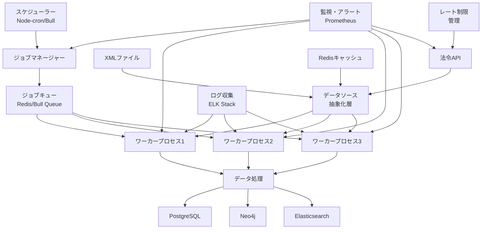

# バッチ処理設計書

**作成日**: 2025年8月3日  
**バージョン**: 1.0  
**プロジェクト名**: LawFinder

## 1. 概要

本ドキュメントは、LawFinderシステムにおけるバッチ処理の詳細設計を定義する。定期的なデータ更新、参照関係の再計算、データ品質の維持など、システムの継続的な運用に必要なバッチ処理を設計する。

### 1.1 バッチ処理の目的

1. **データ鮮度の維持**: 初期はXMLファイル、運用後は法令APIからの定期的な取得と更新
2. **参照関係の精度向上**: AI解析結果の継続的な改善
3. **データ整合性の確保**: 各データストア間の同期と整合性チェック
4. **パフォーマンス最適化**: インデックスの再構築とデータの最適化
5. **監査とコンプライアンス**: ログの集約と監査レポートの生成
6. **API利用の最適化**: レート制限の遵守とキャッシュ効率の向上

### 1.2 処理分類

| 分類 | 実行頻度 | 主な処理 |
|-----|---------|---------|
| 日次バッチ | 毎日深夜 | 法令データ更新（XML/API）、差分同期、APIキャッシュ更新 |
| 時間バッチ | 毎時 | API経由の法令更新チェック、レート制限リセット |
| 週次バッチ | 週末 | 参照関係の再検証、データ最適化、API利用統計 |
| 月次バッチ | 月末 | 統計情報生成、アーカイブ、API利用レポート |
| オンデマンド | 必要時 | 全文再インデックス、緊急修正、初期データ投入 |

## 2. バッチ処理アーキテクチャ

### 2.1 システム構成



### 2.2 技術スタック

| コンポーネント | 技術 | 用途 |
|--------------|------|------|
| スケジューラー | node-cron | 定期実行のスケジューリング |
| ジョブキュー | Bull (Redis) | ジョブの管理と分散処理 |
| ワーカー | Node.js Worker Threads | 並列処理 |
| データソース抽象化 | Strategy Pattern | XML/API統一インターフェース |
| APIクライアント | axios + bottleneck | API通信とレート制限 |
| キャッシング | Redis + node-cache | APIレスポンスキャッシュ |
| モニタリング | Prometheus + Grafana | メトリクス収集と可視化 |
| ログ管理 | Winston + ELK Stack | ログ収集と分析 |
| エラー追跡 | Sentry | エラー監視とアラート |

## 3. 日次バッチ処理

### 3.1 法令データ更新バッチ

#### 3.1.1 処理概要

```typescript
// batches/daily/LawDataUpdateBatch.ts
export class LawDataUpdateBatch implements BatchJob {
    name = 'law-data-update';
    schedule = '0 2 * * *'; // 毎日午前2時
    timeout = 3600000; // 1時間
    retries = 3;
    
    constructor(
        private readonly dataSourceFactory: DataSourceFactory,
        private readonly lawRepository: LawRepository,
        private readonly changeDetector: ChangeDetector,
        private readonly notificationService: NotificationService,
        private readonly cacheService: CacheService
    ) {}
    
    async execute(context: BatchContext): Promise<BatchResult> {
        const startTime = Date.now();
        const results = {
            processed: 0,
            updated: 0,
            errors: 0,
            apiCalls: 0,
            cacheHits: 0,
            changes: [] as LawChange[]
        };
        
        try {
            // データソースの選択（初期投入かAPI更新か）
            const isInitialLoad = await this.isInitialDataLoad();
            const dataSource = isInitialLoad 
                ? this.dataSourceFactory.createXMLSource()
                : this.dataSourceFactory.createAPISource();
            
            context.logger.info(`Using data source: ${isInitialLoad ? 'XML Files' : 'Law API'}`);
            
            // 1. 最新の法令リストを取得
            const latestLaws = await dataSource.fetchLawList();
            
            // 2. 更新が必要な法令を特定
            const toUpdate = isInitialLoad 
                ? latestLaws.laws // 初期投入は全件
                : await this.detectAPIUpdates(latestLaws.laws);
            
            context.logger.info(`Found ${toUpdate.length} laws to update`);
            
            // 3. バッチ処理で更新
            const batchSize = isInitialLoad ? 100 : 20; // APIの場合は小さめのバッチ
            for (let i = 0; i < toUpdate.length; i += batchSize) {
                const batch = toUpdate.slice(i, i + batchSize);
                await this.processBatch(batch, dataSource, results, context);
                
                // 進捗報告
                context.reportProgress((i + batch.length) / toUpdate.length * 100);
                
                // APIレート制限の考慮
                if (!isInitialLoad && (i + batchSize) < toUpdate.length) {
                    await this.delay(2000); // 2秒待機
                }
            }
            
            // 4. キャッシュ統計の記録
            if (!isInitialLoad) {
                context.logger.info(`API calls: ${results.apiCalls}, Cache hits: ${results.cacheHits}`);
            }
            
            // 5. 変更通知
            if (results.changes.length > 0) {
                await this.notificationService.notifyLawChanges(results.changes);
            }
            
            return {
                status: 'completed',
                duration: Date.now() - startTime,
                summary: results,
                nextRun: this.getNextRunTime()
            };
            
        } catch (error) {
            context.logger.error('Law data update failed', error);
            throw new BatchProcessingError(this.name, error);
        }
    }
    
    private async detectAPIUpdates(laws: LawListItem[]): Promise<LawListItem[]> {
        // 前回の更新日時以降に変更されたものを検出
        const lastUpdate = await this.getLastUpdateTime();
        return laws.filter(law => new Date(law.lastModified) > lastUpdate);
    }
    
    private async processBatch(
        laws: LawListItem[],
        dataSource: LawDataSource,
        results: any,
        context: BatchContext
    ): Promise<void> {
        const promises = laws.map(async (lawInfo) => {
            try {
                // キャッシュチェック（API使用時のみ）
                if (dataSource.type === 'api') {
                    const cached = await this.cacheService.get(`law:${lawInfo.lawId}`);
                    if (cached && !this.isExpired(cached)) {
                        results.cacheHits++;
                        results.processed++;
                        return;
                    }
                    results.apiCalls++;
                }
                
                // 法令詳細データ取得
                const lawData = await dataSource.fetchLawDetail(lawInfo.lawId);
                
                // 更新処理
                const law = await this.lawRepository.findById(lawInfo.lawId);
                if (law) {
                    const changes = law.update(lawData);
                    if (changes.length > 0) {
                        await this.lawRepository.save(law);
                        results.updated++;
                        results.changes.push({
                            lawId: lawInfo.lawId,
                            lawTitle: law.title,
                            changes: changes
                        });
                    }
                } else {
                    // 新規作成
                    const newLaw = Law.create(lawData);
                    await this.lawRepository.save(newLaw);
                    results.updated++;
                }
                
                // キャッシュ更新（API使用時）
                if (dataSource.type === 'api') {
                    await this.cacheService.set(`law:${lawInfo.lawId}`, lawData, 86400); // 24時間
                }
                
                results.processed++;
            } catch (error) {
                context.logger.error(`Failed to update law ${lawInfo.lawId}`, error);
                results.errors++;
            }
        });
        
        await Promise.all(promises);
    }
```

#### 3.1.2 実行ログ例

初期データ投入（XMLファイル）の場合：
```log
[2025-08-03 02:00:00] INFO: Starting batch job: law-data-update
[2025-08-03 02:00:01] INFO: Using data source: XML Files
[2025-08-03 02:00:02] INFO: Found 10234 laws to update
[2025-08-03 02:00:03] INFO: Processing batch 1/103 (100 laws)
[2025-08-03 02:05:32] INFO: Processing batch 2/103 (100 laws)
[2025-08-03 02:10:48] INFO: Processing batch 3/103 (100 laws)
... (中略) ...
[2025-08-03 04:45:23] INFO: Batch completed. Processed: 10234, Updated: 10234, Errors: 15
[2025-08-03 04:45:28] INFO: Batch job completed successfully
```

API経由の差分更新の場合：
```log
[2025-08-04 02:00:00] INFO: Starting batch job: law-data-update
[2025-08-04 02:00:01] INFO: Using data source: Law API
[2025-08-04 02:00:02] INFO: Checking updates since 2025-08-03 02:00:00
[2025-08-04 02:00:05] INFO: Found 23 laws to update
[2025-08-04 02:00:06] INFO: Processing batch 1/2 (20 laws)
[2025-08-04 02:02:18] INFO: Processing batch 2/2 (3 laws)
[2025-08-04 02:02:42] INFO: API calls: 18, Cache hits: 5
[2025-08-04 02:02:43] INFO: Batch completed. Processed: 23, Updated: 18, Errors: 0
[2025-08-04 02:02:44] INFO: Sending update notifications...
[2025-08-04 02:02:46] INFO: Batch job completed successfully
```

### 3.2 参照関係差分更新バッチ

```typescript
// batches/daily/ReferenceDiffUpdateBatch.ts
export class ReferenceDiffUpdateBatch implements BatchJob {
    name = 'reference-diff-update';
    schedule = '0 3 * * *'; // 毎日午前3時
    timeout = 7200000; // 2時間
    
    async execute(context: BatchContext): Promise<BatchResult> {
        // 前日更新された法令の参照関係を再抽出
        const yesterday = new Date();
        yesterday.setDate(yesterday.getDate() - 1);
        
        const updatedLaws = await this.lawRepository.findUpdatedSince(yesterday);
        const referenceExtractor = new ReferenceExtractor();
        
        for (const law of updatedLaws) {
            try {
                // 既存の参照関係を取得
                const existingRefs = await this.referenceRepository.findByLaw(law.id);
                
                // 新しい参照関係を抽出
                const newRefs = await referenceExtractor.extractFromLaw(law);
                
                // 差分を計算
                const diff = this.calculateDiff(existingRefs, newRefs);
                
                // 削除された参照
                for (const ref of diff.removed) {
                    await this.referenceRepository.delete(ref.id);
                }
                
                // 追加された参照
                for (const ref of diff.added) {
                    await this.referenceRepository.save(ref);
                }
                
                // 更新された参照
                for (const ref of diff.updated) {
                    await this.referenceRepository.update(ref);
                }
                
                context.logger.info(`Updated references for law ${law.id}: +${diff.added.length}, -${diff.removed.length}, ~${diff.updated.length}`);
                
            } catch (error) {
                context.logger.error(`Failed to update references for law ${law.id}`, error);
            }
        }
        
        return { status: 'completed' };
    }
}
```

### 3.3 データ同期バッチ

```typescript
// batches/daily/DataSyncBatch.ts
export class DataSyncBatch implements BatchJob {
    name = 'data-sync';
    schedule = '0 4 * * *'; // 毎日午前4時
    
    async execute(context: BatchContext): Promise<BatchResult> {
        const syncTasks = [
            this.syncPostgresToNeo4j(),
            this.syncToElasticsearch(),
            this.invalidateRedisCache()
        ];
        
        const results = await Promise.allSettled(syncTasks);
        
        const failures = results.filter(r => r.status === 'rejected');
        if (failures.length > 0) {
            throw new Error(`${failures.length} sync tasks failed`);
        }
        
        return { status: 'completed' };
    }
    
    private async syncPostgresToNeo4j(): Promise<void> {
        // PostgreSQLの法令メタデータをNeo4jに同期
        const laws = await this.postgresRepo.findAll();
        
        for (const law of laws) {
            await this.neo4jRepo.upsertLaw({
                lawId: law.lawId,
                lawTitle: law.lawTitle,
                lawType: law.lawType,
                status: law.status
            });
        }
    }
    
    private async syncToElasticsearch(): Promise<void> {
        // 更新された法令をElasticsearchに再インデックス
        const yesterday = new Date();
        yesterday.setDate(yesterday.getDate() - 1);
        
        const updatedLaws = await this.lawRepository.findUpdatedSince(yesterday);
        
        for (const law of updatedLaws) {
            await this.esClient.index({
                index: 'laws',
                id: law.lawId,
                body: {
                    lawId: law.lawId,
                    lawTitle: law.lawTitle,
                    fullText: law.getFullText(),
                    lastUpdated: law.updatedAt
                }
            });
        }
    }
}
```

## 4. 時間バッチ処理

### 4.1 API法令更新チェックバッチ

```typescript
// batches/hourly/APILawUpdateCheckBatch.ts
export class APILawUpdateCheckBatch implements BatchJob {
    name = 'api-law-update-check';
    schedule = '0 * * * *'; // 毎時0分
    timeout = 600000; // 10分
    
    constructor(
        private readonly apiClient: LawAPIClient,
        private readonly cacheService: CacheService,
        private readonly notificationService: NotificationService,
        private readonly metricsCollector: MetricsCollector
    ) {}
    
    async execute(context: BatchContext): Promise<BatchResult> {
        const results = {
            newLaws: 0,
            updatedLaws: 0,
            apiCallsRemaining: 0,
            cacheRefreshed: 0
        };
        
        try {
            // 1. APIレート制限状況の確認
            const rateLimitStatus = await this.apiClient.getRateLimitStatus();
            results.apiCallsRemaining = rateLimitStatus.remaining;
            
            if (rateLimitStatus.remaining < 100) {
                context.logger.warn(`Low API rate limit: ${rateLimitStatus.remaining} calls remaining`);
                return {
                    status: 'skipped',
                    reason: 'Low API rate limit',
                    summary: results
                };
            }
            
            // 2. 過去1時間の更新チェック
            const oneHourAgo = new Date(Date.now() - 3600000);
            const updates = await this.apiClient.getUpdatedLaws({ 
                updatedSince: oneHourAgo,
                limit: 100
            });
            
            // 3. 新規・更新法令の検出
            for (const law of updates.laws) {
                const exists = await this.cacheService.exists(`law:${law.lawId}`);
                if (!exists) {
                    results.newLaws++;
                } else {
                    results.updatedLaws++;
                }
                
                // キャッシュの事前更新
                await this.cacheService.set(
                    `law:metadata:${law.lawId}`, 
                    law, 
                    3600 // 1時間
                );
                results.cacheRefreshed++;
            }
            
            // 4. 重要な更新があれば通知
            if (results.newLaws > 0 || results.updatedLaws > 5) {
                await this.notificationService.notifyImportantUpdates({
                    newLaws: results.newLaws,
                    updatedLaws: results.updatedLaws,
                    timestamp: new Date()
                });
            }
            
            // 5. メトリクス記録
            await this.metricsCollector.recordAPIUsage({
                endpoint: 'getUpdatedLaws',
                callsUsed: 1,
                callsRemaining: results.apiCallsRemaining,
                timestamp: new Date()
            });
            
            return {
                status: 'completed',
                summary: results
            };
            
        } catch (error) {
            if (error.response?.status === 429) {
                context.logger.error('API rate limit exceeded');
                // 次回実行時間を延期
                return {
                    status: 'rate_limited',
                    retryAfter: error.response.headers['retry-after'] || 3600
                };
            }
            throw error;
        }
    }
}
```

### 4.2 APIレート制限管理バッチ

```typescript
// batches/hourly/APIRateLimitManagementBatch.ts
export class APIRateLimitManagementBatch implements BatchJob {
    name = 'api-rate-limit-management';
    schedule = '30 * * * *'; // 毎時30分
    timeout = 300000; // 5分
    
    async execute(context: BatchContext): Promise<BatchResult> {
        const status = await this.apiClient.getRateLimitStatus();
        
        // 1. 現在のレート制限状況を記録
        await this.metricsCollector.recordRateLimitStatus(status);
        
        // 2. レート制限の警告閾値チェック
        const usagePercent = (status.limit - status.remaining) / status.limit * 100;
        
        if (usagePercent > 90) {
            // 高使用率アラート
            await this.alertService.sendRateLimitAlert({
                usagePercent,
                remaining: status.remaining,
                resetTime: status.resetAt
            });
            
            // バッチジョブの実行間隔を調整
            await this.adjustBatchIntervals(usagePercent);
        }
        
        // 3. キャッシュ最適化
        if (usagePercent > 80) {
            // キャッシュTTLを延長してAPI呼び出しを削減
            await this.optimizeCacheTTL();
        }
        
        // 4. 使用統計の生成
        const hourlyStats = await this.generateHourlyAPIStats();
        await this.saveAPIStats(hourlyStats);
        
        return {
            status: 'completed',
            summary: {
                rateLimitUsage: `${usagePercent.toFixed(1)}%`,
                callsRemaining: status.remaining,
                resetIn: `${Math.floor((status.resetAt - Date.now()) / 60000)} minutes`
            }
        };
    }
    
    private async adjustBatchIntervals(usagePercent: number): Promise<void> {
        if (usagePercent > 95) {
            // 緊急モード：非必須のAPI呼び出しを停止
            await this.scheduler.pauseJob('api-law-update-check');
            this.logger.warn('Paused non-essential API jobs due to high rate limit usage');
        } else if (usagePercent > 90) {
            // 実行間隔を2倍に延長
            await this.scheduler.updateInterval('api-law-update-check', '0 */2 * * *');
        }
    }
}
```

## 5. 週次バッチ処理

### 5.1 AI参照検証バッチ

```typescript
// batches/weekly/AIReferenceVerificationBatch.ts
export class AIReferenceVerificationBatch implements BatchJob {
    name = 'ai-reference-verification';
    schedule = '0 1 * * 0'; // 毎週日曜日午前1時
    timeout = 14400000; // 4時間
    
    constructor(
        private readonly referenceRepository: ReferenceRepository,
        private readonly aiVerifier: AIReferenceVerifier,
        private readonly llmClient: LLMClient
    ) {}
    
    async execute(context: BatchContext): Promise<BatchResult> {
        // 低信頼度の参照を取得
        const lowConfidenceRefs = await this.referenceRepository.findLowConfidence(0.7);
        context.logger.info(`Found ${lowConfidenceRefs.length} references to verify`);
        
        const results = {
            verified: 0,
            improved: 0,
            failed: 0
        };
        
        // GPT-4oを使用した高精度検証
        for (const ref of lowConfidenceRefs) {
            try {
                const verificationResult = await this.aiVerifier.verify(ref, {
                    model: 'gpt-4o',
                    includeContext: true,
                    crossReference: true
                });
                
                if (verificationResult.confidence > ref.confidence) {
                    ref.updateAIAnalysis(verificationResult);
                    await this.referenceRepository.update(ref);
                    results.improved++;
                }
                
                if (verificationResult.confidence > 0.9) {
                    results.verified++;
                }
                
            } catch (error) {
                context.logger.error(`Failed to verify reference ${ref.id}`, error);
                results.failed++;
            }
            
            // レート制限対策
            await this.delay(1000);
        }
        
        return {
            status: 'completed',
            summary: results
        };
    }
    
    private delay(ms: number): Promise<void> {
        return new Promise(resolve => setTimeout(resolve, ms));
    }
}
```

### 5.2 データ品質チェックバッチ

```typescript
// batches/weekly/DataQualityCheckBatch.ts
export class DataQualityCheckBatch implements BatchJob {
    name = 'data-quality-check';
    schedule = '0 3 * * 0'; // 毎週日曜日午前3時
    
    async execute(context: BatchContext): Promise<BatchResult> {
        const checks = [
            this.checkOrphanedReferences(),
            this.checkDuplicateReferences(),
            this.checkCircularReferences(),
            this.checkDataConsistency(),
            this.checkMissingMetadata()
        ];
        
        const issues: DataQualityIssue[] = [];
        
        for (const check of checks) {
            const checkIssues = await check;
            issues.push(...checkIssues);
        }
        
        // レポート生成
        const report = this.generateQualityReport(issues);
        await this.saveReport(report);
        
        // 重大な問題がある場合はアラート
        const criticalIssues = issues.filter(i => i.severity === 'critical');
        if (criticalIssues.length > 0) {
            await this.alertService.sendCriticalAlert(criticalIssues);
        }
        
        return {
            status: 'completed',
            summary: {
                totalIssues: issues.length,
                critical: criticalIssues.length,
                warning: issues.filter(i => i.severity === 'warning').length,
                info: issues.filter(i => i.severity === 'info').length
            }
        };
    }
    
    private async checkOrphanedReferences(): Promise<DataQualityIssue[]> {
        const orphaned = await this.neo4jRepo.findOrphanedReferences();
        
        return orphaned.map(ref => ({
            type: 'orphaned_reference',
            severity: 'warning',
            entityId: ref.id,
            description: `Reference ${ref.id} points to non-existent target`,
            suggestion: 'Remove or update the reference'
        }));
    }
    
    private async checkCircularReferences(): Promise<DataQualityIssue[]> {
        const circular = await this.neo4jRepo.findCircularReferences();
        
        return circular.map(cycle => ({
            type: 'circular_reference',
            severity: 'critical',
            entityId: cycle.join(' -> '),
            description: `Circular reference detected: ${cycle.join(' -> ')}`,
            suggestion: 'Review and fix the reference cycle'
        }));
    }
}
```

### 5.3 パフォーマンス最適化バッチ

```typescript
// batches/weekly/PerformanceOptimizationBatch.ts
export class PerformanceOptimizationBatch implements BatchJob {
    name = 'performance-optimization';
    schedule = '0 5 * * 0'; // 毎週日曜日午前5時
    
    async execute(context: BatchContext): Promise<BatchResult> {
        const tasks = [
            this.optimizeNeo4jIndexes(),
            this.optimizePostgresIndexes(),
            this.optimizeElasticsearchIndexes(),
            this.cleanupRedisCache()
        ];
        
        await Promise.all(tasks);
        
        return { status: 'completed' };
    }
    
    private async optimizeNeo4jIndexes(): Promise<void> {
        const session = this.neo4jDriver.session();
        
        try {
            // インデックス統計の更新
            await session.run('CALL db.analyzeSamples()');
            
            // キャッシュのクリア
            await session.run('CALL db.clearQueryCaches()');
            
            // ストアの最適化
            await session.run('CALL apoc.periodic.checkpoint()');
            
        } finally {
            await session.close();
        }
    }
    
    private async optimizePostgresIndexes(): Promise<void> {
        // VACUUM ANALYZE実行
        await this.pgClient.query('VACUUM ANALYZE lawfinder.laws');
        await this.pgClient.query('VACUUM ANALYZE lawfinder.articles');
        
        // インデックスの再構築（必要に応じて）
        const indexStats = await this.pgClient.query(`
            SELECT 
                schemaname,
                tablename,
                indexname,
                idx_scan,
                idx_tup_read,
                idx_tup_fetch
            FROM pg_stat_user_indexes
            WHERE idx_scan = 0
            AND schemaname = 'lawfinder'
        `);
        
        // 未使用インデックスの警告
        for (const idx of indexStats.rows) {
            this.logger.warn(`Unused index detected: ${idx.indexname}`);
        }
    }
}
```

## 6. 月次バッチ処理

### 6.1 統計レポート生成バッチ

```typescript
// batches/monthly/StatisticsReportBatch.ts
export class StatisticsReportBatch implements BatchJob {
    name = 'statistics-report';
    schedule = '0 0 1 * *'; // 毎月1日午前0時
    
    async execute(context: BatchContext): Promise<BatchResult> {
        const month = new Date();
        month.setMonth(month.getMonth() - 1);
        
        const stats = await this.gatherStatistics(month);
        const report = await this.generateReport(stats);
        
        // レポート保存
        await this.saveReport(report);
        
        // 管理者に送信
        await this.emailService.sendMonthlyReport(report);
        
        return {
            status: 'completed',
            reportUrl: report.url
        };
    }
    
    private async gatherStatistics(month: Date): Promise<MonthlyStatistics> {
        return {
            laws: {
                total: await this.lawRepo.count(),
                active: await this.lawRepo.countByStatus('active'),
                updated: await this.lawRepo.countUpdatedInMonth(month),
                new: await this.lawRepo.countCreatedInMonth(month),
                fromAPI: await this.lawRepo.countBySource('api', month),
                fromXML: await this.lawRepo.countBySource('xml', month)
            },
            references: {
                total: await this.refRepo.count(),
                verified: await this.refRepo.countVerified(),
                lowConfidence: await this.refRepo.countLowConfidence(),
                byType: await this.refRepo.countByType()
            },
            apiUsage: {
                totalCalls: await this.getAPICallStats(month),
                byEndpoint: await this.getAPICallsByEndpoint(month),
                rateLimitHits: await this.getRateLimitHits(month),
                avgLatency: await this.getAPIAvgLatency(month),
                cacheHitRate: await this.getCacheHitRate(month)
            },
            usage: {
                searchQueries: await this.getSearchStats(month),
                activeUsers: await this.getUserStats(month)
            },
            performance: {
                avgResponseTime: await this.getAvgResponseTime(month),
                availability: await this.getUptime(month),
                errorRate: await this.getErrorRate(month),
                batchJobSuccess: await this.getBatchJobSuccessRate(month)
            }
        };
    }
}
```

### 6.2 データアーカイブバッチ

```typescript
// batches/monthly/DataArchiveBatch.ts
export class DataArchiveBatch implements BatchJob {
    name = 'data-archive';
    schedule = '0 2 1 * *'; // 毎月1日午前2時
    
    async execute(context: BatchContext): Promise<BatchResult> {
        const archiveDate = new Date();
        archiveDate.setMonth(archiveDate.getMonth() - 6); // 6ヶ月前
        
        // 古いログのアーカイブ
        await this.archiveOldLogs(archiveDate);
        
        // 古い監査ログのアーカイブ
        await this.archiveAuditLogs(archiveDate);
        
        // 削除された法令データのアーカイブ
        await this.archiveDeletedLaws(archiveDate);
        
        return { status: 'completed' };
    }
    
    private async archiveOldLogs(before: Date): Promise<void> {
        // S3へのアーカイブ
        const logs = await this.logRepo.findBefore(before);
        
        const archive = {
            period: `${before.getFullYear()}-${before.getMonth() + 1}`,
            logs: logs,
            createdAt: new Date()
        };
        
        await this.s3Client.putObject({
            Bucket: 'lawfinder-archives',
            Key: `logs/${archive.period}.json.gz`,
            Body: gzip(JSON.stringify(archive))
        }).promise();
        
        // アーカイブ済みログの削除
        await this.logRepo.deleteBefore(before);
    }
}
```

### 6.3 API利用レポートバッチ

```typescript
// batches/monthly/APIUsageReportBatch.ts
export class APIUsageReportBatch implements BatchJob {
    name = 'api-usage-report';
    schedule = '0 6 1 * *'; // 毎月1日午前6時
    timeout = 1800000; // 30分
    
    async execute(context: BatchContext): Promise<BatchResult> {
        const previousMonth = new Date();
        previousMonth.setMonth(previousMonth.getMonth() - 1);
        
        // 1. API利用統計の集計
        const apiStats = await this.collectAPIStatistics(previousMonth);
        
        // 2. コスト計算
        const costAnalysis = this.calculateAPICosts(apiStats);
        
        // 3. 最適化提案の生成
        const optimizations = await this.generateOptimizationSuggestions(apiStats);
        
        // 4. レポート生成
        const report = {
            period: `${previousMonth.getFullYear()}-${previousMonth.getMonth() + 1}`,
            summary: {
                totalAPICalls: apiStats.totalCalls,
                uniqueEndpoints: apiStats.endpoints.length,
                avgCallsPerDay: apiStats.totalCalls / 30,
                peakUsageDay: apiStats.peakDay,
                cacheHitRate: `${(apiStats.cacheHits / apiStats.totalRequests * 100).toFixed(1)}%`
            },
            byEndpoint: apiStats.endpoints.map(ep => ({
                endpoint: ep.name,
                calls: ep.calls,
                avgLatency: `${ep.avgLatency}ms`,
                errors: ep.errors,
                cost: costAnalysis.byEndpoint[ep.name]
            })),
            rateLimitIncidents: apiStats.rateLimitHits,
            costs: {
                total: costAnalysis.total,
                projected: costAnalysis.projected,
                savingsFromCache: costAnalysis.cacheSavings
            },
            optimizations: optimizations,
            alerts: this.generateAlerts(apiStats, costAnalysis)
        };
        
        // 5. レポート保存と送信
        await this.saveReport(report);
        await this.emailService.sendAPIUsageReport(report);
        
        // 6. Prometheusメトリクスの更新
        await this.updateMonthlyMetrics(apiStats);
        
        return {
            status: 'completed',
            reportUrl: report.url
        };
    }
    
    private calculateAPICosts(stats: APIStatistics): CostAnalysis {
        const COST_PER_1000_CALLS = 0.5; // 仮定の料金
        
        return {
            total: (stats.totalCalls / 1000) * COST_PER_1000_CALLS,
            projected: (stats.avgCallsPerDay * 365 / 1000) * COST_PER_1000_CALLS,
            cacheSavings: (stats.cacheHits / 1000) * COST_PER_1000_CALLS,
            byEndpoint: Object.fromEntries(
                stats.endpoints.map(ep => [
                    ep.name,
                    (ep.calls / 1000) * COST_PER_1000_CALLS
                ])
            )
        };
    }
    
    private async generateOptimizationSuggestions(stats: APIStatistics): Promise<string[]> {
        const suggestions = [];
        
        // キャッシュ率が低い場合
        if (stats.cacheHitRate < 0.7) {
            suggestions.push('キャッシュTTLを延長して、API呼び出し回数を削減できます');
        }
        
        // 特定エンドポイントの過剰使用
        const highUsageEndpoints = stats.endpoints.filter(ep => ep.calls > stats.avgCallsPerEndpoint * 2);
        if (highUsageEndpoints.length > 0) {
            suggestions.push(`エンドポイント ${highUsageEndpoints[0].name} の呼び出しが多いため、バッチ処理の最適化を検討してください`);
        }
        
        // レート制限への接近
        if (stats.rateLimitHits > 0) {
            suggestions.push('レート制限に達しています。処理の分散化を検討してください');
        }
        
        return suggestions;
    }
}
```

## 7. オンデマンドバッチ処理

### 7.1 全文再インデックスバッチ

```typescript
// batches/ondemand/FullReindexBatch.ts
export class FullReindexBatch implements BatchJob {
    name = 'full-reindex';
    schedule = null; // オンデマンド実行のみ
    timeout = 28800000; // 8時間
    
    async execute(context: BatchContext): Promise<BatchResult> {
        // 新しいインデックスを作成
        const newIndex = `laws_${Date.now()}`;
        await this.createNewIndex(newIndex);
        
        // 全法令を再インデックス
        const laws = await this.lawRepo.findAll();
        const batchSize = 100;
        
        for (let i = 0; i < laws.length; i += batchSize) {
            const batch = laws.slice(i, i + batchSize);
            await this.indexBatch(batch, newIndex);
            
            context.reportProgress(i / laws.length * 100);
        }
        
        // エイリアスの切り替え
        await this.switchAlias('laws', newIndex);
        
        // 古いインデックスの削除
        await this.deleteOldIndexes();
        
        return { status: 'completed' };
    }
}
```

### 7.2 緊急修正バッチ

```typescript
// batches/ondemand/EmergencyFixBatch.ts
export class EmergencyFixBatch implements BatchJob {
    name = 'emergency-fix';
    schedule = null;
    
    async execute(context: BatchContext): Promise<BatchResult> {
        const fixType = context.params.fixType;
        
        switch (fixType) {
            case 'reference-correction':
                return await this.fixReferences(context);
            case 'data-migration':
                return await this.migrateData(context);
            case 'cache-clear':
                return await this.clearAllCaches(context);
            default:
                throw new Error(`Unknown fix type: ${fixType}`);
        }
    }
}
```

### 7.3 初期データ投入バッチ

```typescript
// batches/ondemand/InitialDataLoadBatch.ts
export class InitialDataLoadBatch implements BatchJob {
    name = 'initial-data-load';
    schedule = null; // オンデマンド実行のみ
    timeout = 36000000; // 10時間
    
    constructor(
        private readonly xmlDataSource: XMLFileDataSource,
        private readonly dataProcessor: DataProcessor,
        private readonly progressTracker: ProgressTracker
    ) {}
    
    async execute(context: BatchContext): Promise<BatchResult> {
        const startTime = Date.now();
        const results = {
            totalFiles: 0,
            processedFiles: 0,
            successfulFiles: 0,
            failedFiles: 0,
            laws: 0,
            articles: 0,
            references: 0,
            errors: [] as ProcessingError[]
        };
        
        try {
            // 1. システムステータスチェック
            const isInitialized = await this.checkSystemInitialized();
            if (isInitialized) {
                throw new Error('System already initialized. Use regular update batch instead.');
            }
            
            // 2. XMLファイルリストの取得
            const xmlFiles = await this.xmlDataSource.listAllFiles();
            results.totalFiles = xmlFiles.length;
            context.logger.info(`Found ${xmlFiles.length} XML files to process`);
            
            // 3. 並列処理の設定
            const PARALLEL_WORKERS = 5;
            const BATCH_SIZE = 100;
            const batches = this.createBatches(xmlFiles, BATCH_SIZE);
            
            // 4. プログレストラッカーの初期化
            await this.progressTracker.initialize({
                totalItems: xmlFiles.length,
                jobId: context.jobId
            });
            
            // 5. バッチごとに処理
            for (let i = 0; i < batches.length; i++) {
                const batch = batches[i];
                context.logger.info(`Processing batch ${i + 1}/${batches.length}`);
                
                // 並列処理
                const batchResults = await Promise.allSettled(
                    batch.map(file => this.processXMLFile(file, results))
                );
                
                // 結果の集計
                batchResults.forEach((result, index) => {
                    if (result.status === 'fulfilled') {
                        results.successfulFiles++;
                    } else {
                        results.failedFiles++;
                        results.errors.push({
                            file: batch[index],
                            error: result.reason.message
                        });
                    }
                    results.processedFiles++;
                });
                
                // 進捗更新
                const progress = (results.processedFiles / results.totalFiles) * 100;
                await this.progressTracker.update(progress);
                context.reportProgress(progress);
                
                // メモリ管理
                if (i % 10 === 0) {
                    global.gc && global.gc();
                }
            }
            
            // 6. 後処理
            context.logger.info('Running post-processing tasks...');
            await this.runPostProcessing(results);
            
            // 7. システムを初期化済みとしてマーク
            await this.markSystemInitialized();
            
            return {
                status: 'completed',
                duration: Date.now() - startTime,
                summary: results,
                message: `Successfully loaded ${results.laws} laws with ${results.articles} articles and ${results.references} references`
            };
            
        } catch (error) {
            context.logger.error('Initial data load failed', error);
            
            // ロールバック処理
            await this.rollbackPartialLoad();
            
            throw new BatchProcessingError(this.name, error);
        }
    }
    
    private async processXMLFile(
        filePath: string,
        results: any
    ): Promise<ProcessingResult> {
        // XMLファイルの処理
        const lawData = await this.xmlDataSource.parseLawXML(filePath);
        
        // データ処理パイプライン実行
        const processed = await this.dataProcessor.process(lawData);
        
        // 統計更新
        results.laws++;
        results.articles += processed.articles.length;
        results.references += processed.references.length;
        
        return processed;
    }
    
    private async runPostProcessing(results: any): Promise<void> {
        // インデックスの最適化
        await this.optimizeIndexes();
        
        // グラフデータベースの関係性構築
        await this.buildGraphRelationships();
        
        // 統計情報の生成
        await this.generateInitialStatistics(results);
        
        // キャッシュの事前ウォーミング
        await this.warmupCache();
    }
    
    private createBatches<T>(items: T[], batchSize: number): T[][] {
        const batches: T[][] = [];
        for (let i = 0; i < items.length; i += batchSize) {
            batches.push(items.slice(i, i + batchSize));
        }
        return batches;
    }
}
```

## 8. ジョブ管理とスケジューリング

### 8.1 ジョブスケジューラー

```typescript
// scheduler/BatchScheduler.ts
export class BatchScheduler {
    private jobs: Map<string, ScheduledJob> = new Map();
    private queue: Queue;
    
    constructor(
        private readonly jobRegistry: JobRegistry,
        private readonly redisClient: Redis
    ) {
        this.queue = new Queue('batch-jobs', {
            redis: redisClient,
            defaultJobOptions: {
                removeOnComplete: 100,
                removeOnFail: 1000,
                attempts: 3,
                backoff: {
                    type: 'exponential',
                    delay: 2000
                }
            }
        });
        
        this.setupWorkers();
    }
    
    async initialize(): Promise<void> {
        // 登録されたジョブをスケジュール
        for (const job of this.jobRegistry.getAllJobs()) {
            if (job.schedule) {
                await this.scheduleJob(job);
            }
        }
        
        // ジョブ実行履歴のクリーンアップ
        this.scheduleCleanup();
    }
    
    private async scheduleJob(job: BatchJob): Promise<void> {
        const scheduled = cron.schedule(job.schedule, async () => {
            await this.queue.add(job.name, {
                jobName: job.name,
                scheduledAt: new Date(),
                params: {}
            });
        });
        
        this.jobs.set(job.name, scheduled);
        this.logger.info(`Scheduled job: ${job.name} with cron: ${job.schedule}`);
    }
    
    private setupWorkers(): void {
        const worker = new Worker('batch-jobs', async (job) => {
            const batchJob = this.jobRegistry.getJob(job.data.jobName);
            if (!batchJob) {
                throw new Error(`Unknown job: ${job.data.jobName}`);
            }
            
            const context = new BatchContext({
                jobId: job.id,
                jobName: job.data.jobName,
                params: job.data.params,
                logger: this.logger,
                reportProgress: (progress) => job.updateProgress(progress)
            });
            
            // 実行履歴の記録開始
            await this.recordJobStart(context);
            
            try {
                const result = await batchJob.execute(context);
                await this.recordJobComplete(context, result);
                return result;
            } catch (error) {
                await this.recordJobFailure(context, error);
                throw error;
            }
        }, {
            concurrency: 3,
            redis: this.redisClient
        });
        
        worker.on('failed', (job, error) => {
            this.logger.error(`Job ${job.name} failed:`, error);
            this.alertService.sendJobFailureAlert(job, error);
        });
    }
}
```

### 8.2 ジョブモニタリング

```typescript
// monitoring/BatchMonitor.ts
export class BatchMonitor {
    private metrics: PrometheusMetrics;
    
    constructor() {
        this.setupMetrics();
    }
    
    private setupMetrics(): void {
        this.metrics = {
            jobDuration: new Histogram({
                name: 'batch_job_duration_seconds',
                help: 'Duration of batch jobs',
                labelNames: ['job_name', 'status']
            }),
            jobErrors: new Counter({
                name: 'batch_job_errors_total',
                help: 'Total number of batch job errors',
                labelNames: ['job_name', 'error_type']
            }),
            jobQueueSize: new Gauge({
                name: 'batch_job_queue_size',
                help: 'Number of jobs in queue',
                labelNames: ['queue_name']
            }),
            jobProcessingTime: new Summary({
                name: 'batch_job_processing_time',
                help: 'Processing time of batch jobs',
                labelNames: ['job_name']
            })
        };
    }
    
    recordJobExecution(job: string, duration: number, status: string): void {
        this.metrics.jobDuration.observe({ job_name: job, status }, duration);
    }
    
    recordJobError(job: string, errorType: string): void {
        this.metrics.jobErrors.inc({ job_name: job, error_type: errorType });
    }
}
```

## 9. エラーハンドリングとリカバリ

### 9.1 エラーハンドリング戦略

```typescript
// error/BatchErrorHandler.ts
export class BatchErrorHandler {
    async handleError(
        error: Error,
        context: BatchContext,
        job: BatchJob
    ): Promise<ErrorHandlingResult> {
        // エラー分類
        const errorType = this.classifyError(error);
        
        switch (errorType) {
            case 'transient':
                // 一時的なエラー：リトライ
                return {
                    action: 'retry',
                    delay: this.calculateBackoff(context.attempt),
                    maxAttempts: job.retries || 3
                };
                
            case 'data':
                // データエラー：スキップして続行
                await this.logDataError(error, context);
                return {
                    action: 'skip',
                    continueProcessing: true
                };
                
            case 'fatal':
                // 致命的エラー：ジョブ中断
                await this.handleFatalError(error, context);
                return {
                    action: 'abort',
                    notifyAdmin: true
                };
                
            default:
                return {
                    action: 'abort',
                    notifyAdmin: false
                };
        }
    }
    
    private classifyError(error: Error): string {
        if (error instanceof NetworkError || error instanceof TimeoutError) {
            return 'transient';
        }
        
        if (error instanceof ValidationError || error instanceof DataIntegrityError) {
            return 'data';
        }
        
        if (error instanceof OutOfMemoryError || error instanceof DatabaseConnectionError) {
            return 'fatal';
        }
        
        return 'unknown';
    }
}
```

### 9.2 チェックポイントとリカバリ

```typescript
// recovery/CheckpointManager.ts
export class CheckpointManager {
    async saveCheckpoint(
        jobId: string,
        state: any,
        progress: number
    ): Promise<void> {
        await this.redis.setex(
            `checkpoint:${jobId}`,
            86400, // 24時間
            JSON.stringify({
                state,
                progress,
                timestamp: new Date()
            })
        );
    }
    
    async loadCheckpoint(jobId: string): Promise<Checkpoint | null> {
        const data = await this.redis.get(`checkpoint:${jobId}`);
        return data ? JSON.parse(data) : null;
    }
    
    async resumeFromCheckpoint(
        job: BatchJob,
        checkpoint: Checkpoint
    ): Promise<BatchResult> {
        const context = new BatchContext({
            resumedFrom: checkpoint.progress,
            state: checkpoint.state
        });
        
        this.logger.info(`Resuming job ${job.name} from ${checkpoint.progress}%`);
        
        return await job.execute(context);
    }
}
```

## 10. パフォーマンスチューニング

### 10.1 並列処理の最適化

```typescript
// optimization/ParallelProcessor.ts
export class ParallelProcessor {
    private workerPool: WorkerPool;
    
    constructor(options: ParallelOptions) {
        this.workerPool = new WorkerPool({
            size: options.workers || os.cpus().length,
            taskTimeout: options.taskTimeout || 60000
        });
    }
    
    async processBatch<T, R>(
        items: T[],
        processor: (item: T) => Promise<R>,
        options: BatchOptions = {}
    ): Promise<R[]> {
        const batchSize = options.batchSize || 100;
        const results: R[] = [];
        
        // アイテムをバッチに分割
        const batches = this.chunk(items, batchSize);
        
        // 並列処理
        const batchPromises = batches.map(batch => 
            this.workerPool.exec(processor, batch)
        );
        
        // プログレスバー表示
        if (options.showProgress) {
            const bar = new ProgressBar('Processing [:bar] :percent :etas', {
                total: items.length,
                width: 40
            });
            
            for await (const result of this.streamResults(batchPromises)) {
                results.push(...result);
                bar.tick(result.length);
            }
        } else {
            const batchResults = await Promise.all(batchPromises);
            batchResults.forEach(r => results.push(...r));
        }
        
        return results;
    }
}
```

### 10.2 メモリ管理

```typescript
// optimization/MemoryManager.ts
export class MemoryManager {
    private gcInterval: NodeJS.Timer;
    
    startMonitoring(): void {
        this.gcInterval = setInterval(() => {
            const usage = process.memoryUsage();
            
            // ヒープ使用率が80%を超えたらGCを強制実行
            if (usage.heapUsed / usage.heapTotal > 0.8) {
                if (global.gc) {
                    global.gc();
                    this.logger.info('Manual GC triggered due to high memory usage');
                }
            }
            
            // メトリクス記録
            this.metrics.recordMemoryUsage(usage);
            
        }, 30000); // 30秒ごと
    }
    
    async processLargeDataset<T>(
        dataSource: AsyncIterable<T>,
        processor: (item: T) => Promise<void>
    ): Promise<void> {
        const CHUNK_SIZE = 1000;
        let buffer: T[] = [];
        let processed = 0;
        
        for await (const item of dataSource) {
            buffer.push(item);
            
            if (buffer.length >= CHUNK_SIZE) {
                await this.processChunk(buffer, processor);
                processed += buffer.length;
                buffer = []; // メモリ解放
                
                // 定期的にGCヒント
                if (processed % 10000 === 0 && global.gc) {
                    global.gc();
                }
            }
        }
        
        // 残りを処理
        if (buffer.length > 0) {
            await this.processChunk(buffer, processor);
        }
    }
}
```

## 11. 運用・保守

### 11.1 ログローテーション設定

```javascript
// config/winston.config.js
const winston = require('winston');
require('winston-daily-rotate-file');

const transport = new winston.transports.DailyRotateFile({
    filename: 'logs/batch-%DATE%.log',
    datePattern: 'YYYY-MM-DD',
    zippedArchive: true,
    maxSize: '100m',
    maxFiles: '30d'
});

const logger = winston.createLogger({
    level: 'info',
    format: winston.format.combine(
        winston.format.timestamp(),
        winston.format.errors({ stack: true }),
        winston.format.splat(),
        winston.format.json()
    ),
    defaultMeta: { service: 'batch-processor' },
    transports: [
        transport,
        new winston.transports.Console({
            format: winston.format.simple()
        })
    ]
});
```

### 11.2 監視ダッシュボード設定

```yaml
# prometheus/alerts.yml
groups:
  - name: batch_alerts
    rules:
      - alert: BatchJobFailed
        expr: increase(batch_job_errors_total[5m]) > 0
        for: 5m
        labels:
          severity: warning
        annotations:
          summary: "Batch job {{ $labels.job_name }} failed"
          description: "{{ $labels.job_name }} has failed {{ $value }} times in the last 5 minutes"
      
      - alert: BatchJobStuck
        expr: batch_job_duration_seconds > 7200
        for: 10m
        labels:
          severity: critical
        annotations:
          summary: "Batch job {{ $labels.job_name }} is stuck"
          description: "{{ $labels.job_name }} has been running for more than 2 hours"
      
      - alert: HighQueueSize
        expr: batch_job_queue_size > 1000
        for: 15m
        labels:
          severity: warning
        annotations:
          summary: "Batch job queue is growing"
          description: "Queue size is {{ $value }}"
```

### 11.3 運用手順書

#### 手動実行手順

```bash
# 特定のバッチジョブを手動実行
npm run batch:execute -- --job=law-data-update --params='{"force":true}'

# ジョブの状態確認
npm run batch:status -- --job=law-data-update

# 実行中のジョブを停止
npm run batch:stop -- --job=law-data-update

# 失敗したジョブのリトライ
npm run batch:retry -- --job-id=12345
```

#### トラブルシューティング

| 症状 | 原因 | 対処法 |
|-----|------|--------|
| ジョブが開始されない | Redisの接続エラー | Redis接続を確認、再起動 |
| メモリ不足エラー | 大量データの一括処理 | バッチサイズを減らす |
| タイムアウト | 外部API遅延 | タイムアウト値を調整 |
| 重複実行 | ロック機構の不具合 | 分散ロックを確認 |

## 12. 改訂履歴

| バージョン | 日付 | 変更内容 |
|----------|------|----------|
| 1.0 | 2025-08-03 | 初版作成 |
| 1.1 | 2025-08-03 | API対応更新：データソース抽象化、時間バッチ追加、API利用管理機能追加 |