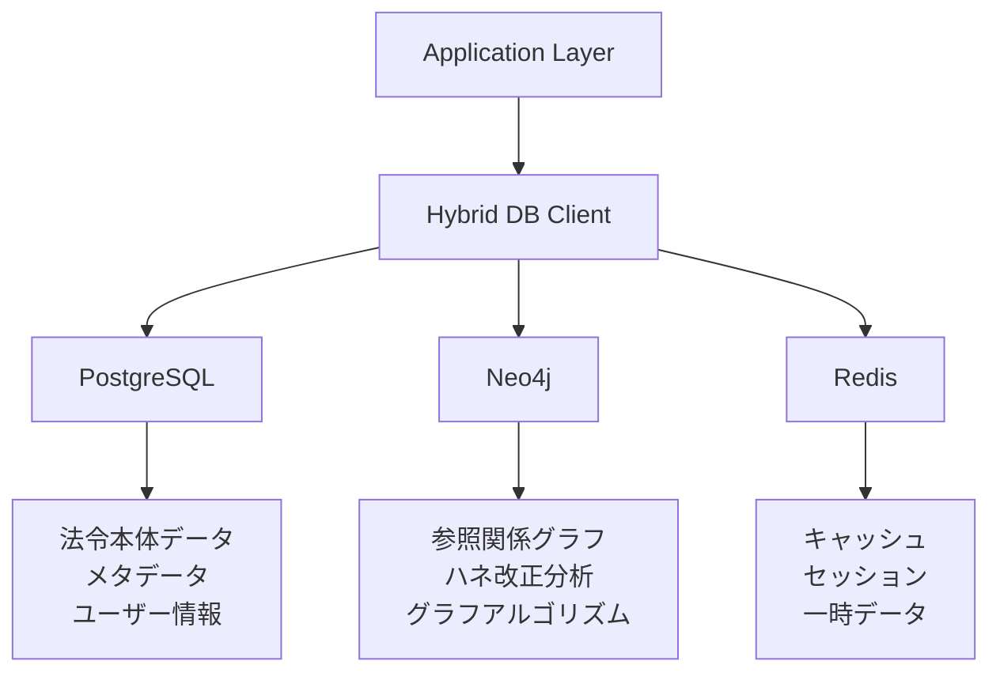

# 03_データベース設計書

**作成日**: 2025年8月21日  
**対象プロジェクト**: LawFinder  
**ステータス**: ハイブリッド構成実装中  

## 1. データベース設計概要

### 1.1 ハイブリッドDB戦略

LawFinderは、各データベースの特性を活かしたハイブリッド構成を採用しています。



### 1.2 データベース責務分散

| データベース | 責務 | 理由 |
|-------------|------|------|
| PostgreSQL | 法令本体、メタデータ、ユーザー管理 | ACID特性、全文検索、複雑クエリ |
| Neo4j | 参照関係、グラフ分析 | グラフ探索、中心性分析、パス検索 |
| Redis | キャッシュ、セッション | 高速アクセス、揮発性データ |

## 2. PostgreSQL設計

### 2.1 スキーマ設計

#### 法令マスタ（laws）
```sql
CREATE TABLE laws (
    law_id VARCHAR(20) PRIMARY KEY,          -- 例: 129AC0000000089
    law_type VARCHAR(20) NOT NULL,           -- Act, CabinetOrder, MinisterialOrdinance
    law_num VARCHAR(100) NOT NULL,           -- 法令番号
    law_title VARCHAR(500) NOT NULL,         -- 法令名
    law_title_kana VARCHAR(500),             -- 法令名かな
    law_title_abbrev VARCHAR(200),           -- 法令略称
    era VARCHAR(20) NOT NULL,                -- 元号
    year INTEGER NOT NULL,                   -- 年
    num INTEGER NOT NULL,                    -- 号
    promulgate_date DATE NOT NULL,           -- 公布日
    enforce_date DATE,                       -- 施行日
    repeal_date DATE,                        -- 廃止日
    status VARCHAR(20) NOT NULL DEFAULT 'active', -- active/repealed/not_yet_enforced
    last_updated_date DATE,                  -- 最終更新日
    content JSONB,                           -- 法令本体（構造化）
    created_at TIMESTAMP DEFAULT NOW(),
    updated_at TIMESTAMP DEFAULT NOW()
);

-- インデックス
CREATE INDEX idx_laws_type ON laws(law_type);
CREATE INDEX idx_laws_status ON laws(status);
CREATE INDEX idx_laws_promulgate_date ON laws(promulgate_date);
CREATE INDEX idx_laws_title_gin ON laws USING gin(to_tsvector('japanese', law_title));
```

#### 条文（articles）
```sql
CREATE TABLE articles (
    id UUID PRIMARY KEY DEFAULT gen_random_uuid(),
    law_id VARCHAR(20) NOT NULL REFERENCES laws(law_id),
    article_number VARCHAR(10) NOT NULL,     -- "1", "1_2"（枝番対応）
    article_title VARCHAR(200),              -- 条見出し
    content TEXT NOT NULL,                   -- 条文内容
    is_deleted BOOLEAN DEFAULT FALSE,
    created_at TIMESTAMP DEFAULT NOW(),
    updated_at TIMESTAMP DEFAULT NOW(),
    
    UNIQUE(law_id, article_number)
);

-- インデックス
CREATE INDEX idx_articles_law_id ON articles(law_id);
CREATE INDEX idx_articles_number ON articles(article_number);
CREATE INDEX idx_articles_content_gin ON articles USING gin(to_tsvector('japanese', content));
```

#### 項（paragraphs）
```sql
CREATE TABLE paragraphs (
    id UUID PRIMARY KEY DEFAULT gen_random_uuid(),
    article_id UUID NOT NULL REFERENCES articles(id) ON DELETE CASCADE,
    paragraph_number INTEGER NOT NULL,
    content TEXT NOT NULL,
    created_at TIMESTAMP DEFAULT NOW(),
    
    UNIQUE(article_id, paragraph_number)
);

CREATE INDEX idx_paragraphs_article_id ON paragraphs(article_id);
```

#### 号（items）
```sql
CREATE TABLE items (
    id UUID PRIMARY KEY DEFAULT gen_random_uuid(),
    paragraph_id UUID NOT NULL REFERENCES paragraphs(id) ON DELETE CASCADE,
    item_number VARCHAR(10) NOT NULL,        -- "1", "イ", "ア"など
    content TEXT NOT NULL,
    created_at TIMESTAMP DEFAULT NOW(),
    
    UNIQUE(paragraph_id, item_number)
);

CREATE INDEX idx_items_paragraph_id ON items(paragraph_id);
```

### 2.2 ユーザー管理

#### ユーザー（users）
```sql
CREATE TABLE users (
    id UUID PRIMARY KEY DEFAULT gen_random_uuid(),
    email VARCHAR(255) NOT NULL UNIQUE,
    name VARCHAR(100) NOT NULL,
    organization VARCHAR(200),
    role VARCHAR(20) NOT NULL DEFAULT 'viewer', -- admin/editor/viewer
    password_hash VARCHAR(255) NOT NULL,
    is_active BOOLEAN DEFAULT TRUE,
    last_login_at TIMESTAMP,
    created_at TIMESTAMP DEFAULT NOW(),
    updated_at TIMESTAMP DEFAULT NOW()
);

CREATE INDEX idx_users_email ON users(email);
CREATE INDEX idx_users_role ON users(role);
CREATE INDEX idx_users_organization ON users(organization);
```

#### セッション（user_sessions）
```sql
CREATE TABLE user_sessions (
    id UUID PRIMARY KEY DEFAULT gen_random_uuid(),
    user_id UUID NOT NULL REFERENCES users(id) ON DELETE CASCADE,
    token_hash VARCHAR(255) NOT NULL UNIQUE,
    expires_at TIMESTAMP NOT NULL,
    created_at TIMESTAMP DEFAULT NOW()
);

CREATE INDEX idx_user_sessions_token ON user_sessions(token_hash);
CREATE INDEX idx_user_sessions_user_id ON user_sessions(user_id);
CREATE INDEX idx_user_sessions_expires ON user_sessions(expires_at);
```

### 2.3 監査ログ

#### 操作ログ（audit_logs）
```sql
CREATE TABLE audit_logs (
    id BIGSERIAL PRIMARY KEY,
    user_id UUID REFERENCES users(id),
    action VARCHAR(50) NOT NULL,             -- CREATE, UPDATE, DELETE, LOGIN
    resource_type VARCHAR(50) NOT NULL,      -- law, article, reference
    resource_id VARCHAR(100),
    old_values JSONB,
    new_values JSONB,
    ip_address INET,
    user_agent TEXT,
    created_at TIMESTAMP DEFAULT NOW()
);

-- 月次パーティショニング
CREATE TABLE audit_logs_2025_08 PARTITION OF audit_logs
FOR VALUES FROM ('2025-08-01') TO ('2025-09-01');

CREATE INDEX idx_audit_logs_user_action ON audit_logs(user_id, action);
CREATE INDEX idx_audit_logs_created_at ON audit_logs(created_at);
CREATE INDEX idx_audit_logs_resource ON audit_logs(resource_type, resource_id);
```

### 2.4 参照検出アルゴリズム管理

#### アルゴリズムバージョン（algorithm_versions）
```sql
CREATE TABLE algorithm_versions (
    id SERIAL PRIMARY KEY,
    version VARCHAR(20) NOT NULL UNIQUE,     -- "1.0.0", "1.1.0"
    description TEXT,
    config JSONB,                            -- アルゴリズム設定
    is_active BOOLEAN DEFAULT FALSE,
    created_at TIMESTAMP DEFAULT NOW(),
    activated_at TIMESTAMP
);

CREATE INDEX idx_algorithm_versions_active ON algorithm_versions(is_active);
```

#### 参照検出結果（reference_detections）
```sql
CREATE TABLE reference_detections (
    id SERIAL PRIMARY KEY,
    algorithm_version_id INTEGER REFERENCES algorithm_versions(id),
    source_law_id VARCHAR(20) NOT NULL,
    source_article_id UUID NOT NULL,
    target_law_id VARCHAR(20),
    target_article_id UUID,
    reference_text TEXT NOT NULL,
    reference_type VARCHAR(50) NOT NULL,
    confidence FLOAT NOT NULL CHECK (confidence >= 0.0 AND confidence <= 1.0),
    context TEXT,
    metadata JSONB,
    detected_at TIMESTAMP DEFAULT NOW(),
    is_verified BOOLEAN DEFAULT FALSE,
    
    UNIQUE(algorithm_version_id, source_law_id, source_article_id, reference_text)
);

CREATE INDEX idx_ref_detections_source ON reference_detections(source_law_id, source_article_id);
CREATE INDEX idx_ref_detections_target ON reference_detections(target_law_id, target_article_id);
CREATE INDEX idx_ref_detections_type ON reference_detections(reference_type);
CREATE INDEX idx_ref_detections_confidence ON reference_detections(confidence);
```

## 3. Neo4j設計

### 3.1 ノード定義

#### Law（法令）ノード
```cypher
CREATE CONSTRAINT law_id_unique IF NOT EXISTS FOR (l:Law) REQUIRE l.law_id IS UNIQUE;

// サンプルノード
CREATE (l:Law {
    law_id: '129AC0000000089',
    law_type: 'Act',
    law_title: '民法',
    law_number: '明治二十九年法律第八十九号',
    promulgate_date: date('1896-04-27'),
    enforce_date: date('1896-04-27'),
    status: 'active'
});
```

#### Article（条文）ノード
```cypher
CREATE CONSTRAINT article_id_unique IF NOT EXISTS FOR (a:Article) REQUIRE a.article_id IS UNIQUE;

// サンプルノード
CREATE (a:Article {
    article_id: '129AC0000000089_art90',
    law_id: '129AC0000000089',
    article_number: '90',
    article_title: '（公序良俗）',
    content: '公の秩序又は善良の風俗に反する法律行為は、無効とする。'
});
```

### 3.2 リレーションシップ定義

#### 構造的リレーションシップ
```cypher
// 法令と条文の関係
(:Law)-[:HAS_ARTICLE {position: Integer}]->(:Article)

// 条文間の参照関係（メイン）
(:Article)-[:REFERS_TO {
    reference_id: String,
    source_text: String,
    reference_type: String,      // internal, external, relative, complex
    sub_type: String,           // apply, deem, replace, except, follow
    confidence: Float,
    conditions: [String],       // 適用条件
    exceptions: [String],       // 例外事項
    ai_verified: Boolean,
    detected_at: DateTime,
    detection_method: String
}]->(:Article)
```

#### 特殊な参照タイプ
```cypher
// 準用関係（より詳細な関係性）
(:Article)-[:APPLIES {
    type: 'preparation',        // 準用の種類
    scope: String,             // 適用範囲
    modifications: [String]    // 読み替え内容
}]->(:Article)

// 相対参照（前条、次項など）
(:Article)-[:RELATIVE_REF {
    direction: String,         // 'previous', 'next', 'same'
    target_type: String,      // 'article', 'paragraph', 'item'
    offset: Integer           // 相対位置
}]->(:Article)
```

### 3.3 インデックス設計

```cypher
// ノードプロパティインデックス
CREATE INDEX law_id_index IF NOT EXISTS FOR (l:Law) ON (l.law_id);
CREATE INDEX article_id_index IF NOT EXISTS FOR (a:Article) ON (a.article_id);
CREATE INDEX law_article_composite IF NOT EXISTS FOR (a:Article) ON (a.law_id, a.article_number);

// 全文検索インデックス
CALL db.index.fulltext.createNodeIndex(
    'lawTitleIndex',
    ['Law'],
    ['law_title'],
    {analyzer: 'japanese'}
) YIELD name, type, state;

CALL db.index.fulltext.createNodeIndex(
    'articleContentIndex',
    ['Article'],
    ['content'],
    {analyzer: 'japanese'}
) YIELD name, type, state;

// リレーションシップインデックス
CREATE INDEX reference_type_index IF NOT EXISTS FOR ()-[r:REFERS_TO]-() ON (r.reference_type);
CREATE INDEX confidence_index IF NOT EXISTS FOR ()-[r:REFERS_TO]-() ON (r.confidence);
```

### 3.4 ハネ改正分析クエリ

#### 基本的な影響分析
```cypher
// 特定条文の改正が与える影響を5段階まで分析
MATCH path = (amended:Article {article_id: $articleId})
  <-[:REFERS_TO*1..5]-(affected:Article)
WHERE ALL(rel IN relationships(path) WHERE rel.confidence > 0.7)
WITH path, affected,
     [rel IN relationships(path) | rel.reference_type] as referenceChain,
     reduce(conf = 1.0, rel IN relationships(path) | conf * rel.confidence) as pathConfidence
RETURN affected.law_id as affectedLaw,
       affected.article_number as affectedArticle,
       referenceChain,
       pathConfidence,
       length(path) as depth
ORDER BY depth, pathConfidence DESC;
```

#### 中心性分析
```cypher
// 最も多くの条文から参照されている条文（中心性が高い）
MATCH (a:Article)<-[r:REFERS_TO]-(referencing:Article)
WHERE r.confidence > 0.8
RETURN a.law_id, a.article_number, a.article_title,
       count(referencing) as incoming_references
ORDER BY incoming_references DESC
LIMIT 20;
```

## 4. Redis設計

### 4.1 キャッシュ戦略

#### キーの命名規則
```
法令詳細: law:{law_id}                    TTL: 24時間
条文詳細: article:{article_id}            TTL: 24時間
参照関係: references:from:{article_id}     TTL: 12時間
検索結果: search:{query_hash}             TTL: 1時間
セッション: session:{session_id}           TTL: 30分
```

#### データ構造と実装例
```typescript
class RedisCache {
  private redis: Redis;
  
  // 法令データのキャッシュ
  async cacheLaw(lawId: string, law: Law): Promise<void> {
    await this.redis.setex(
      `law:${lawId}`,
      86400, // 24時間
      JSON.stringify(law)
    );
  }
  
  // 参照関係のキャッシュ（Set構造）
  async cacheReferences(articleId: string, references: Reference[]): Promise<void> {
    const pipeline = this.redis.pipeline();
    const key = `references:from:${articleId}`;
    
    // 既存データを削除
    pipeline.del(key);
    
    // 参照データを追加
    references.forEach(ref => {
      pipeline.sadd(key, JSON.stringify(ref));
    });
    
    // TTL設定
    pipeline.expire(key, 43200); // 12時間
    
    await pipeline.exec();
  }
}
```

### 4.2 セッション管理

```typescript
interface UserSession {
  userId: string;
  email: string;
  role: UserRole;
  lastActivity: Date;
  permissions: string[];
}

class SessionManager {
  async createSession(user: User): Promise<string> {
    const sessionId = crypto.randomUUID();
    const session: UserSession = {
      userId: user.id,
      email: user.email,
      role: user.role,
      lastActivity: new Date(),
      permissions: this.getPermissions(user.role)
    };
    
    await this.redis.setex(
      `session:${sessionId}`,
      1800, // 30分
      JSON.stringify(session)
    );
    
    return sessionId;
  }
}
```

## 5. データ同期設計

### 5.1 HybridDBClient

```typescript
export class HybridDBClient {
  constructor(
    private postgres: PrismaClient,
    private neo4j: Driver,
    private redis: Redis
  ) {}
  
  // 法令取得（PostgreSQL → Redis キャッシュ）
  async getLaw(lawId: string): Promise<Law | null> {
    // 1. キャッシュ確認
    const cached = await this.redis.get(`law:${lawId}`);
    if (cached) {
      return JSON.parse(cached);
    }
    
    // 2. PostgreSQLから取得
    const law = await this.postgres.law.findUnique({
      where: { law_id: lawId },
      include: { articles: true }
    });
    
    if (law) {
      // 3. キャッシュに保存
      await this.redis.setex(`law:${lawId}`, 86400, JSON.stringify(law));
    }
    
    return law;
  }
  
  // 参照関係取得（Neo4j → Redis キャッシュ）
  async getReferences(articleId: string): Promise<Reference[]> {
    // 1. キャッシュ確認
    const cachedRefs = await this.redis.smembers(`references:from:${articleId}`);
    if (cachedRefs.length > 0) {
      return cachedRefs.map(ref => JSON.parse(ref));
    }
    
    // 2. Neo4jから取得
    const session = this.neo4j.session();
    try {
      const result = await session.run(`
        MATCH (source:Article {article_id: $articleId})-[r:REFERS_TO]->(target:Article)
        RETURN r, target
      `, { articleId });
      
      const references = result.records.map(record => ({
        sourceId: articleId,
        targetId: record.get('target').properties.article_id,
        type: record.get('r').properties.reference_type,
        confidence: record.get('r').properties.confidence,
        sourceText: record.get('r').properties.source_text
      }));
      
      // 3. キャッシュに保存
      if (references.length > 0) {
        const pipeline = this.redis.pipeline();
        references.forEach(ref => {
          pipeline.sadd(`references:from:${articleId}`, JSON.stringify(ref));
        });
        pipeline.expire(`references:from:${articleId}`, 43200);
        await pipeline.exec();
      }
      
      return references;
    } finally {
      await session.close();
    }
  }
}
```

### 5.2 データ同期戦略

#### PostgreSQL → Neo4j 同期
```typescript
class DataSyncService {
  async syncReferencesToNeo4j(): Promise<void> {
    // 1. PostgreSQLから参照データを取得
    const references = await this.postgres.reference_detections.findMany({
      where: { is_verified: true },
      include: {
        source_article: true,
        target_article: true
      }
    });
    
    // 2. Neo4jへバッチ投入
    const session = this.neo4j.session();
    try {
      await session.writeTransaction(async tx => {
        for (const ref of references) {
          await tx.run(`
            MERGE (source:Article {article_id: $sourceId})
            MERGE (target:Article {article_id: $targetId})
            MERGE (source)-[r:REFERS_TO {reference_id: $refId}]->(target)
            SET r.reference_type = $type,
                r.confidence = $confidence,
                r.source_text = $sourceText,
                r.detected_at = datetime($detectedAt)
          `, {
            sourceId: ref.source_article_id,
            targetId: ref.target_article_id,
            refId: ref.id.toString(),
            type: ref.reference_type,
            confidence: ref.confidence,
            sourceText: ref.reference_text,
            detectedAt: ref.detected_at.toISOString()
          });
        }
      });
    } finally {
      await session.close();
    }
  }
}
```

## 6. パフォーマンス最適化

### 6.1 PostgreSQL最適化

#### インデックス戦略
```sql
-- 複合インデックス
CREATE INDEX idx_articles_law_number ON articles (law_id, article_number);

-- 部分インデックス
CREATE INDEX idx_active_laws ON laws (law_id) WHERE status = 'active';

-- 全文検索インデックス
CREATE INDEX idx_laws_title_full_text ON laws 
USING gin(to_tsvector('japanese', law_title));

-- カバリングインデックス
CREATE INDEX idx_articles_covering ON articles (law_id, article_number) 
INCLUDE (article_title, content);
```

#### クエリ最適化
```sql
-- マテリアライズドビュー
CREATE MATERIALIZED VIEW law_statistics AS
SELECT 
    law_type,
    COUNT(*) as total_count,
    COUNT(CASE WHEN status = 'active' THEN 1 END) as active_count,
    AVG(EXTRACT(YEAR FROM promulgate_date)) as avg_year
FROM laws
GROUP BY law_type;

-- 定期的なリフレッシュ
CREATE OR REPLACE FUNCTION refresh_law_statistics()
RETURNS void AS $$
BEGIN
    REFRESH MATERIALIZED VIEW CONCURRENTLY law_statistics;
END;
$$ LANGUAGE plpgsql;
```

### 6.2 Neo4j最適化

#### スキーマインデックス
```cypher
// 複合インデックス
CREATE INDEX law_status_index IF NOT EXISTS FOR (l:Law) ON (l.status, l.law_type);

// ベクトルインデックス（将来のAI機能用）
CREATE VECTOR INDEX article_embedding_index IF NOT EXISTS FOR (a:Article) ON (a.embedding) 
OPTIONS {indexConfig: {`vector.dimensions`: 1536, `vector.similarity_function`: 'cosine'}};
```

#### クエリ最適化
```cypher
// インデックスヒント
MATCH (l:Law)
USING INDEX l:Law(law_id)
WHERE l.law_id = '129AC0000000089'
RETURN l;

// プロファイル実行
PROFILE MATCH path = (a:Article)-[:REFERS_TO*1..3]->(target:Article)
WHERE a.article_id = '129AC0000000089_art90'
RETURN path;
```

## 7. バックアップ・災害復旧

### 7.1 バックアップ戦略

#### PostgreSQL
```bash
# 日次バックアップ
pg_dump -h localhost -p 5432 -U postgres lawfinder | gzip > backup_$(date +%Y%m%d).sql.gz

# Point-in-Time Recovery用
postgresql.conf:
  wal_level = replica
  archive_mode = on
  archive_command = 'cp %p /backup/wal/%f'
```

#### Neo4j
```bash
# 日次バックアップ
neo4j-admin database backup --database=neo4j --to-path=/backup/neo4j/$(date +%Y%m%d)

# オンラインバックアップ（Enterprise版）
neo4j-admin database backup --database=neo4j --backup-dir=/backup/neo4j --name=daily_backup
```

#### Redis
```bash
# AOFバックアップ
redis.conf:
  appendonly yes
  appendfsync everysec

# RDBスナップショット
BGSAVE
```

### 7.2 災害復旧手順

```bash
# PostgreSQL復旧
pg_restore -h localhost -p 5432 -U postgres -d lawfinder backup_20250821.sql.gz

# Neo4j復旧
neo4j-admin database restore --from-path=/backup/neo4j/20250821 --database=neo4j

# Redis復旧
redis-cli --rdb /backup/redis/dump.rdb
```

## 8. セキュリティ設計

### 8.1 データ暗号化

```sql
-- PostgreSQL TDE（Transparent Data Encryption）
CREATE EXTENSION IF NOT EXISTS pgcrypto;

-- 機密フィールドの暗号化
CREATE TABLE encrypted_user_data (
    user_id UUID PRIMARY KEY,
    encrypted_email BYTEA,
    encrypted_phone BYTEA
);

-- 暗号化関数
CREATE OR REPLACE FUNCTION encrypt_pii(text_data TEXT)
RETURNS BYTEA AS $$
BEGIN
    RETURN pgp_sym_encrypt(text_data, current_setting('app.encryption_key'));
END;
$$ LANGUAGE plpgsql;
```

### 8.2 アクセス制御

```sql
-- ロールベースアクセス制御
CREATE ROLE lawfinder_read;
CREATE ROLE lawfinder_write;
CREATE ROLE lawfinder_admin;

-- 権限設定
GRANT SELECT ON ALL TABLES IN SCHEMA public TO lawfinder_read;
GRANT SELECT, INSERT, UPDATE ON ALL TABLES IN SCHEMA public TO lawfinder_write;
GRANT ALL PRIVILEGES ON ALL TABLES IN SCHEMA public TO lawfinder_admin;

-- 行レベルセキュリティ
ALTER TABLE audit_logs ENABLE ROW LEVEL SECURITY;

CREATE POLICY user_audit_policy ON audit_logs
FOR SELECT TO lawfinder_read
USING (user_id = current_user_id());
```

---

**改訂履歴**

| バージョン | 日付 | 変更内容 |
|----------|------|----------|
| 1.0 | 2025-08-21 | 初版作成（データベース設計、Neo4j統合設計を統合） |