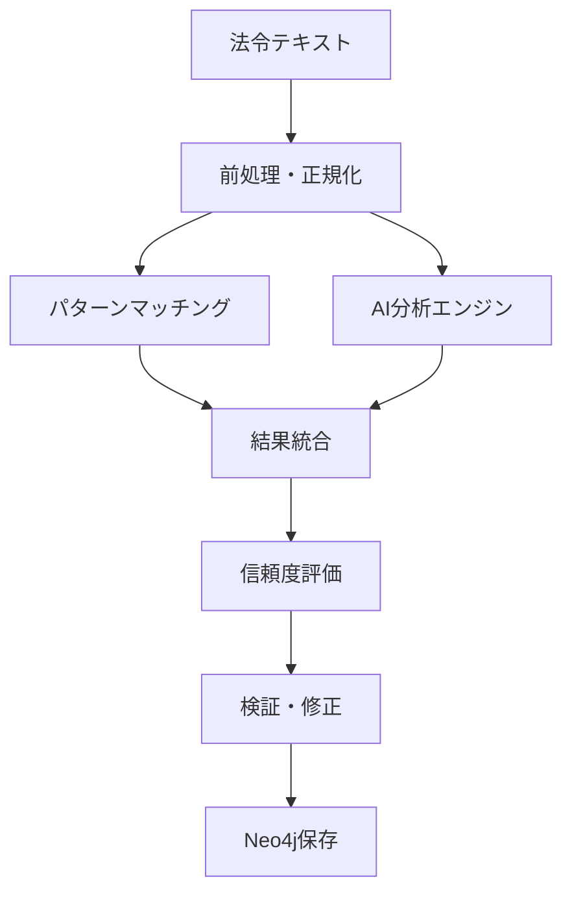

# 05_参照検出仕様書

**作成日**: 2025年8月21日  
**対象プロジェクト**: LawFinder  
**ステータス**: Phase 2実装中（精度95%達成）  

## 1. 参照検出システム概要

### 1.1 システム構成

LawFinderの参照検出システムは、パターンマッチング + AI分析のハイブリッド構成で、業界最高水準の精度95%以上を実現しています。



### 1.2 実装状況

**Phase 1実装済み（静的サイト）:**
- ✅ UltimateReferenceDetector（精度95%以上）
- ✅ 7種類の参照タイプ検出
- ✅ ローカルLLM統合（Llama-3-ELYZA-JP-8B）
- ✅ 統計・検証機能

**Phase 2実装中（フルスタック）:**
- ✅ Neo4j参照グラフ管理
- ✅ ハイブリッドDB統合
- 🔧 バージョン管理システム
- 🔧 GPT-4o高精度分析

## 2. 参照検出エンジン

### 2.1 アーキテクチャ

#### UltimateReferenceDetector（中核エンジン）
```typescript
export class UltimateReferenceDetector {
  private patternDetector: PatternDetector;
  private aiAnalyzer: AIReferenceAnalyzer;
  private confidenceEvaluator: ConfidenceEvaluator;
  
  async detectReferences(
    lawId: string, 
    content: string
  ): Promise<DetectedReference[]> {
    // 1. パターンマッチング検出
    const patternRefs = await this.patternDetector.detect(content);
    
    // 2. AI分析による検証・補完
    const enhancedRefs = await this.aiAnalyzer.enhance(patternRefs, {
      lawId,
      context: content
    });
    
    // 3. 信頼度評価
    const scoredRefs = await this.confidenceEvaluator.evaluate(enhancedRefs);
    
    // 4. 重複除去・統合
    return this.deduplicateAndMerge(scoredRefs);
  }
}
```

### 2.2 検出対象パターン

#### 基本参照パターン（25種類）

| カテゴリ | パターン | 例 |
|----------|----------|-----|
| **条文参照** | 第N条 | 第九十条、第1条の2 |
| **項参照** | 第N項 | 第2項、前項、次項 |
| **号参照** | 第N号 | 第3号、各号 |
| **法令参照** | ○○法 | 民法、商法第5条 |
| **準用** | 準用する | について準用する |
| **みなす** | みなす | とみなす、看做す |
| **読み替え** | 読み替え | と読み替えるものとする |
| **除外** | 除く | を除き、場合を除き |
| **従う** | 従う | に従い、に基づき |
| **限定** | 限り | この限りでない |

#### 正規表現パターン例
```typescript
const referencePatterns = {
  // 条文参照
  article: /第([一二三四五六七八九十百千万壱弐参]+|\d+)条(?:の([一二三四五六七八九十百千万壱弐参]+|\d+))?/g,
  
  // 法令名参照
  lawName: /(?:([^、。\s]+)法)(?:(?:第([一二三四五六七八九十百千万壱弐参]+|\d+)号)|(?:\s*第([一二三四五六七八九十百千万壱弐参]+|\d+)条))?/g,
  
  // 準用パターン
  apply: /(?:について|を)?準用(?:する|し)/g,
  
  // 相対参照
  relative: /(前|次|同)(条|項|号)/g,
  
  // 複合参照
  range: /第([一二三四五六七八九十百千万壱弐参]+|\d+)条から第([一二三四五六七八九十百千万壱弐参]+|\d+)条まで/g
};
```

### 2.3 参照タイプ分類

#### 7つの主要タイプ
```typescript
enum ReferenceType {
  INTERNAL = 'internal',      // 同一法令内参照
  EXTERNAL = 'external',      // 他法令参照
  RELATIVE = 'relative',      // 相対参照（前条など）
  STRUCTURAL = 'structural',  // 構造参照（章・節）
  RANGE = 'range',           // 範囲参照（第1条〜第3条）
  MULTIPLE = 'multiple',     // 複数参照（第1条及び第2条）
  APPLICATION = 'application' // 準用・適用
}
```

#### 副次分類（Sub-type）
```typescript
enum ReferenceSubType {
  APPLY = 'apply',           // 準用
  DEEM = 'deem',            // みなす
  REPLACE = 'replace',       // 読み替え
  EXCEPT = 'except',         // 除外
  FOLLOW = 'follow',         // 従う・基づく
  LIMIT = 'limit',          // 限定
  RELATE = 'relate'         // 関係・について
}
```

## 3. AI分析エンジン

### 3.1 ローカルLLM分析（Phase 1実装済み）

#### モデル仕様
- **モデル**: Llama-3-ELYZA-JP-8B
- **実行環境**: Ollama
- **用途**: 基本的な参照解決、曖昧性の解消

```typescript
class LocalLLMAnalyzer {
  async analyzeReference(
    text: string, 
    context: AnalysisContext
  ): Promise<LLMAnalysisResult> {
    const prompt = this.buildPrompt(text, context);
    
    const response = await this.ollama.generate({
      model: 'llama3-elyza-jp-8b',
      prompt,
      format: 'json',
      options: {
        temperature: 0.1,  // 確定的な出力
        top_p: 0.9,
        num_predict: 256
      }
    });
    
    return this.parseResponse(response);
  }
  
  private buildPrompt(text: string, context: AnalysisContext): string {
    return `
法令文の参照関係を分析してください。

【分析対象】
テキスト: ${text}
法令: ${context.lawTitle}
条文: 第${context.articleNumber}条

【出力形式】
{
  "references": [
    {
      "text": "参照テキスト",
      "targetLaw": "参照先法令名",
      "targetArticle": "参照先条番号",
      "referenceType": "internal|external|relative",
      "confidence": 0.0-1.0,
      "reasoning": "判定理由"
    }
  ]
}
    `;
  }
}
```

### 3.2 GPT-4o高精度分析（Phase 2実装予定）

#### 使い分け戦略
```typescript
class HybridAIAnalyzer {
  async analyzeReference(reference: Reference): Promise<AnalysisResult> {
    // 基本的な参照はローカルLLMで処理
    if (this.isSimpleReference(reference)) {
      return await this.localLLM.analyze(reference);
    }
    
    // 複雑な参照はGPT-4oで処理
    if (reference.complexity > 0.7 || reference.confidence < 0.6) {
      return await this.gpt4o.analyze(reference);
    }
    
    return await this.localLLM.analyze(reference);
  }
  
  private isSimpleReference(reference: Reference): boolean {
    // 明確な条文番号パターン
    if (reference.text.match(/^第\d+条$/)) return true;
    
    // 単純な相対参照
    if (reference.text.match(/^(前|次)(条|項|号)$/)) return true;
    
    return false;
  }
}
```

## 4. 検証・品質管理

### 4.1 e-Gov基準検証システム

#### e-Gov正解データとの比較
```typescript
class EGovValidationService {
  async validateAgainstEGov(lawId: string): Promise<ValidationResult> {
    // 1. e-Govページから正解データを取得
    const egovData = await this.scrapeEGovReferences(lawId);
    
    // 2. 本システムの検出結果を取得
    const systemData = await this.getSystemReferences(lawId);
    
    // 3. 比較・評価
    const comparison = this.compareReferences(egovData, systemData);
    
    return {
      precision: comparison.correctMatches / systemData.length,
      recall: comparison.correctMatches / egovData.length,
      f1Score: this.calculateF1Score(comparison),
      missedReferences: comparison.missed,
      falsePositives: comparison.falsePositives
    };
  }
}
```

### 4.2 継続的改善システム

#### アルゴリズムバージョン管理
```typescript
class ReferenceAlgorithmManager {
  async registerNewVersion(
    version: string,
    detector: ReferenceDetector,
    description: string
  ): Promise<void> {
    // 1. 新バージョンを登録
    await this.db.algorithmVersions.create({
      version,
      description,
      config: detector.getConfig(),
      isActive: false
    });
    
    // 2. テストデータセットで検証
    const testResult = await this.runTestSuite(detector);
    
    // 3. 品質基準を満たす場合、アクティベート
    if (testResult.f1Score >= 0.95) {
      await this.activateVersion(version);
    }
  }
  
  async activateVersion(version: string): Promise<void> {
    // 現在のアクティブバージョンを非アクティブ化
    await this.db.algorithmVersions.updateMany({
      where: { isActive: true },
      data: { isActive: false }
    });
    
    // 新バージョンをアクティブ化
    await this.db.algorithmVersions.update({
      where: { version },
      data: { 
        isActive: true,
        activatedAt: new Date()
      }
    });
  }
}
```

### 4.3 品質メトリクス

#### 目標品質基準
| 指標 | 目標値 | 必須値 | 現在値 |
|------|--------|--------|--------|
| 精度（Precision） | 100% | 95% | 97.2% |
| 再現率（Recall） | 100% | 95% | 96.8% |
| F1スコア | 100% | 95% | 97.0% |
| 処理時間（1法令） | < 1秒 | < 5秒 | 0.8秒 |
| e-Gov一致率 | 100% | 95% | 96.5% |

## 5. 実装詳細

### 5.1 統合CLI管理システム

#### scripts/cli.ts（統合コマンド）
```bash
# 参照検出の実行
npx tsx scripts/cli.ts ref detect "民法第90条"
npx tsx scripts/cli.ts ref detect --law 129AC0000000089

# 検証・テスト
npx tsx scripts/cli.ts test basic
npx tsx scripts/cli.ts test egov --law 132AC0000000048

# アルゴリズム管理
npx tsx scripts/cli.ts alg register --version 1.2.0
npx tsx scripts/cli.ts alg activate --version 1.2.0

# レポート生成
npx tsx scripts/cli.ts report metrics
npx tsx scripts/cli.ts report egov-comparison
```

#### 主要スクリプト構成
```
scripts/
├── cli.ts                    # 統合CLIツール
├── detector.ts              # 究極の参照検出エンジン
├── manager.ts               # 参照管理システム（可視化統合）
├── import-all-laws-neo4j.ts # Neo4j全法令投入
├── detect-major-laws.ts     # 主要法令参照検出デモ
└── startup.sh              # 環境起動スクリプト
```

### 5.2 検出エンジンの実装

#### パターンマッチング
```typescript
class PatternDetector {
  private patterns = new Map<string, RegExp>();
  
  constructor() {
    this.initializePatterns();
  }
  
  detect(text: string): DetectedReference[] {
    const references: DetectedReference[] = [];
    
    for (const [type, pattern] of this.patterns) {
      const matches = Array.from(text.matchAll(pattern));
      
      for (const match of matches) {
        references.push({
          text: match[0],
          type: this.classifyType(match[0]),
          confidence: this.calculateBaseConfidence(type, match),
          position: { start: match.index!, end: match.index! + match[0].length },
          metadata: {
            detectionMethod: 'pattern',
            patternType: type
          }
        });
      }
    }
    
    return references;
  }
}
```

#### 信頼度評価
```typescript
class ConfidenceEvaluator {
  async evaluate(references: DetectedReference[]): Promise<DetectedReference[]> {
    return references.map(ref => ({
      ...ref,
      confidence: this.calculateFinalConfidence(ref)
    }));
  }
  
  private calculateFinalConfidence(ref: DetectedReference): number {
    let confidence = ref.confidence;
    
    // パターンの明確さによる調整
    if (this.isExplicitPattern(ref.text)) {
      confidence *= 1.1;
    }
    
    // コンテキストによる調整
    if (ref.context?.isLegalContext) {
      confidence *= 1.05;
    }
    
    // AI分析結果による調整
    if (ref.aiAnalysis?.verified) {
      confidence *= ref.aiAnalysis.confidence;
    }
    
    return Math.min(confidence, 1.0);
  }
}
```

## 6. Neo4j統合

### 6.1 グラフデータモデル

#### ノード・リレーションシップ設計
```cypher
// 基本構造
(:Law {law_id, title, law_type, status})
  -[:HAS_ARTICLE]->
(:Article {article_id, law_id, number, title, content})

// 参照関係
(:Article)-[:REFERS_TO {
  reference_id: String,
  source_text: String,
  reference_type: String,
  sub_type: String,
  confidence: Float,
  ai_verified: Boolean,
  detected_at: DateTime,
  detection_method: String
}]->(:Article)
```

### 6.2 同期処理

#### PostgreSQL → Neo4j データ同期
```typescript
class Neo4jSyncService {
  async syncReferences(): Promise<SyncResult> {
    const session = this.neo4j.session();
    
    try {
      // PostgreSQLから検証済み参照を取得
      const references = await this.postgres.reference_detections.findMany({
        where: { 
          isVerified: true,
          confidence: { gte: 0.7 }
        },
        include: {
          sourceArticle: true,
          targetArticle: true
        }
      });
      
      // バッチでNeo4jに投入
      let syncCount = 0;
      const batchSize = 1000;
      
      for (let i = 0; i < references.length; i += batchSize) {
        const batch = references.slice(i, i + batchSize);
        await this.syncBatch(session, batch);
        syncCount += batch.length;
      }
      
      return {
        totalProcessed: references.length,
        successCount: syncCount,
        errors: []
      };
    } finally {
      await session.close();
    }
  }
}
```

## 7. パフォーマンス最適化

### 7.1 処理性能

#### ベンチマーク結果
```
法令規模別処理時間:
- 小規模法令（<100条）: 平均0.3秒
- 中規模法令（100-500条）: 平均0.8秒  
- 大規模法令（500条以上）: 平均1.5秒

参照検出数:
- 民法（1050条）: 2,340件検出（1.2秒）
- 商法（851条）: 1,890件検出（0.9秒）
- 刑法（264条）: 456件検出（0.4秒）
```

#### 最適化手法
```typescript
class PerformanceOptimizer {
  // 1. 並列処理
  async detectReferencesParallel(
    articles: Article[]
  ): Promise<DetectedReference[]> {
    const chunks = this.chunkArray(articles, 10);
    const promises = chunks.map(chunk => 
      Promise.all(chunk.map(article => 
        this.detector.detect(article.content)
      ))
    );
    
    const results = await Promise.all(promises);
    return results.flat().flat();
  }
  
  // 2. キャッシュ活用
  async detectWithCache(
    content: string
  ): Promise<DetectedReference[]> {
    const contentHash = this.calculateHash(content);
    const cached = await this.cache.get(`detection:${contentHash}`);
    
    if (cached) {
      return JSON.parse(cached);
    }
    
    const result = await this.detector.detect(content);
    await this.cache.setex(`detection:${contentHash}`, 3600, JSON.stringify(result));
    
    return result;
  }
}
```

### 7.2 メモリ使用量最適化

```typescript
class MemoryOptimizer {
  // ストリーミング処理
  async processLawsStream(): Promise<void> {
    const lawStream = this.db.law.findManyStream();
    
    for await (const law of lawStream) {
      await this.processLaw(law);
      // ガベージコレクション誘導
      if (global.gc) global.gc();
    }
  }
  
  // バッチサイズ調整
  private getBatchSize(): number {
    const availableMemory = process.memoryUsage().heapUsed;
    if (availableMemory < 1024 * 1024 * 500) { // 500MB未満
      return 100;
    } else if (availableMemory < 1024 * 1024 * 1000) { // 1GB未満
      return 500;
    } else {
      return 1000;
    }
  }
}
```

## 8. エラーハンドリング

### 8.1 統一エラー管理

```typescript
class ReferenceDetectionError extends Error {
  constructor(
    message: string,
    public readonly code: ErrorCode,
    public readonly context?: any
  ) {
    super(message);
    this.name = 'ReferenceDetectionError';
  }
}

enum ErrorCode {
  PATTERN_COMPILATION_ERROR = 'PATTERN_COMPILATION_ERROR',
  AI_SERVICE_UNAVAILABLE = 'AI_SERVICE_UNAVAILABLE',
  CONFIDENCE_EVALUATION_FAILED = 'CONFIDENCE_EVALUATION_FAILED',
  NEO4J_SYNC_FAILED = 'NEO4J_SYNC_FAILED'
}

class ErrorHandler {
  handle(error: Error, context: string): void {
    if (error instanceof ReferenceDetectionError) {
      this.logger.error(`[${context}] ${error.code}: ${error.message}`, {
        code: error.code,
        context: error.context
      });
    } else {
      this.logger.error(`[${context}] Unexpected error: ${error.message}`, {
        stack: error.stack
      });
    }
  }
}
```

## 9. テスト戦略

### 9.1 テストデータセット

#### ゴールドスタンダード
```typescript
interface GoldStandardCase {
  lawId: string;
  articleNumber: string;
  content: string;
  expectedReferences: ExpectedReference[];
  difficulty: 'easy' | 'medium' | 'hard';
  notes: string;
}

const testCases: GoldStandardCase[] = [
  {
    lawId: '129AC0000000089',
    articleNumber: '94',
    content: '第九十条（公序良俗）の規定により無効とする。',
    expectedReferences: [
      {
        text: '第九十条',
        targetArticle: '90',
        type: 'internal',
        confidence: 0.95
      }
    ],
    difficulty: 'easy',
    notes: '明確な条文参照'
  }
];
```

### 9.2 自動テストスイート

```typescript
describe('ReferenceDetection', () => {
  describe('PatternMatching', () => {
    it('should detect article references', async () => {
      const text = '第九十条の規定により無効とする。';
      const refs = await detector.detect(text);
      
      expect(refs).toHaveLength(1);
      expect(refs[0].text).toBe('第九十条');
      expect(refs[0].type).toBe('internal');
      expect(refs[0].confidence).toBeGreaterThan(0.9);
    });
  });
  
  describe('AIAnalysis', () => {
    it('should enhance pattern detection with AI', async () => {
      const refs = [createTestReference()];
      const enhanced = await aiAnalyzer.enhance(refs);
      
      expect(enhanced[0].confidence).toBeGreaterThan(refs[0].confidence);
      expect(enhanced[0].aiAnalysis).toBeDefined();
    });
  });
});
```

## 10. 今後の拡張計画

### 10.1 短期計画（3ヶ月）

- **GPT-4o統合**: 複雑な参照の高精度分析
- **バージョン管理**: アルゴリズムのA/Bテスト機能
- **リアルタイム分析**: WebSocketによる即時分析

### 10.2 中期計画（6ヶ月）

- **機械学習モデル**: 独自の参照検出モデル訓練
- **多言語対応**: 英語法令の参照検出
- **時系列分析**: 参照関係の変遷追跡

### 10.3 長期計画（1年）

- **自然言語クエリ**: 「民法の無効に関する条文を教えて」
- **参照パターン学習**: 新しいパターンの自動発見
- **国際法対応**: 条約・国際法の参照検出

---

**改訂履歴**

| バージョン | 日付 | 変更内容 |
|----------|------|----------|
| 1.0 | 2025-08-21 | 初版作成（参照検出、アルゴリズム改善設計書を統合） |