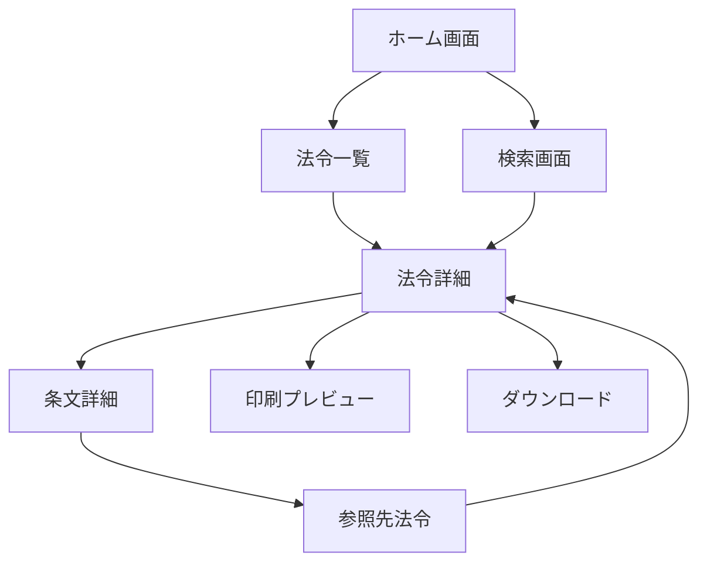
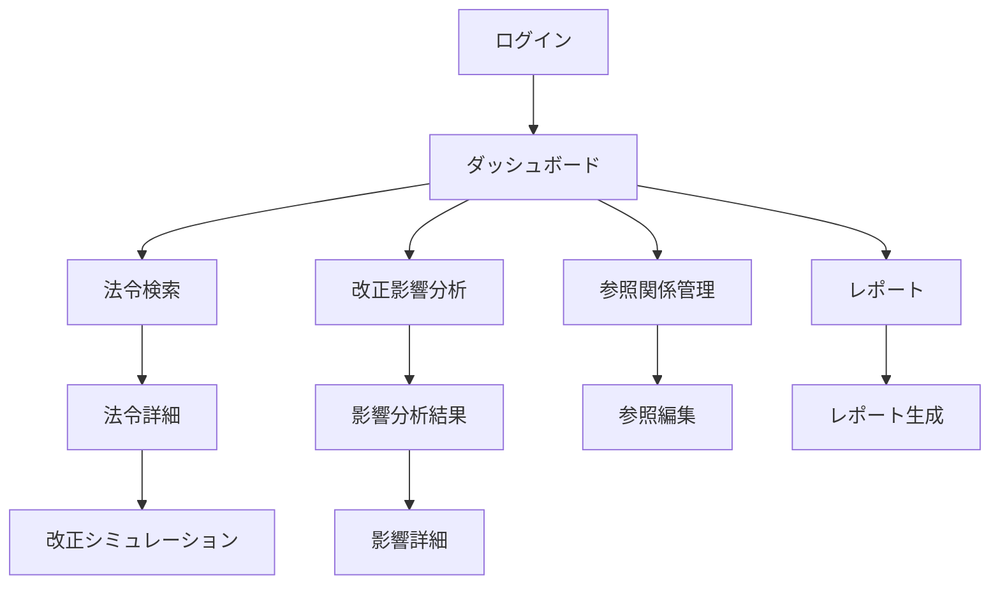

# 06_UI画面設計書

**作成日**: 2025年8月21日  
**対象プロジェクト**: LawFinder  
**ステータス**: Phase 2実装中  

## 1. UI設計概要

### 1.1 設計方針

LawFinderのUIは、法令検索の効率性と視覚的な理解しやすさを重視した設計となっています。

**基本方針:**
- **ユーザビリティ優先**: 法務担当者が直感的に操作できるUI
- **e-Gov準拠**: 政府標準のUIパターンを踏襲
- **レスポンシブデザイン**: PC、タブレット、スマートフォン対応
- **アクセシビリティ**: WCAG 2.1 AA準拠
- **パフォーマンス**: 初期表示3秒以内、画面遷移1秒以内

### 1.2 対象ユーザー

**Phase 1（一般公開）:**
- 一般市民
- 法学研究者
- 法務関係者

**Phase 2（管理システム）:**
- 政府法制局職員
- 各省庁の法令起案担当者
- 立法支援者

### 1.3 技術スタック

```typescript
// UI Framework
- React 19.0.0
- Next.js 15.4.5 (App Router)
- TypeScript 5.3.3

// Styling
- Tailwind CSS 3.4.1
- Headless UI (コンポーネント)
- Material Icons (アイコン)

// State Management
- React Hooks (useState, useEffect)
- SWR (データフェッチング)

// Visualization
- D3.js (グラフ可視化)
- Cytoscape.js (ネットワーク図)
```

## 2. 画面遷移設計

### 2.1 Phase 1: 静的サイト画面遷移



### 2.2 Phase 2: 管理システム画面遷移



## 3. 画面設計詳細

### 3.1 ホーム画面（P1-001）

#### レイアウト構成
```
┌─────────────────────────────────────────────────────────────┐
│ [Logo] LawFinder        [法令一覧] [詳細検索] [ヘルプ]      │
├─────────────────────────────────────────────────────────────┤
│                                                             │
│              🏛️ 日本の法令を簡単に検索・閲覧              │
│                                                             │
│         ┌─────────────────────────────────────────┐         │
│         │ 🔍 法令名・キーワードを入力...          │         │
│         └─────────────────────────────────────────┘         │
│                        [検索]                               │
│                                                             │
│  ┌─────────────┐  ┌─────────────┐  ┌─────────────┐       │
│  │   📋        │  │   🔗        │  │   📊        │       │
│  │ 法令一覧    │  │ 参照関係    │  │ 統計情報    │       │
│  │ 全ての法令を │  │ 法令間の    │  │ 法令データの │       │
│  │ 一覧表示    │  │ つながりを  │  │ 統計を表示  │       │
│  └─────────────┘  └─────────────┘  └─────────────┘       │
│                                                             │
│  よく検索される法令                                         │
│  ・民法                  ・刑法                             │
│  ・商法                  ・会社法                           │
│  ・労働基準法            ・個人情報保護法                   │
│                                                             │
│  最近更新された法令                                         │
│  ・○○法の一部を改正する法律（令和7年法律第○号）          │
│  ・△△に関する法律施行令の一部を改正する政令              │
│                                                             │
└─────────────────────────────────────────────────────────────┘
[フッター: 利用規約 | プライバシーポリシー | © 2025 LawFinder]
```

#### React実装例
```tsx
export default function HomePage() {
  const [searchQuery, setSearchQuery] = useState('');
  const { data: popularLaws } = useSWR('/api/laws/popular');
  const { data: recentLaws } = useSWR('/api/laws/recent');

  const handleSearch = async (e: FormEvent) => {
    e.preventDefault();
    router.push(`/search?q=${encodeURIComponent(searchQuery)}`);
  };

  return (
    <div className="min-h-screen bg-gray-50">
      <Header />
      
      <main className="container mx-auto px-4 py-8">
        {/* ヒーローセクション */}
        <section className="text-center mb-12">
          <h1 className="text-4xl font-bold text-gray-900 mb-4">
            🏛️ 日本の法令を簡単に検索・閲覧
          </h1>
          
          {/* 検索フォーム */}
          <form onSubmit={handleSearch} className="max-w-2xl mx-auto mb-8">
            <div className="relative">
              <input
                type="text"
                value={searchQuery}
                onChange={(e) => setSearchQuery(e.target.value)}
                placeholder="法令名・キーワードを入力..."
                className="w-full px-4 py-3 text-lg border border-gray-300 rounded-lg focus:ring-2 focus:ring-blue-500 focus:border-transparent"
              />
              <button
                type="submit"
                className="absolute right-2 top-2 px-6 py-2 bg-blue-600 text-white rounded-md hover:bg-blue-700"
              >
                検索
              </button>
            </div>
          </form>
        </section>

        {/* 機能カード */}
        <section className="grid md:grid-cols-3 gap-8 mb-12">
          <FeatureCard
            icon="📋"
            title="法令一覧"
            description="全ての法令を一覧表示"
            href="/laws"
          />
          <FeatureCard
            icon="🔗"
            title="参照関係"
            description="法令間のつながりを可視化"
            href="/references"
          />
          <FeatureCard
            icon="📊"
            title="統計情報"
            description="法令データの統計を表示"
            href="/stats"
          />
        </section>

        {/* 人気法令 */}
        <section className="mb-8">
          <h2 className="text-2xl font-semibold mb-4">よく検索される法令</h2>
          <div className="grid md:grid-cols-2 lg:grid-cols-3 gap-4">
            {popularLaws?.map((law) => (
              <LawCard key={law.id} law={law} />
            ))}
          </div>
        </section>
      </main>
    </div>
  );
}
```

### 3.2 法令詳細画面（P1-002）

#### レイアウト構成
```
┌─────────────────────────────────────────────────────────────┐
│ [< 戻る] 民法（明治二十九年法律第八十九号）                   │
├─────────────────────────────────────────────────────────────┤
│                                                             │
│ ┌─────────────┬─────────────────────────────────────────┐ │
│ │ 目次        │ 民法                                     │ │
│ │             │ （明治二十九年法律第八十九号）            │ │
│ │ 第一編 総則 │                                         │ │
│ │  第一章 通則│ 施行日：明治29年4月27日                 │ │
│ │  第二章 人  │ 最終改正：令和5年法律第53号              │ │
│ │  第三章 法人│                                         │ │
│ │  第四章 物  │ [📥 ダウンロード] [🖨️ 印刷] [🔗 共有]    │ │
│ │  第五章 法律│                                         │ │
│ │  ...        │ ────────────────────────────────────── │ │
│ │             │                                         │ │
│ │ [📂] 参照関係│ 第一編　総則                             │ │
│ │ ├ 参照元(15)│                                         │ │
│ │ └ 参照先(8) │ 第一章　通則                             │ │
│ │             │                                         │ │
│ │ [🔍] 検索   │ （基本原則）                             │ │
│ │ [_______]   │ 第一条　私権は、公共の福祉に適合しなけ   │ │
│ │             │ ればならない。                           │ │
│ │             │ ２　権利の行使及び義務の履行は、信義に   │ │
│ │             │ 従い誠実に行わなければならない。         │ │
│ │             │ ３　権利の濫用は、これを許さない。       │ │
│ │             │                                         │ │
│ │             │ （解釈の基準）                           │ │
│ │             │ 第二条　この法律は、個人の尊厳と両性の   │ │
│ │             │ 本質的平等を旨として、解釈しなければな   │ │
│ │             │ らない。                                 │ │
│ └─────────────┴─────────────────────────────────────────┘ │
│                                                             │
│ [前の条] [1] [2] [3] ... [1044] [次の条]  ジャンプ: [___] │
│                                                             │
└─────────────────────────────────────────────────────────────┘
```

#### React実装例
```tsx
export default function LawDetailPage({ params }: { params: { id: string } }) {
  const { data: law, isLoading } = useSWR(`/api/laws/${params.id}`);
  const { data: references } = useSWR(`/api/references?lawId=${params.id}`);
  const [selectedArticle, setSelectedArticle] = useState<string | null>(null);
  const [searchQuery, setSearchQuery] = useState('');

  if (isLoading) return <LawDetailSkeleton />;
  if (!law) return <NotFound />;

  return (
    <div className="min-h-screen bg-white">
      <Header />
      
      {/* ブレッドクラム */}
      <nav className="bg-gray-50 px-4 py-2">
        <ol className="flex items-center space-x-2">
          <li><Link href="/" className="text-blue-600 hover:underline">ホーム</Link></li>
          <li className="text-gray-400">/</li>
          <li><Link href="/laws" className="text-blue-600 hover:underline">法令一覧</Link></li>
          <li className="text-gray-400">/</li>
          <li className="text-gray-900">{law.title}</li>
        </ol>
      </nav>

      <div className="flex">
        {/* サイドバー */}
        <aside className="w-80 border-r border-gray-200 h-screen sticky top-0 overflow-y-auto">
          <div className="p-4">
            <h2 className="font-semibold text-lg mb-4">目次</h2>
            
            {/* 目次ツリー */}
            <TableOfContents 
              structure={law.structure}
              onArticleClick={setSelectedArticle}
              selectedArticle={selectedArticle}
            />
            
            {/* 参照関係セクション */}
            <div className="mt-8">
              <h3 className="font-medium text-base mb-2">📂 参照関係</h3>
              <div className="space-y-2">
                <details className="group">
                  <summary className="cursor-pointer flex items-center">
                    <span className="text-sm">参照元 ({references?.incoming?.length || 0})</span>
                  </summary>
                  <div className="ml-4 mt-2 space-y-1">
                    {references?.incoming?.map((ref) => (
                      <ReferenceLink key={ref.id} reference={ref} />
                    ))}
                  </div>
                </details>
                
                <details className="group">
                  <summary className="cursor-pointer flex items-center">
                    <span className="text-sm">参照先 ({references?.outgoing?.length || 0})</span>
                  </summary>
                  <div className="ml-4 mt-2 space-y-1">
                    {references?.outgoing?.map((ref) => (
                      <ReferenceLink key={ref.id} reference={ref} />
                    ))}
                  </div>
                </details>
              </div>
            </div>

            {/* 検索 */}
            <div className="mt-8">
              <h3 className="font-medium text-base mb-2">🔍 検索</h3>
              <input
                type="text"
                value={searchQuery}
                onChange={(e) => setSearchQuery(e.target.value)}
                placeholder="条文内を検索..."
                className="w-full px-3 py-2 border border-gray-300 rounded text-sm"
              />
            </div>
          </div>
        </aside>

        {/* メインコンテンツ */}
        <main className="flex-1 p-8">
          {/* 法令ヘッダー */}
          <div className="mb-8">
            <h1 className="text-3xl font-bold text-gray-900 mb-2">{law.title}</h1>
            <p className="text-gray-600 mb-4">{law.lawNumber}</p>
            
            <div className="flex items-center justify-between mb-4">
              <div className="text-sm text-gray-500 space-y-1">
                <p>施行日：{formatDate(law.effectiveDate)}</p>
                {law.lastUpdated && (
                  <p>最終改正：{formatDate(law.lastUpdated)}</p>
                )}
              </div>
              
              <div className="flex space-x-2">
                <ActionButton icon="📥" label="ダウンロード" onClick={() => downloadLaw(law.id)} />
                <ActionButton icon="🖨️" label="印刷" onClick={() => printLaw()} />
                <ActionButton icon="🔗" label="共有" onClick={() => shareLaw(law.id)} />
              </div>
            </div>
          </div>

          {/* 法令本文 */}
          <div className="prose prose-lg max-w-none">
            <LawContent 
              law={law}
              highlightQuery={searchQuery}
              selectedArticle={selectedArticle}
            />
          </div>

          {/* ページネーション */}
          <div className="mt-8 flex items-center justify-between">
            <div className="flex space-x-2">
              <button className="px-4 py-2 border border-gray-300 rounded hover:bg-gray-50">
                前の条
              </button>
              <ArticleNavigation articles={law.articles} current={selectedArticle} />
              <button className="px-4 py-2 border border-gray-300 rounded hover:bg-gray-50">
                次の条
              </button>
            </div>
            
            <div className="flex items-center space-x-2">
              <span className="text-sm text-gray-600">ジャンプ:</span>
              <input
                type="text"
                placeholder="条番号"
                className="w-20 px-2 py-1 border border-gray-300 rounded text-sm"
              />
              <button className="px-3 py-1 bg-blue-600 text-white rounded text-sm">移動</button>
            </div>
          </div>
        </main>
      </div>
    </div>
  );
}
```

### 3.3 ハネ改正分析画面（P2-004）

#### レイアウト構成
```
┌─────────────────────────────────────────────────────────────┐
│ 改正影響分析（ハネ改正検出）                    [ヘルプ] [?] │
├─────────────────────────────────────────────────────────────┤
│                                                             │
│ 改正対象の選択                                               │
│ ┌─────────────────────────────────────────────────────┐ │
│ │ 法令: [民法_______________▼] 条文: [第94条_____▼]    │ │
│ │                                                       │ │
│ │ または改正法令を指定:                                 │ │
│ │ [民法の一部を改正する法律（令和○年）_________] [選択] │ │
│ └─────────────────────────────────────────────────────┘ │
│                                                             │
│ 分析オプション                                               │
│ ┌─────────────────────────────────────────────────────┐ │
│ │ 探索深度: [3▼] 階層まで                              │ │
│ │ ☑ 間接参照を含める                                   │ │
│ │ ☑ 信頼度80%以上のみ表示                             │ │
│ │ ☑ 準用・読み替え規定を考慮                          │ │
│ └─────────────────────────────────────────────────────┘ │
│                                                             │
│                    [分析開始]                               │
│                                                             │
│ 分析結果                                                     │
│ ┌─────────────────────────────────────────────────────┐ │
│ │ 📊 影響サマリー                                       │ │
│ │ ・影響を受ける法令: 23件                             │ │
│ │ ・影響を受ける条文: 156条                            │ │
│ │ ・直接影響: 45条 / 間接影響: 111条                   │ │
│ │ ・処理時間: 1.2秒                                    │ │
│ │                                                       │ │
│ │ [詳細レポート] [CSV出力] [グラフ表示] [JSON出力]     │ │
│ └─────────────────────────────────────────────────────┘ │
│                                                             │
│ 影響を受ける法令一覧                                         │
│ ┌─────────────────────────────────────────────────────┐ │
│ │ 法令名     | 条文数 | 影響度 | 参照タイプ | 信頼度   │ │
│ │ ────────────────────────────────────────────── │ │
│ │ 商法      | 12    | 高    | 準用      | 92%      │ │
│ │ 会社法    | 8     | 高    | 準用      | 89%      │ │
│ │ 民事訴訟法 | 5     | 中    | 読み替え   | 85%      │ │
│ │ 破産法    | 3     | 中    | みなし    | 78%      │ │
│ │ ...       |       |       |           |          │ │
│ └─────────────────────────────────────────────────────┘ │
│                                                             │
└─────────────────────────────────────────────────────────────┘
```

#### React実装例
```tsx
export default function ImpactAnalysisPage() {
  const [selectedLaw, setSelectedLaw] = useState<string>('');
  const [selectedArticles, setSelectedArticles] = useState<string[]>([]);
  const [analysisOptions, setAnalysisOptions] = useState({
    depth: 3,
    includeIndirect: true,
    confidenceThreshold: 0.8,
    includeApplications: true
  });
  const [isAnalyzing, setIsAnalyzing] = useState(false);
  const [analysisResult, setAnalysisResult] = useState<ImpactAnalysisResult | null>(null);

  const { data: laws } = useSWR('/api/laws?limit=1000');
  const { data: articles } = useSWR(
    selectedLaw ? `/api/laws/${selectedLaw}/articles` : null
  );

  const handleAnalysis = async () => {
    if (!selectedLaw || selectedArticles.length === 0) return;

    setIsAnalyzing(true);
    try {
      const response = await fetch('/api/analysis/impact', {
        method: 'POST',
        headers: { 'Content-Type': 'application/json' },
        body: JSON.stringify({
          sourceLawId: selectedLaw,
          targetArticleIds: selectedArticles,
          analysisDepth: analysisOptions.depth,
          includeIndirect: analysisOptions.includeIndirect,
          confidenceThreshold: analysisOptions.confidenceThreshold
        })
      });
      
      const result = await response.json();
      setAnalysisResult(result.data);
    } catch (error) {
      toast.error('分析中にエラーが発生しました');
    } finally {
      setIsAnalyzing(false);
    }
  };

  return (
    <div className="min-h-screen bg-gray-50">
      <Header />
      
      <main className="container mx-auto px-4 py-8">
        <div className="max-w-6xl mx-auto">
          {/* ページヘッダー */}
          <div className="flex items-center justify-between mb-8">
            <h1 className="text-3xl font-bold text-gray-900">
              改正影響分析（ハネ改正検出）
            </h1>
            <button className="text-blue-600 hover:text-blue-800">
              <HelpIcon /> ヘルプ
            </button>
          </div>

          {/* 改正対象選択 */}
          <section className="bg-white rounded-lg shadow-sm border p-6 mb-6">
            <h2 className="text-lg font-semibold mb-4">改正対象の選択</h2>
            
            <div className="grid md:grid-cols-2 gap-4 mb-4">
              <div>
                <label className="block text-sm font-medium text-gray-700 mb-2">
                  法令
                </label>
                <LawSelector
                  laws={laws}
                  value={selectedLaw}
                  onChange={setSelectedLaw}
                  placeholder="法令を選択..."
                />
              </div>
              
              <div>
                <label className="block text-sm font-medium text-gray-700 mb-2">
                  条文
                </label>
                <ArticleMultiSelector
                  articles={articles}
                  values={selectedArticles}
                  onChange={setSelectedArticles}
                  placeholder="条文を選択..."
                  disabled={!selectedLaw}
                />
              </div>
            </div>

            <div className="border-t pt-4">
              <label className="block text-sm font-medium text-gray-700 mb-2">
                または改正法令を指定:
              </label>
              <div className="flex space-x-2">
                <input
                  type="text"
                  placeholder="改正法令名を入力..."
                  className="flex-1 px-3 py-2 border border-gray-300 rounded-md"
                />
                <button className="px-4 py-2 bg-blue-600 text-white rounded-md hover:bg-blue-700">
                  選択
                </button>
              </div>
            </div>
          </section>

          {/* 分析オプション */}
          <section className="bg-white rounded-lg shadow-sm border p-6 mb-6">
            <h2 className="text-lg font-semibold mb-4">分析オプション</h2>
            
            <div className="space-y-4">
              <div className="flex items-center space-x-4">
                <label className="text-sm font-medium text-gray-700">探索深度:</label>
                <select
                  value={analysisOptions.depth}
                  onChange={(e) => setAnalysisOptions(prev => ({
                    ...prev,
                    depth: Number(e.target.value)
                  }))}
                  className="px-3 py-1 border border-gray-300 rounded"
                >
                  <option value={1}>1階層まで</option>
                  <option value={2}>2階層まで</option>
                  <option value={3}>3階層まで</option>
                  <option value={4}>4階層まで</option>
                  <option value={5}>5階層まで</option>
                </select>
              </div>

              <div className="space-y-2">
                <label className="flex items-center">
                  <input
                    type="checkbox"
                    checked={analysisOptions.includeIndirect}
                    onChange={(e) => setAnalysisOptions(prev => ({
                      ...prev,
                      includeIndirect: e.target.checked
                    }))}
                    className="mr-2"
                  />
                  間接参照を含める
                </label>
                
                <label className="flex items-center">
                  <input
                    type="checkbox"
                    checked={analysisOptions.confidenceThreshold >= 0.8}
                    onChange={(e) => setAnalysisOptions(prev => ({
                      ...prev,
                      confidenceThreshold: e.target.checked ? 0.8 : 0.0
                    }))}
                    className="mr-2"
                  />
                  信頼度80%以上のみ表示
                </label>
                
                <label className="flex items-center">
                  <input
                    type="checkbox"
                    checked={analysisOptions.includeApplications}
                    onChange={(e) => setAnalysisOptions(prev => ({
                      ...prev,
                      includeApplications: e.target.checked
                    }))}
                    className="mr-2"
                  />
                  準用・読み替え規定を考慮
                </label>
              </div>
            </div>
          </section>

          {/* 分析実行ボタン */}
          <div className="text-center mb-8">
            <button
              onClick={handleAnalysis}
              disabled={!selectedLaw || selectedArticles.length === 0 || isAnalyzing}
              className="px-8 py-3 bg-blue-600 text-white rounded-lg font-semibold hover:bg-blue-700 disabled:opacity-50 disabled:cursor-not-allowed"
            >
              {isAnalyzing ? (
                <>
                  <Spinner className="inline mr-2" />
                  分析中...
                </>
              ) : (
                '分析開始'
              )}
            </button>
          </div>

          {/* 分析結果 */}
          {analysisResult && (
            <>
              {/* サマリー */}
              <section className="bg-white rounded-lg shadow-sm border p-6 mb-6">
                <h2 className="text-lg font-semibold mb-4">📊 影響サマリー</h2>
                
                <div className="grid md:grid-cols-4 gap-4 mb-4">
                  <div className="text-center">
                    <div className="text-2xl font-bold text-blue-600">
                      {analysisResult.summary.totalAffectedLaws}
                    </div>
                    <div className="text-sm text-gray-600">影響を受ける法令</div>
                  </div>
                  
                  <div className="text-center">
                    <div className="text-2xl font-bold text-green-600">
                      {analysisResult.summary.totalAffectedArticles}
                    </div>
                    <div className="text-sm text-gray-600">影響を受ける条文</div>
                  </div>
                  
                  <div className="text-center">
                    <div className="text-2xl font-bold text-red-600">
                      {analysisResult.summary.directImpacts}
                    </div>
                    <div className="text-sm text-gray-600">直接影響</div>
                  </div>
                  
                  <div className="text-center">
                    <div className="text-2xl font-bold text-orange-600">
                      {analysisResult.summary.indirectImpacts}
                    </div>
                    <div className="text-sm text-gray-600">間接影響</div>
                  </div>
                </div>

                <div className="text-sm text-gray-500 mb-4">
                  処理時間: {analysisResult.summary.executionTime}ms
                </div>

                <div className="flex space-x-2">
                  <ExportButton format="pdf" data={analysisResult} />
                  <ExportButton format="csv" data={analysisResult} />
                  <ExportButton format="json" data={analysisResult} />
                  <button
                    onClick={() => setShowGraph(true)}
                    className="px-4 py-2 bg-green-600 text-white rounded hover:bg-green-700"
                  >
                    グラフ表示
                  </button>
                </div>
              </section>

              {/* 影響法令一覧 */}
              <section className="bg-white rounded-lg shadow-sm border p-6">
                <h2 className="text-lg font-semibold mb-4">影響を受ける法令一覧</h2>
                
                <ImpactTable affectedLaws={analysisResult.affectedLaws} />
              </section>
            </>
          )}
        </div>
      </main>
    </div>
  );
}
```

## 4. UIコンポーネント設計

### 4.1 基本コンポーネント

#### Button コンポーネント
```tsx
interface ButtonProps {
  variant: 'primary' | 'secondary' | 'danger' | 'ghost';
  size: 'sm' | 'md' | 'lg';
  disabled?: boolean;
  loading?: boolean;
  icon?: React.ReactNode;
  children: React.ReactNode;
  onClick?: () => void;
}

export function Button({ 
  variant = 'primary', 
  size = 'md', 
  disabled, 
  loading, 
  icon, 
  children, 
  onClick 
}: ButtonProps) {
  const baseClasses = 'inline-flex items-center justify-center font-medium transition-colors focus:outline-none focus:ring-2 focus:ring-offset-2';
  
  const variantClasses = {
    primary: 'bg-blue-600 text-white hover:bg-blue-700 focus:ring-blue-500',
    secondary: 'bg-gray-200 text-gray-900 hover:bg-gray-300 focus:ring-gray-500',
    danger: 'bg-red-600 text-white hover:bg-red-700 focus:ring-red-500',
    ghost: 'text-gray-700 hover:bg-gray-100 focus:ring-gray-500'
  };

  const sizeClasses = {
    sm: 'px-3 py-1.5 text-sm rounded',
    md: 'px-4 py-2 text-sm rounded-md',
    lg: 'px-6 py-3 text-base rounded-lg'
  };

  return (
    <button
      className={`${baseClasses} ${variantClasses[variant]} ${sizeClasses[size]} ${
        disabled || loading ? 'opacity-50 cursor-not-allowed' : ''
      }`}
      disabled={disabled || loading}
      onClick={onClick}
    >
      {loading ? (
        <Spinner className="mr-2" />
      ) : icon ? (
        <span className="mr-2">{icon}</span>
      ) : null}
      {children}
    </button>
  );
}
```

#### SearchBox コンポーネント
```tsx
interface SearchBoxProps {
  placeholder?: string;
  value: string;
  onChange: (value: string) => void;
  onSearch: (value: string) => void;
  suggestions?: string[];
  loading?: boolean;
}

export function SearchBox({
  placeholder = "検索...",
  value,
  onChange,
  onSearch,
  suggestions = [],
  loading = false
}: SearchBoxProps) {
  const [showSuggestions, setShowSuggestions] = useState(false);

  const handleSubmit = (e: FormEvent) => {
    e.preventDefault();
    onSearch(value);
    setShowSuggestions(false);
  };

  return (
    <div className="relative">
      <form onSubmit={handleSubmit}>
        <div className="relative">
          <div className="absolute inset-y-0 left-0 pl-3 flex items-center pointer-events-none">
            <SearchIcon className="h-5 w-5 text-gray-400" />
          </div>
          
          <input
            type="text"
            value={value}
            onChange={(e) => {
              onChange(e.target.value);
              setShowSuggestions(true);
            }}
            onFocus={() => setShowSuggestions(true)}
            placeholder={placeholder}
            className="block w-full pl-10 pr-12 py-3 border border-gray-300 rounded-lg focus:ring-2 focus:ring-blue-500 focus:border-transparent"
          />
          
          <div className="absolute inset-y-0 right-0 flex items-center">
            {loading ? (
              <Spinner className="h-5 w-5 text-gray-400 mr-3" />
            ) : (
              <button
                type="submit"
                className="bg-blue-600 text-white px-4 py-2 rounded-r-lg hover:bg-blue-700"
              >
                検索
              </button>
            )}
          </div>
        </div>
      </form>

      {/* 検索候補 */}
      {showSuggestions && suggestions.length > 0 && (
        <div className="absolute z-10 w-full mt-1 bg-white border border-gray-300 rounded-md shadow-lg">
          {suggestions.map((suggestion, index) => (
            <button
              key={index}
              onClick={() => {
                onChange(suggestion);
                onSearch(suggestion);
                setShowSuggestions(false);
              }}
              className="w-full px-4 py-2 text-left hover:bg-gray-100 first:rounded-t-md last:rounded-b-md"
            >
              {suggestion}
            </button>
          ))}
        </div>
      )}
    </div>
  );
}
```

### 4.2 デザインシステム

#### カラーパレット
```css
:root {
  /* Primary Colors */
  --color-primary-50: #eff6ff;
  --color-primary-100: #dbeafe;
  --color-primary-200: #bfdbfe;
  --color-primary-300: #93c5fd;
  --color-primary-400: #60a5fa;
  --color-primary-500: #3b82f6;
  --color-primary-600: #2563eb;
  --color-primary-700: #1d4ed8;
  --color-primary-800: #1e40af;
  --color-primary-900: #1e3a8a;

  /* Neutral Colors */
  --color-gray-50: #f9fafb;
  --color-gray-100: #f3f4f6;
  --color-gray-200: #e5e7eb;
  --color-gray-300: #d1d5db;
  --color-gray-400: #9ca3af;
  --color-gray-500: #6b7280;
  --color-gray-600: #4b5563;
  --color-gray-700: #374151;
  --color-gray-800: #1f2937;
  --color-gray-900: #111827;

  /* Semantic Colors */
  --color-success: #10b981;
  --color-warning: #f59e0b;
  --color-error: #ef4444;
  --color-info: #3b82f6;
}
```

#### タイポグラフィ
```css
:root {
  /* Font Families */
  --font-family-sans: 'Noto Sans JP', 'Hiragino Sans', 'Yu Gothic UI', sans-serif;
  --font-family-mono: 'SFMono-Regular', 'Menlo', 'Monaco', monospace;

  /* Font Sizes */
  --text-xs: 0.75rem;     /* 12px */
  --text-sm: 0.875rem;    /* 14px */
  --text-base: 1rem;      /* 16px */
  --text-lg: 1.125rem;    /* 18px */
  --text-xl: 1.25rem;     /* 20px */
  --text-2xl: 1.5rem;     /* 24px */
  --text-3xl: 1.875rem;   /* 30px */
  --text-4xl: 2.25rem;    /* 36px */

  /* Line Heights */
  --leading-tight: 1.25;
  --leading-normal: 1.5;
  --leading-relaxed: 1.625;

  /* Font Weights */
  --font-normal: 400;
  --font-medium: 500;
  --font-semibold: 600;
  --font-bold: 700;
}
```

## 5. レスポンシブデザイン

### 5.1 ブレークポイント

```typescript
const breakpoints = {
  sm: '640px',    // タブレット縦向き
  md: '768px',    // タブレット横向き
  lg: '1024px',   // デスクトップ小
  xl: '1280px',   // デスクトップ大
  '2xl': '1536px' // 大型ディスプレイ
};
```

### 5.2 レスポンシブ対応例

```tsx
// ナビゲーション - モバイル対応
export function Navigation() {
  const [isMobileMenuOpen, setIsMobileMenuOpen] = useState(false);

  return (
    <nav className="bg-white shadow-sm border-b">
      <div className="max-w-7xl mx-auto px-4 sm:px-6 lg:px-8">
        <div className="flex justify-between h-16">
          {/* ロゴ */}
          <div className="flex items-center">
            <Link href="/" className="flex-shrink-0">
              <Logo className="h-8 w-auto" />
            </Link>
          </div>

          {/* デスクトップメニュー */}
          <div className="hidden md:flex items-center space-x-8">
            <Link href="/laws" className="text-gray-700 hover:text-gray-900">
              法令一覧
            </Link>
            <Link href="/search" className="text-gray-700 hover:text-gray-900">
              詳細検索
            </Link>
            <Link href="/help" className="text-gray-700 hover:text-gray-900">
              ヘルプ
            </Link>
          </div>

          {/* モバイルメニューボタン */}
          <div className="md:hidden flex items-center">
            <button
              onClick={() => setIsMobileMenuOpen(!isMobileMenuOpen)}
              className="text-gray-700 hover:text-gray-900 focus:outline-none"
            >
              <MenuIcon className="h-6 w-6" />
            </button>
          </div>
        </div>
      </div>

      {/* モバイルメニュー */}
      {isMobileMenuOpen && (
        <div className="md:hidden">
          <div className="px-2 pt-2 pb-3 space-y-1 sm:px-3 bg-gray-50">
            <MobileMenuItem href="/laws" text="法令一覧" />
            <MobileMenuItem href="/search" text="詳細検索" />
            <MobileMenuItem href="/help" text="ヘルプ" />
          </div>
        </div>
      )}
    </nav>
  );
}
```

## 6. アクセシビリティ

### 6.1 WCAG 2.1 AA準拠

#### キーボードナビゲーション
```tsx
// キーボード操作対応
export function SearchResults({ results }: { results: SearchResult[] }) {
  const [focusedIndex, setFocusedIndex] = useState(-1);

  const handleKeyDown = (e: KeyboardEvent) => {
    switch (e.key) {
      case 'ArrowDown':
        e.preventDefault();
        setFocusedIndex(prev => 
          prev < results.length - 1 ? prev + 1 : prev
        );
        break;
      case 'ArrowUp':
        e.preventDefault();
        setFocusedIndex(prev => prev > 0 ? prev - 1 : prev);
        break;
      case 'Enter':
        if (focusedIndex >= 0) {
          navigateToResult(results[focusedIndex]);
        }
        break;
      case 'Escape':
        setFocusedIndex(-1);
        break;
    }
  };

  return (
    <div 
      role="listbox"
      aria-label="検索結果"
      onKeyDown={handleKeyDown}
      tabIndex={0}
    >
      {results.map((result, index) => (
        <div
          key={result.id}
          role="option"
          aria-selected={index === focusedIndex}
          className={`p-4 border-b ${
            index === focusedIndex ? 'bg-blue-50' : ''
          }`}
        >
          <h3 className="font-semibold">{result.title}</h3>
          <p className="text-gray-600">{result.snippet}</p>
        </div>
      ))}
    </div>
  );
}
```

#### スクリーンリーダー対応
```tsx
// ARIA属性の適切な使用
export function LawViewer({ law }: { law: Law }) {
  return (
    <main role="main" aria-labelledby="law-title">
      <h1 id="law-title" className="text-3xl font-bold">
        {law.title}
      </h1>
      
      <nav aria-label="法令内ナビゲーション">
        <h2 className="sr-only">目次</h2>
        <ul role="tree">
          {law.structure.parts.map((part, index) => (
            <li key={index} role="treeitem" aria-expanded="true">
              <button
                aria-controls={`part-${index}-chapters`}
                className="flex items-center w-full text-left"
              >
                {part.name}
              </button>
              <ul id={`part-${index}-chapters`} role="group">
                {part.chapters.map((chapter, chapterIndex) => (
                  <li key={chapterIndex} role="treeitem">
                    <a href={`#chapter-${chapterIndex}`}>
                      {chapter.name}
                    </a>
                  </li>
                ))}
              </ul>
            </li>
          ))}
        </ul>
      </nav>

      <section aria-labelledby="law-content-heading">
        <h2 id="law-content-heading" className="sr-only">
          法令本文
        </h2>
        <div className="prose max-w-none">
          {/* 法令本文 */}
        </div>
      </section>
    </main>
  );
}
```

### 6.2 コントラスト比

すべてのテキストでWCAG AA基準を満たすコントラスト比を確保：

- 通常テキスト: 4.5:1以上
- 大きなテキスト（18px以上）: 3:1以上
- UI コンポーネント: 3:1以上

## 7. パフォーマンス最適化

### 7.1 コード分割

```tsx
// 動的インポートによるコード分割
const ImpactAnalysisPage = lazy(() => import('./ImpactAnalysisPage'));
const GraphVisualization = lazy(() => import('./GraphVisualization'));

// コンポーネントレベルでの分割
export default function App() {
  return (
    <Router>
      <Routes>
        <Route path="/" element={<HomePage />} />
        <Route 
          path="/analysis" 
          element={
            <Suspense fallback={<PageSkeleton />}>
              <ImpactAnalysisPage />
            </Suspense>
          } 
        />
        <Route 
          path="/graph" 
          element={
            <Suspense fallback={<GraphSkeleton />}>
              <GraphVisualization />
            </Suspense>
          }
        />
      </Routes>
    </Router>
  );
}
```

### 7.2 仮想スクロール

```tsx
// 大量データ表示用仮想スクロール
import { FixedSizeList as List } from 'react-window';

export function LawList({ laws }: { laws: Law[] }) {
  const Row = ({ index, style }: { index: number; style: CSSProperties }) => (
    <div style={style}>
      <LawCard law={laws[index]} />
    </div>
  );

  return (
    <List
      height={600}
      itemCount={laws.length}
      itemSize={120}
      width="100%"
    >
      {Row}
    </List>
  );
}
```

### 7.3 画像最適化

```tsx
// Next.js Image コンポーネントの活用
import Image from 'next/image';

export function LawDiagram({ src, alt }: { src: string; alt: string }) {
  return (
    <div className="relative w-full h-64">
      <Image
        src={src}
        alt={alt}
        fill
        style={{ objectFit: 'contain' }}
        sizes="(max-width: 768px) 100vw, (max-width: 1200px) 50vw, 33vw"
        priority={false}
        placeholder="blur"
        blurDataURL="data:image/jpeg;base64,/9j/4AAQSkZJRgABAQAAAQABAAD..."
      />
    </div>
  );
}
```

## 8. エラーハンドリング・ユーザーフィードバック

### 8.1 エラー境界

```tsx
class ErrorBoundary extends Component<
  { children: ReactNode },
  { hasError: boolean; error?: Error }
> {
  constructor(props: { children: ReactNode }) {
    super(props);
    this.state = { hasError: false };
  }

  static getDerivedStateFromError(error: Error) {
    return { hasError: true, error };
  }

  componentDidCatch(error: Error, errorInfo: ErrorInfo) {
    console.error('Error caught by boundary:', error, errorInfo);
    // エラーレポートサービスに送信
    reportError(error, errorInfo);
  }

  render() {
    if (this.state.hasError) {
      return (
        <div className="min-h-screen flex items-center justify-center bg-gray-50">
          <div className="max-w-md w-full bg-white rounded-lg shadow-lg p-6 text-center">
            <div className="w-16 h-16 mx-auto mb-4 bg-red-100 rounded-full flex items-center justify-center">
              <ExclamationTriangleIcon className="w-8 h-8 text-red-600" />
            </div>
            <h2 className="text-xl font-semibold text-gray-900 mb-2">
              エラーが発生しました
            </h2>
            <p className="text-gray-600 mb-4">
              申し訳ございません。予期しないエラーが発生しました。
            </p>
            <button
              onClick={() => window.location.reload()}
              className="w-full bg-blue-600 text-white py-2 px-4 rounded-md hover:bg-blue-700"
            >
              ページを再読み込み
            </button>
          </div>
        </div>
      );
    }

    return this.props.children;
  }
}
```

### 8.2 トースト通知

```tsx
// Toast通知システム
import { toast } from 'react-hot-toast';

export function useToast() {
  const showSuccess = (message: string) => {
    toast.success(message, {
      duration: 4000,
      position: 'top-right',
      style: {
        background: '#10b981',
        color: 'white',
      },
    });
  };

  const showError = (message: string) => {
    toast.error(message, {
      duration: 5000,
      position: 'top-right',
      style: {
        background: '#ef4444',
        color: 'white',
      },
    });
  };

  const showLoading = (message: string) => {
    return toast.loading(message, {
      position: 'top-right',
    });
  };

  return { showSuccess, showError, showLoading };
}
```

## 9. テスト戦略

### 9.1 コンポーネントテスト

```typescript
import { render, screen, fireEvent, waitFor } from '@testing-library/react';
import userEvent from '@testing-library/user-event';
import { SearchBox } from './SearchBox';

describe('SearchBox', () => {
  it('should call onSearch when form is submitted', async () => {
    const mockOnSearch = jest.fn();
    const user = userEvent.setup();

    render(
      <SearchBox
        value=""
        onChange={jest.fn()}
        onSearch={mockOnSearch}
      />
    );

    const input = screen.getByRole('textbox');
    const submitButton = screen.getByRole('button', { name: /検索/i });

    await user.type(input, '民法');
    await user.click(submitButton);

    expect(mockOnSearch).toHaveBeenCalledWith('民法');
  });

  it('should display suggestions when provided', () => {
    const suggestions = ['民法', '商法', '刑法'];

    render(
      <SearchBox
        value="民"
        onChange={jest.fn()}
        onSearch={jest.fn()}
        suggestions={suggestions}
      />
    );

    suggestions.forEach(suggestion => {
      expect(screen.getByText(suggestion)).toBeInTheDocument();
    });
  });
});
```

### 9.2 E2Eテスト

```typescript
import { test, expect } from '@playwright/test';

test('法令検索フロー', async ({ page }) => {
  await page.goto('/');

  // 検索実行
  await page.fill('[data-testid="search-input"]', '民法');
  await page.click('[data-testid="search-button"]');

  // 検索結果確認
  await expect(page.locator('[data-testid="search-results"]')).toBeVisible();
  await expect(page.locator('text=民法')).toBeVisible();

  // 法令詳細画面へ遷移
  await page.click('text=民法');
  await expect(page.locator('[data-testid="law-title"]')).toContainText('民法');

  // 参照リンクの動作確認
  const referenceLink = page.locator('[data-testid="reference-link"]').first();
  if (await referenceLink.isVisible()) {
    await referenceLink.click();
    await expect(page.url()).toMatch(/\/laws\/[^\/]+/);
  }
});

test('ハネ改正分析フロー', async ({ page }) => {
  await page.goto('/analysis');

  // 法令選択
  await page.selectOption('[data-testid="law-selector"]', '129AC0000000089');
  await page.selectOption('[data-testid="article-selector"]', '90');

  // 分析実行
  await page.click('[data-testid="analyze-button"]');

  // 結果確認
  await expect(page.locator('[data-testid="analysis-result"]')).toBeVisible();
  await expect(page.locator('[data-testid="affected-laws-count"]')).toContainText(/\d+/);
});
```

---

**改訂履歴**

| バージョン | 日付 | 変更内容 |
|----------|------|----------|
| 1.0 | 2025-08-21 | 初版作成（画面設計書を統合） |