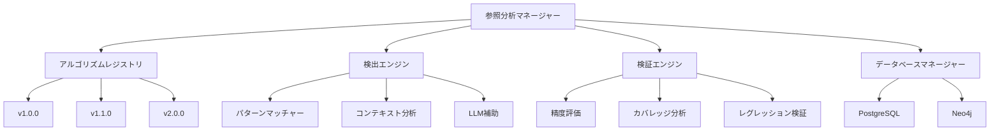
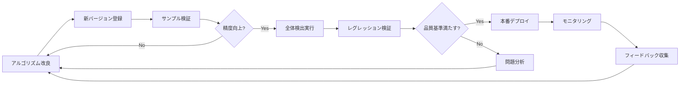
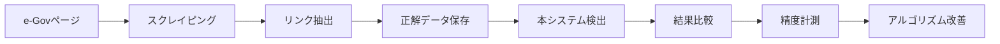

# 参照分析アルゴリズム改善設計書

**作成日**: 2025 年 8 月 17 日  
**バージョン**: 1.0  
**ステータス**: 実装中

## 1. 概要

法令文書における参照関係の完全な検出を実現するため、継続的な改善を前提とした参照分析システムを設計する。本設計は数百回に及ぶ修正・検証サイクルを想定し、アルゴリズムの変更がデータベースの整合性に影響を与えない堅牢なアーキテクチャを提供する。

### 1.1 e-Govを正解データとした検証

本システムの最終目標は、**e-Gov法令検索サイト（https://laws.e-gov.go.jp）と同一の参照リンク構造を実現すること**である。e-Govは日本政府が提供する公式の法令データベースであり、その参照リンク構造は事実上の標準となっている。

#### e-Gov URL構造
```
https://laws.e-gov.go.jp/law/{lawId}
例: https://laws.e-gov.go.jp/law/132AC0000000048 （商法）
```

#### 検証方法
1. **スクレイピング**: e-Govの法令ページから参照リンクを抽出
2. **比較検証**: 本システムの検出結果とe-Govのリンクを比較
3. **精度測定**: 一致率を計測し、アルゴリズムを改善

## 2. 設計原則

### 2.1 基本原則

1. **イミュータブル性**: 過去の検出結果を保持し、アルゴリズムの進化を追跡可能にする
2. **再現性**: 同一バージョンのアルゴリズムは常に同一の結果を生成する
3. **段階的改善**: 既存の検出結果を破壊せずに新しい検出パターンを追加できる
4. **検証可能性**: 各アルゴリズムバージョンの性能を定量的に評価できる
5. **ロールバック可能**: 問題が発生した場合、以前のバージョンに戻せる

### 2.2 データ整合性の保証

- **重複防止**: 同一参照の重複登録を防ぐユニーク制約
- **バージョン管理**: アルゴリズムバージョンごとに検出結果を分離
- **差分管理**: 新旧バージョン間の差分を記録・分析
- **監査証跡**: すべての変更履歴を保持

## 3. システムアーキテクチャ

### 3.1 コンポーネント構成



### 3.2 データベース設計

#### PostgreSQL: 参照検出結果マスター

```sql
-- アルゴリズムバージョン管理
CREATE TABLE algorithm_versions (
    id SERIAL PRIMARY KEY,
    version VARCHAR(20) NOT NULL UNIQUE,
    description TEXT,
    created_at TIMESTAMP DEFAULT CURRENT_TIMESTAMP,
    is_active BOOLEAN DEFAULT false,
    parent_version VARCHAR(20),
    config JSONB
);

-- 参照検出結果（バージョン管理付き）
CREATE TABLE reference_detections (
    id SERIAL PRIMARY KEY,
    algorithm_version_id INTEGER REFERENCES algorithm_versions(id),
    source_law_id VARCHAR(50) NOT NULL,
    source_article VARCHAR(50) NOT NULL,
    target_law_id VARCHAR(50),
    target_article VARCHAR(50),
    reference_type VARCHAR(50) NOT NULL,
    reference_text TEXT NOT NULL,
    confidence FLOAT NOT NULL,
    context TEXT,
    metadata JSONB,
    detected_at TIMESTAMP DEFAULT CURRENT_TIMESTAMP,
    is_verified BOOLEAN DEFAULT false,
    verification_status VARCHAR(20),
    UNIQUE(algorithm_version_id, source_law_id, source_article, reference_text)
);

-- 検証結果
CREATE TABLE reference_validations (
    id SERIAL PRIMARY KEY,
    detection_id INTEGER REFERENCES reference_detections(id),
    validation_type VARCHAR(50), -- manual, automated, llm
    is_correct BOOLEAN,
    notes TEXT,
    validated_by VARCHAR(100),
    validated_at TIMESTAMP DEFAULT CURRENT_TIMESTAMP
);

-- パフォーマンス指標
CREATE TABLE algorithm_metrics (
    id SERIAL PRIMARY KEY,
    algorithm_version_id INTEGER REFERENCES algorithm_versions(id),
    law_id VARCHAR(50),
    total_references INTEGER,
    detected_references INTEGER,
    false_positives INTEGER,
    false_negatives INTEGER,
    precision FLOAT,
    recall FLOAT,
    f1_score FLOAT,
    processing_time_ms INTEGER,
    measured_at TIMESTAMP DEFAULT CURRENT_TIMESTAMP
);
```

#### Neo4j: アクティブな参照グラフ

```cypher
// アクティブバージョンの参照のみを保持
CREATE CONSTRAINT unique_reference IF NOT EXISTS
FOR (r:Reference) REQUIRE (r.source_id, r.target_id, r.text) IS UNIQUE;

// バージョン情報付きノード
CREATE (v:AlgorithmVersion {
    version: '1.0.0',
    is_active: true,
    activated_at: datetime()
})
```

### 3.3 統合管理スクリプト

```typescript
// scripts/reference-manager.ts
interface ReferenceManager {
  // アルゴリズム管理
  registerAlgorithm(version: string, detector: IDetector): void;
  setActiveAlgorithm(version: string): void;

  // 検出実行
  detect(lawId?: string, options?: DetectOptions): DetectionResult;
  detectIncremental(lawId: string): DetectionResult;
  detectAll(options?: DetectOptions): DetectionResult;

  // 検証
  validate(detectionId: number, isCorrect: boolean): void;
  runRegressionTest(version: string): RegressionResult;
  compareVersions(v1: string, v2: string): ComparisonResult;

  // データベース管理
  syncToProduction(version: string): void;
  rollback(version: string): void;
  cleanup(): void;

  // レポート
  getMetrics(version?: string): Metrics;
  generateReport(version: string): Report;
}
```

## 4. アルゴリズム改善ワークフロー

### 4.1 改善サイクル



### 4.2 バージョニング戦略

- **メジャー**: 検出ロジックの大幅変更（v1.0.0 → v2.0.0）
- **マイナー**: 新パターン追加（v1.0.0 → v1.1.0）
- **パッチ**: バグ修正（v1.0.0 → v1.0.1）

### 4.3 品質基準

| 指標               | 目標値 | 必須値 |
| ------------------ | ------ | ------ |
| 精度（Precision）  | 100%   | 90%    |
| 再現率（Recall）   | 100%   | 85%    |
| F1 スコア          | 92.5%  | 87.5%  |
| 処理時間（1 法令） | < 1 秒 | < 5 秒 |
| レグレッション     | 0 件   | < 5 件 |

## 5. 実装計画

### Phase 1: 基盤構築（1 週間）

1. データベーススキーマ実装
2. 統合管理スクリプト作成
3. バージョン管理システム実装
4. 基本的な検証フレームワーク

### Phase 2: 検出エンジン統合（2 週間）

1. 既存検出器のリファクタリング
2. プラグイン型アーキテクチャ実装
3. パターンライブラリの構築
4. コンテキスト分析の実装

### Phase 3: 検証システム（1 週間）

1. 自動検証ツール
2. 手動検証 UI
3. レグレッションテストスイート
4. パフォーマンスベンチマーク

### Phase 4: 運用ツール（1 週間）

1. デプロイメントパイプライン
2. モニタリングダッシュボード
3. A/B テスト機能
4. ロールバック機能

## 6. コマンドインターフェース

```bash
# アルゴリズム管理
npm run ref:register -- --version 1.1.0 --detector improved
npm run ref:activate -- --version 1.1.0

# 検出実行
npm run ref:detect -- --all --version 1.1.0
npm run ref:detect -- --law 129AC0000000089 --incremental
npm run ref:detect -- --sample --size 10

# e-Gov検証
npm run ref:egov-validate -- --law 132AC0000000048        # 特定法令の検証
npm run ref:egov-scrape -- --law 132AC0000000048          # e-Govデータ収集
npm run ref:egov-compare -- --law 132AC0000000048         # 結果比較
npm run ref:egov-report -- --format html                  # 検証レポート

# 検証
npm run ref:validate -- --detection-id 12345 --correct true
npm run ref:test -- --regression --version 1.1.0
npm run ref:compare -- --v1 1.0.0 --v2 1.1.0

# デプロイ
npm run ref:deploy -- --version 1.1.0 --env production
npm run ref:rollback -- --version 1.0.0

# レポート
npm run ref:metrics -- --version 1.1.0
npm run ref:report -- --version 1.1.0 --format html
```

## 7. テストケース管理

### 7.1 e-Govベースゴールドスタンダード

e-Govの実際のリンク構造を正解データとして使用する。

```typescript
interface EGovGoldStandard {
    lawId: string;           // 法令ID
    url: string;            // e-Gov URL
    references: {
        sourceArticle: string;
        targetUrl: string;   // リンク先URL
        targetLawId: string;
        targetArticle: string;
        anchorText: string;  // リンクテキスト
        xpath: string;       // DOM上の位置
    }[];
    extractedAt: Date;      // 抽出日時
}

// e-Govからのデータ収集例
const egovData: EGovGoldStandard = {
    lawId: '132AC0000000048',
    url: 'https://laws.e-gov.go.jp/law/132AC0000000048',
    references: [
        {
            sourceArticle: '第五百五十一条',
            targetUrl: 'https://laws.e-gov.go.jp/law/129AC0000000089#Mp-At_566',
            targetLawId: '129AC0000000089',
            targetArticle: '第五百六十六条',
            anchorText: '民法第五百六十六条',
            xpath: '//article[@id="Mp-At_551"]//a[1]'
        }
    ],
    extractedAt: new Date('2025-08-17')
};
```

### 7.2 自動検証プロセス



### 7.3 検証メトリクス

```typescript
interface ValidationMetrics {
    lawId: string;
    totalEGovLinks: number;        // e-Govの総リンク数
    totalDetected: number;         // 本システムの検出数
    correctMatches: number;        // 完全一致数
    partialMatches: number;        // 部分一致数
    missed: number;                // 検出漏れ
    falsePositives: number;        // 誤検出
    accuracy: number;              // 正確度 (correctMatches / totalEGovLinks)
    completeness: number;          // 完全性 (correctMatches + partialMatches) / totalEGovLinks
}
```

### 7.4 オリジナルゴールドスタンダード

```typescript
interface GoldStandard {
  lawId: string;
  articleNumber: string;
  expectedReferences: Reference[];
  notes: string;
  difficulty: "easy" | "medium" | "hard";
  patterns: string[];
}

// テストケースの例
const testCases: GoldStandard[] = [
  {
    lawId: "129AC0000000089",
    articleNumber: "第三条",
    expectedReferences: [
      { type: "internal", target: "第一条", text: "第一条の規定により" },
      { type: "relative", target: "第二条", text: "前条" },
    ],
    notes: "基本的な内部参照と相対参照",
    difficulty: "easy",
    patterns: ["explicit_article", "relative_previous"],
  },
];
```

### 7.5 エッジケース集

```typescript
const edgeCases = {
  // 大規模漢数字
  largeNumbers: ["第千二百三十四条", "第二千五百六十七条"],

  // 複雑な範囲指定
  complexRanges: ["第一条から第三条まで及び第五条から第七条まで", "第一条第二項から第三項まで並びに第二条"],

  // 入れ子構造
  nestedReferences: ["第一条（第三条において準用する場合を含む。）", "第二条第一項（同条第三項において準用する場合を含む。）"],

  // 条件付き参照
  conditionalReferences: ["第一条の規定が適用される場合にあっては第二条", "第三条に規定する場合を除き、第四条"],
};
```

## 8. モニタリングとアラート

### 8.1 主要メトリクス

- **検出率**: 新バージョンで検出された参照数の変化
- **処理時間**: アルゴリズムの実行時間
- **エラー率**: 検出失敗や例外の発生率
- **ユーザーフィードバック**: 手動検証での修正率

### 8.2 アラート条件

- 検出率が 10%以上低下
- 処理時間が 2 倍以上に増加
- エラー率が 5%を超過
- レグレッションが 10 件以上発生

## 9. 成功基準

### 9.1 最終目標
1. **e-Gov完全一致**: e-Govと100%同一のリンク構造を実現
2. **完全性**: 99%以上の参照を正確に検出
3. **正確性**: 誤検出率を 1%未満に抑制
4. **性能**: 1 法令あたり 1 秒以内で処理
5. **保守性**: 新パターン追加が 1 時間以内で可能
6. **信頼性**: 本番環境でのエラー率 0.1%未満

### 9.2 段階的マイルストーン

| フェーズ | e-Gov一致率 | 目標期間 |
|----------|------------|----------|
| Phase 1 | 70% | 1ヶ月 |
| Phase 2 | 85% | 2ヶ月 |
| Phase 3 | 95% | 3ヶ月 |
| Phase 4 | 99% | 6ヶ月 |
| Phase 5 | 100% | 1年 |

## 10. リスクと対策

| リスク                         | 影響 | 対策                                     |
| ------------------------------ | ---- | ---------------------------------------- |
| アルゴリズム変更による品質低下 | 高   | 段階的ロールアウト、A/B テスト           |
| データベース肥大化             | 中   | 定期的なアーカイブ、古いバージョンの削除 |
| 処理時間の増大                 | 中   | 差分検出、並列処理、キャッシュ           |
| 複雑性の増大                   | 高   | モジュール化、ドキュメント充実           |

## 11. 今後の拡張

- **機械学習統合**: パターン自動学習
- **LLM 活用**: 文脈依存参照の解決
- **可視化ツール**: 参照ネットワークの視覚化
- **API 公開**: 外部システムとの連携

---

**改訂履歴**

| バージョン | 日付       | 変更内容 | 作成者      |
| ---------- | ---------- | -------- | ----------- |
| 1.0        | 2025/08/17 | 初版作成 | Claude Code |
| 1.1        | 2025/08/17 | e-Gov検証機能追加 | Claude Code |
